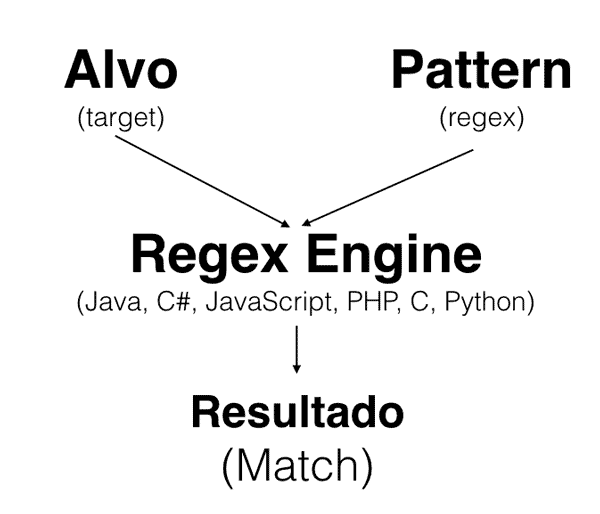

-------------------------------------------------------------------------
<h1>Começando com Regex</h1>

<h2>Começando a aprender Regex com Javascript</h2>

- Expressões Regulares (Regex)
- Cadeias de caractéres que utilizam um padrão para encontrar um certo texto.

O que é uma Expressão Regular?
Uma expressão regular, ou Regex, são padrões utilizados para identificar determinadas combinações ou cadeias de caracteres em uma string. Ela faz parte do dia a dia de todos os programadores e administradores de infra. Por meio dela, podemos validar a entrada de usuários ou encontrar alguma informação em logs, documentação ou saída de comando. O mais legal é que as regex são escritas independentes de uma linguagem, como JavaScript ou C#. As expressões são definidas em sua própria linguagem formal e uma vez aprendida, podemos aplicar o conhecimento dentro da linguagem de nossa preferência. Em outras palavras, linguagens como Java, JavaScript, C# e várias outras possuem uma implementação das expressões regulares e sabem interpretá-la.

Neste curso, vamos focar nessa linguagem formal, mas claro, também mostraremos como executá-la nas plataformas diversas.

Onde queremos chegar? Entender, por exemplo, uma regex assim:

<(img)\s+src="(.+)"(?:>(?:.*)<\/\1>|\s+\/>)
E saber executá-la utilizando a sua linguagem. No último capítulo desse curso mostraremos como executar uma regex com Java, C#, PHP, Python, Ruby e JavaScript.

Ambiente de execução
Para testar as regex durante o curso, preparamos uma página HTML e um código JavaScript que interpreta a regex. Você pode baixar o projeto aqui. Basta extrair o ZIP e abrir o arquivo index.html.

Ao abrir, podemos ver que a página mostra um formulário para executar e testar as regex. Vamos utilizar esse formulário para analisar as expressões.

Repare que já estamos usando um vocabulário focado na regex. A string que queremos usar na busca, no exemplo da imagem, a string imagem.png é chamada de alvo, ou target. A expressão regular, na imagem .*png, estamos chamando de pattern. Os resultados são os matches.

Já estamos aplicando a primeira regex, estamos procurando algum texto que termine com png. O ponto (.) é um caractere especial e significa qualquer caractere. Ou seja, a regex não interpreta o ponto literalmente e sim faz um match para qualquer char.

O asterisco (*) é outro meta-char com o significado "zero, um ou mais vezes". Ao adicionar o asterisco (*), conseguimos definir a quantidade, por isso ele também é chamado de quantifier. O ponto (.) e asterisco (*) fazem parte dos metacaracteres que veremos durante o curso.

Apresentando o código
Qualquer regex precisa ser interpretada por meio de uma regex engine. Esse motor é uma parte de software que processa a expressão, tentando achar o padrão dentro da string dada, devolvendo os resultados. Normalmente a regex engine faz parte da aplicação maior, para executar uma validação ou busca de uma string.

No nosso caso, usamos uma regex engine baseada na linguagem JavaScript. No treinamento, veremos ainda como usar expressões regulares em outras linguagens, como Java, C# ou Ruby.

Vamos dar uma olhada na função executaRegex, dentro do arquivo regex.js. Nela criamos o objeto que sabe interpretar a expressão regular. O JavaScript chama esse objeto de RegExp:

var objetoRegex = new RegExp(textoPattern, 'g');
No construtor passamos o pattern, aquilo que colocamos no input Pattern da página index.html. A letra g é uma flag do mundo JavaScript e significa global, para aplicar a regex na string inteira (e não parar no primeiro match) .

Após a inicialização do objeto regex, podemos executá-lo usando o método exec, que recebe como parâmetro o alvo:

while (resultado = objetoRegex.exec(textoTarget)) {

    //codigo omitido

}
O método exec devolve um resultado que possui a string match e outras informações, como a posição/index. Repare que estamos fazendo um laço sempre pedindo o próximo resultado.

O resto do código do arquivo regex.js se preocupa com a leitura, validação e apresentação dos dados.

<h2>Regex Engine</h2>
O que é um Regex-Engine?
R: É um software para interpretar e aplicar a regex.
Uma expressão regular sozinha é apenas uma string. É preciso ter um software para interpretar a regex e aplicá-la no alvo. Esse software é o Regex Engine que existe para a maioria das plataformas de desenvolvimento, como JavaScript, C#, Python, Ruby ou PHP.

<h2>Meta Caracteres</h2>

Ainda estamos engatinhando no mundo de Expressões Regulares mas já conhecemos alguns meta caracteres.
Quais dos caracteres abaixo não representa um meta-char?
R: Resposta correta: O caractere "e comercial" (&) não é uma meta-char.

Explicação: Existem alguns caracteres que possuem um significado especial para o regex engine. Especial significa que o regex engine não interpreta o valor literal e sim diferente. Esses caracteres são chamados de meta caracteres.

Nessa aula já vimos alguns:

. o "ponto" que significa qualquer char
* o asterisco que serve para definir uma quantidade de chars, zero ou mais vezes
{e } as chaves que servem para definir uma quantidade de caracteres específicas que é desejado encontrar
Por exemplo:

a{3} letra a 3 vezes.
\d* um digito zero ou mais vezes
Lembrando também, se quisermos procurar pelo * ou . literalmente (sem significado especial), devemos utilizar o caractere \

Durante o curso veremos ainda mais meta chars!

<h2>O nosso primeiro problema</h2>
Já vimos um pequeno exemplo de regex e já sabemos que existem metacaracteres (meta-char) que possuem significados especiais, como o ponto (.) ou asterisco (*). No nosso primeiro exemplo para valor, vamos focar no CPF.

Uma tarefa muito comum no dia a dia do desenvolvedor é parsear um arquivo linha a linha, onde cada linha representa um dado ou registro. Há vários tipos de arquivos, e nesse curso vamos usar o exemplo de arquivo CSV, ou Comma-separated Values, por exemplo:

João Fulano,123.456.789-00,21 de Maio de 1993,(21) 3079-9987,Rua do Ouvidor,50,20040-030,Rio de Janeiro
Maria Fulana, 98765432100,11 de Abril de 1995,(11) 933339871,Rua Vergueiro,3185,04101-300,São Paulo
denise teste, 987.654.321.00,28 de Dezembro de 1991,(31)45562712,SCS Qd. 8 Bl. B-50,11,70333-900,Rio Grande
Então, em cada linha temos vários valores separados pela vírgula, por exemplo:

João Fulano,123.456.789-00,21 de Maio de 1093,(21) 3079-9987,Rua Buarque de Macedo,67,22220-232,Rio de Janeiro
Encontrando números
Repare que o segundo valor é um CPF que precisamos extrair dessa linha. Você conhece um CPF e sabe o padrão de caracteres dele, só falta traduzir o seu conhecimento para a linguagem que a regex engine entende!

Um CPF são 9 números, separados em blocos de 3 números por um ponto, mais um hífen e mais dois números. Para representar um número, podemos utilizar uma caracter class, que é um símbolo especial para representar um conjunto de caracteres. No mundo de regex, um número é representado pelo \d.

O primeiro quantifier
Agora queremos que esse número apareça 3 vezes. Já vimos que o asterisco (*) significa 0, 1 ou mais vezes, ou seja, não atende. Queremos exatamente 3 números que podemos definir pela expressão \d{3}.

Dentro das chaves definimos a quantidade que o caractere deve estar presente. Com isso, já podemos encontrar 3 dígitos. Agora vem o "ponto" só que aprendemos que esse caractere possui um significado especial. No entanto queremos procurar o ponto literalmente e não qualquer caractere. Para deixar claro que o ponto deve ser ponto apenas, é preciso escapar o caractere com \. Assim temos:

\d{3}\.
Sabendo disso podemos definir o resto do CPF:

\d{3}\.\d{3}\.\d{3}\-\d{2}
Repare que o usamos um hífen seguido por apenas 2 dígitos.

<h2>Mão na massa - Encontrando o IP</h2>

O número do IP de um computador é gerado ao conectá-lo à internet, esse número permite que o dispositivo seja identificado e capaz de enviar/receber informações. Abaixo há alguns exemplos de IP:

126.1.112.34

128.126.12.244

192.168.0.34

Cada grupo pode ter de um à três algarismos. Considerando somente essa regra, como podemos encontrar o padrão desses números?

R:\\d{1,3}\.\d{1,3}\.\d{1,3}\.\d{1,3}

 
Um IP tem quatro grupos de no mínimo um e máximo três números. Repare que estamos escapando o ponto (.) entre os números, que são blocos de dígitos \d entre 1 e 3 caracteres {1,3}

<h2>Mão na massa - Encontrando o CEP</h2>

Agora tente definir a regex para encontrar o CEP dentro de uma linha no nosso CSV, por exemplo:

João Fulano,123.456.789-00,21 de Maio de 1993,(21) 3079-9987,Rua do Ouvidor,50,20040-030,Rio de Janeiro
Mãos à obra!

Um CEP não há muito mistério, são 5 dígitos -(hífen) 3 dígitos.

Traduzindo isso para uma expressão regular:

\d{5}-\d{3}

<h2>Mão na massa - Buscando o telefone</h2>

Usando o que aprendemos até então, qual padrão podemos utilizar para encontrar o número telefônico? Por exemplo: (21) 3216-2345

Dica: Os parênteses são meta-chars e precisam ser utilizados para capturar o valor literal: \( e \)

Regex correta: \(\d{2}\) \d{4}-\d{4}

R:Quebrou a cabeça? O parênteses é um meta caracter de grupo, algo que ainda aprenderemos. Sendo assim, precisamos escapá-lo com um \ quando temos o interesse de encontrá-lo em uma string.

A regex não está perfeita pois o telefone poderia variar, por exemplo ter com 9 números ou um 0 na frente do DDD (além de definir melhor o espaço). Nos próximos capítulos veremos como definir essas possibilidades.

<h2>Para que servem Regex?</h2>
Na aula e nos últimos exercícios já vimos alguns exemplos de expressões regulares. Com isso, avalie as seguintes opções:

A) Extraindo seções específicas de uma arquivo de texto
B) Validação de formatação de, por exemplo, e-mail ou telefone
C) Análise de arquivos de texto e extração de dados para, por exemplo, gravar no banco de dados
D) Substituindo os valores de um texto para limpar, reformatar ou alterar o conteúdo
Dentre essas opções, quais alternativas correspondem às possibilidades utilizando RegEx?

R:
Todas as alternativas estão corretas e representam exemplos clássicos para utilizar expressões regulares.

No entanto, é importante lembrar que uma expressão regular faz a análise de um determinado padrão de caracteres em uma string. Podemos usar esse padrão para por exemplo validar um email ou telefone. Para saber se o email realmente existe e validar a autenticidade do email uma regex não serve.

<h2>O que aprendemos?</h2>

Regex, ou expressões regulares, é uma linguagem para encontrar padrões de texto.
Sendo uma linguagem independente, existem interpretadores para a maioria das plataformas de desenvolvimento, como JavaScript, C#, Python ou Ruby.
Uma classe de caracteres predefinida é \d, que significa qualquer dígito.
Existem vários meta-char, como . ou *.
Existem quantifiers que definem quantas vezes um caractere deve aparecer:
{1} é um quantifier que significa uma vez.
* é um quantifier que significa zero, uma ou mais vezes
. é um meta-char que significa qualquer char.
Com \ podemos escapar meta-chars, por exemplo \..

---------------------------------------------------------------------------------------------
<h1>Seção 02 - Classes de Caracteres</h1>

<h2>Entendendo Classes de Caracteres</h2>
No último capítulo demos uma introdução às regex e vimos nossa primeira expressão para encontrar um CPF em uma linha de texto. Já criamos uma expressão regular, bastante simples ainda encontrando o CPF:

\d{3}\.\d{3}\.\d{3}-\d{2}
Olhando novamente no nosso arquivo CSV, percebemos que há uma pequena variação da formatação do CPF: 987.654.321.00 e 11122233300.

A nossa regex falha e não "enxerga" esses CPFs. Para fazer ela funcionar, devemos usar o poder das classes de caracteres. Na aula anterior já vimos uma classe predefinida, o \d. Essa classe na verdade é apenas um atalho pra [0-9], ou seja qualquer dígito. Os colchetes definem uma classe de caracteres e nada impede que criemos nossa própria classe.

Repare que na décima segunda posição do CPF pode vir um ponto OU hífen, que podemos declarar com a classe: [.-]. Perceba também que não escapamos o ponto (.), pois dentro dos colchetes o ponto já possui o seu valor literal. Importante também é que a ordem não importa, [.-] e [-.] são a mesma coisa.

Caracteres opcionais
A quantidade de vezes que essa classe de caracteres deve aparecer é definida por um quantifier, por exemplo, como já vimos:

[.-]* - ponto ou hífen zero, uma ou mais vezes.

[.-]{1} - ponto ou hífen uma vez.

No nosso caso [.-] é opcional, pode ter ou não ter, mas uma vez apenas. Dentro da regex, isso é declarado através do meta-char ponto de interrogação (?). O ponto de interrogação (?), que significa zero ou uma vez, é mais um quantifier.

Assim podemos combinar a classe [.-] com o quantifier ?:

[.-]?- ponto ou hífen zero ou uma vez.
Vamos aplicar isso na nossa regex:

\d{3}[.-]?\d{3}[.-]?\d{3}[.-]?\d{2}
Agora sim, os CPFs serão encontrados com ou sem hífen/ponto.

Sabendo disso até podemos reescrever a classe \d (sim \d também é uma classe, já predefinida). Invés de usar \d podemos escrever:

[0123456789]
Ou mais curto:

[0-9]
Só cuidado, o hífen não possui um significado especial e define todos os números de 0 até 9.

<h2>Mãos na massa: Ajudando Alura</h2>

s textos e exercícios no Alura usam uma formatação para deixar uma parte em negrito, itálico ou para mostrar que se trata de código. Na primeira versão da Alura era necessário usar tags HTML no texto para essa formatação. Por exemplo, veja uma de um exercício antigo:

No <code>for</code>, o valor de <code>i</code> começa de zero e é incrementado a cada volta enquanto <code>i < 10</code>, portando o bloco de código do for é executado 10 vezes.
A sua tarefa agora é criar uma regex que procurará o <code> ou </code> dentro do alvo acima. Mãos à obra!

VER OPINIÃO DO INSTRUTOR
Opinião do Instrutor

A regex utilizada é: </?code>

Repare que usamos o meta-char ? para sinalizar que o / é opcional.

Isso foi um exemplo real do Alura, usamos essa regex para substituir </?code>com o char backstick. A nova formatação do Alura se chama de Markdown, ou seja, o texto que usava <code> se tornou:

No `for`, o valor de `i` começa de zero e é incrementado a cada volta enquanto `i < 10`, portando o bloco de código do for é executado 10 vezes.
Veremos ainda como podemos substituir uma string através de uma regex!!

<h2>Qual é a classe?</h2>
Veja as alternativas abaixo.
Qual é a classe correta para definir os números entre 1 e 3 e 6 e 9?
R:[1-36-9]

<h2>Praticando classes e quantifier</h2>
No exemplo do CPF, usamos a classe de caracteres \d para descrever todos os dígitos. Se existe uma classe para dígitos, também deve ter uma para letras, certo?

Para ver isso em um exemplo real, vamos olhar novamente no nosso arquivo CSV. Repare que temos uma coluna que possui uma data extensa: 11 de Abril de 1995. Que tal definir uma regex para esse padrão textual?

Vamos copiar a data e colocar no nosso formulário. É sempre útil analisar a regex por partes e testar passo a passo. O início é bem simples, temos dois dígitos e já sabemos descrever essa classe:

\d\d
No entanto, para ser uma data, isso é muito abrangente e por isso definimos nossa própria classe de dígitos, mais específica:

[0-3]?\d
Isso pega os dias com um ou dois dígitos, mas o primeiro dia pode ser apenas 0, 1, 2 ou 3. Dentro da classe até podemos deixar isso mais explicito:

[0123]?\d
Trabalhando com espaços
Depois do dia, vem um espaço e a sílaba de. Como poderíamos definir um espaço dentro de uma regex? E se não for o espaço e sim um tab? Felizmente já existe uma classe predefinida, a \s. \s significa whitespace. A definição do \s pode variar um pouco entre as implementações, mas normalmente é um atalho para [ \t\r\n\f] onde:

O primeiro caractere é um espaço branco.
\t é um tab.
\r é carriage return.
\n é newline.
\f é form feed.
É muito coisa para se lembrar, então é melhor usar o \s. Vamos aplicar isso na nossa regex, já usando um quantifier, pois podemos ter mais do que um espaço:

[0123]?\d\s{1,}
Nos colchetes colocamos 1, que significa um ou mais. Novamente existe um atalho, já que isso é muito comum:

[0123]?\d\s+
O símbolo + é um outro atalho para definir a quantidade e agora já conhecemos todos:

? - zero ou uma vez.
* - zero ou mais vezes.
+ - uma ou mais vezes.
{n} - exatamente n vezes.
{n,} - no mínimo n vezes.
{n,m} - no mínimo n vezes, no máximo m vezes.
Agora sim podemos continuar com o valor literal de e o mês. O primeiro é muito simples pois basta colocar a palavra seguida por um ou mais whitespaces:

[0123]?\d\s+de\s+
Dá match em: 11 de

Classes de letras
Para descrever o mês, devemos usar uma nova classe de letras, seguem alguns exemplos:

[A-Z] significa de A até Z, sempre maiúscula.
[a-z] significa de a até z, sempre minúscula,
[A-Za-z] significa A-Z ou a-z.
[abc] significa a, b ou c.
Sabendo disso, podemos combinar a classe com um quantifier. Vamos começar com uma letra maiúscula ,seguida por uma quantidade de letras minúsculas, adicionando ainda a letra ç (do mês março):

[A-Z][a-zç]+
Também podemos ser mais restritivos ainda, como um mês escrito tem no máximo 8 caracteres (depois da primeira letra), temos:

[0123]?\d\s+de\s+[A-Z][a-zç]{1,8}
Dá match em: 21 de Maio

Continuando, tem mais uma vez a sílaba de, repetindo a expressão anterior:

[0123]?\d\s+de\s+[A-Z][a-zç]{1,8}\s+de\s+
Dá match em: 21 de Maio de

Por fim podemos declarar o ano que é composto por quatro dígitos:

[0123]?\d\s+de\s+[A-Z][a-zç]{1,8}\s+de\s+\d\d\d\d
Dá match em: 21 de Maio de 1993

Daria também para melhorar um pouco mais a expressão, deixando claro que o ano deve começar com 1 ou 2 seguido por 3 dígitos:

[0123]?\d\s+de\s+[A-Z][a-zç]{1,8}\s+de\s+[12]\d{3}
Dá match em: 21 de Maio de 1993

Por fim, não podemos esquecer de mencionar a classe de word char. Um word char é apresentado com \w e é um atalho para [A-Za-z0-9_].

<h2>Trabalhando com horários</h2>

No vídeo vimos como definir uma regex para encontrar a data. Agora precisamos garantir que o nosso usuário preencha um horário que siga esse padrão: 19h32min16s.
Qual expressão regular podemos usar nesse padrão?
R: Regex correta: \d{2}h\d{2}min\d{2}s

Como não precisamos limitar os números nesse padrão, podemos utilizar a classe padrão \d para trabalhar com dígitos.

Tem uma regex parecida nas respostas, no entanto ela usa uma \ na frente de cada classes de digitos:

\[0-9]{2}h\[0-9]{2}min\[0-9]{2}s
Sem essa barra a regex também funcionaria:

[0-9]{2}h[0-9]{2}min[0-9]{2}s

<h2>Mão na massa: Reconhecendo a placa de um veículo</h2>

Fomos contratados para desenvolver um sistema para cadastro de veículos em um estacionamento. Para isso, precisaremos cadastrar as placas dos veículos no sistema e para fazer a validação usaremos expressão regular.
Como seria a expressão regular que devemos usar para validarmos a placa de um carro?
Exemplo de placa: KMG-8089

R:Primeiro deve definir as 3 letras maiúsculas: [A-Z]{3}

Agora só falta o hífen e os 4 dígitos, a regex completa fica:

[A-Z]{3}-\d{4}

<h2>Mão na massa: Expressão regular a favor dos alunos!</h2>
Gilberto é professor de física em um colégio cuja média para passar é 8. Aliás, uma média bem alta. Contudo, este professor é amigo dos alunos, e costuma parovar aqueles que conseguem notas de 7.2 a 7.9.
Ajude Gilberto e, claro, seus alunos, separando do arquivo CSV os nomes e as notas dos alunos que tiraram de 7.2 a 7.9 para que o professor "camarada" possa aprová-los!
9.8 - Robson, 7.1 - Teresa, 4.5 - Armênio, 6.5 - Zulu, 7.7 - Stefania, 7.8, 5.0 - Romeu, 7.2 - Pompilho, 3.1 - Reinaldo, 7.3 - Bernadete, 4.7 - Cinério

Use o avaliador de expressão regular disponibilizado pelo curso.

R: [1]?[7-9]\.\d\s+-\s+\w+

Vejamos! Queremos pegar todo mundo que comece com nota 7.

7\.
Lembre-se que precisamos escapar o . usando um \ antes por ele ser um meta char. Agora, vamos definir nossa própria classe usando colchetes. Nela, precisamos aceitar somente um número de 2 a 9`:

7\.[2-9]
Perfeito, com isso temos as possibilidades 7.2,7.3,7.4,7.5,7.6,7.7, 7.8 e 7.9.

Sabemos que depois do número, temos um espaço e um hífen seguido de espaço:

7\.[2-9]\s+-\s+
Por fim, depois do hífen queremos pegar qualquer quantidade de caracteres, por isso usaremos o atalho de classe \w que pega qualquer dígito, seja ele letra ou número:

7\.[2-9]\s+-\s+\w+

<h2>Mão na massa: Uma expressão regular incorreta pode prejudicar alguém</h2>
Laudilene, é professora de filosofia, amiga de Gilberto, professor de física. Ambos dão uma "colher de chá" para seus alunos. No caso de Laudi, ela dá até meio ponto para que seus alunos atinjam a média 8 para serem aprovados.

Depois de calcular as médias das provas dos alunos, Laudi, muito cansada, lançou todas as médias em um arquivo texto:

10 - Bruce, 9.5 - Miranda, 7.9    - Bob, 10 - Zimbabue, 7.5 - Bety
Para extrairmos a nota e o nome de alunos elegíveis para receberem até meio ponto podemos usar a expressão.

[7]\.[5-9] - \w+
Contudo, se copiarmos e colocarmos a linha com as médias do aluno em nosso testador de expressão e usarmos a expressão acima, recebemos como "match" apenas

7.5 - Bety
Coitado de Bob! Ele tem direito também!

Explique por que a nota e o nome de Bob não entraram na seleção e proponha um solução alterando a expressão regular utilizada.

Veja o texto com as médias digitado por Laudi:

10 - Bruce, 9.5 - Miranda, 7.9    - Bob, 10 - Zimbabue, 7.5 - Bety
Veja que sem querer, ela adicionou mais de um espaço separando a nota de Bob do hífen. Esse pequeno detalhe foi suficiente para que nossa expressão [7]\.[5-9] - \w+ não fosse capaz de adicionar a nota de Bob na seleção. Tudo isso porque usamos um espaço antes do hífen e um espaço depois. Poderíamos até corrigir no arquivo original, mas se Laudi errar novamente?

Vamos alterar nossa expressão regular para considerar um ou mais espaços (inclusive tab) antes do hífen e depois. Para isso usamos \s+. Alterando nossa expressão:

[7]\.[5-9]\s+-\s+\w+
Lembre-se que \s é um atalho para espaços, tab's e que o + significa um ou mais.

<h2>Mão na massa: Separando joio do trigo</h2>
Temos a seguinte linha:
BALEIRO GARROTE SERROTE GOLEIRO ROTEIRO
Escreva uma expressão regular que faça match apenas com as palavras GARROTE, SERROTE e ROTEIRO. Não esqueça de usar nossa ferramenta para testar nossas expressões regulares.

Uma solução possível é:

[A-Z]*ROT[A-Z]+
Veja que usamos a classe de caracteres [A-Z] porque queremos lidar apenas com todos as letras em maiúsculo. Além disso, na primeira parte da expressão temos [A-Z]*, usamos o quantifier * que indica zero ou mais vezes. Por fim temos [A-Z]*ROT[A-Z]+.

<h2>Mais sobre classes</h2>
As classes são uma das partes mais importantes de expressões regulares, tão importante que vamos falar mais um pouco sobre elas :)

Algo que não podemos esquecer é, quando definimos uma classe, a grande maioria dos meta chars são interpretados como caracteres literais, ou seja, não são mais meta-chars!

Por exemplo, vamos analisar a classe [a+] Ela é composta dos chars a e + e dentro dos colchetes o char + não é um quantifier!

Para entender melhor, faça o teste com o alvo a+a+ aplicando a regex [a+]:

Repare que temos 4 matches. A regex engine selecionou cada caracter da classe separadamente (a ou +), apenas um caractere por vez. Consequentemente achou 4 matches.

Agora tente a regex [a+]+ com o mesmo alvo:

Repare que temos apenas um match! A regex engine aplicou o caractere a ou +, uma ou mais vezes no alvo!

Sabendo disso e dado o seguinte alvo: ?classes+poderosas*

Qual regex abaixo seleciona o alvo inteiro (um match apenas)?

Resposta correta: [a-z?*+]+

Como falamos, a grande maioria de meta-chars são valores literais na definição da classe (dentro de []). Por exemplo, a classe abaixo define apenas valores literais:

[.?+*{}]
Apenas os caracteres \ (barra invertida), - (hífen) e ^ (circunflexo) realmente são meta-chars dentro de uma classe. O hífen e a barra invertida já vimos na aula, por exemplo na classe:

[a-z\d]
Definimos uma classe com letras minúsculas e dígitos.

O circunflexo (^) significa negação dentro dos colchetes e mais para frente falamos mais sobre ele! Aguarde :)

<h2>Opcional: Validando o usuário no serviço Rest</h2>
Você é um desenvolvedor back-end de uma startup que possui uma aplicação web de anúncios de restaurantes e lanchonetes. A aplicação que foi desenvolvida usando AngularJS no client-side consumindo serviços Rest desenvolvidos em Jersey/JAX-RS, precisa fazer um cadastro dos seus usuários que possuem um username.

Esse username possui regras de quais caracteres ele pode compor e nós queremos que ele seja válido antes de consultarmos no banco de dados as informações sobre ele.

Vamos ver abaixo a action que receberá o usuário para ser cadastrado:

@POST
@Path("/user")
@Consumes(MediaType.APPLICATION_JSON)
public Response listaDeRestaurantes(@Valid User user) { 
    // codigo omitido
}
O projeto utiliza a especificação Bean Validation que permite realizar validações de modelos através de anotações. Para validar um campo usando expressões regulares, podermos usar a anotação @Pattern(regexp="...")

// User.java
public class User {
    @Pattern(regexp = "???")
    @NotEmpty
    private String username;

}
O username precisa ser da seguinte forma:

O limite é de 10 caracteres;
O primeiro caractere deve ser uma letra do alfabeto, não pode ser um número;
A partir do segundo caractere podemos ter letras maiúsculas, minúsculas e números;
Como deve ficar a anotação @Pattern com uma expressão regular com essas características?

A resposta é: [a-zA-Z][a-zA-Z0-9]{0,9}.

Também é possível usar expressões regulares na anotação @Path do JAX-RS. Por exemplo: @Path("/username/{username:[a-zA-Z][a-zA-Z0-9]{0,9}")

Se você quiser conhecer um pouco mais sobre Jersey e AngularJS (1 e 2) temos alguns treinamentos específicos sobre esses temas:

<h2>Para saber mais: Melhorando a legibilidade</h2>
Na aula criamos um pequeno "monstro" para definir a expressão da data:

[0123]?\d\s+de\s+[A-Z][a-zç]{1,8}\s+de\s+[12]\d{3}
Como poderíamos deixar a expressão mais fácil de entender?

Uma forma fácil de melhorar a legibilidade seria usar algumas variáveis auxiliares, que deixam claro o que estamos definindo, por exemplo no JavaScript podemos criar 4 variáveis:

var DIA  = "[0123]?\d"; 
var _DE_ = "\s+de\s+";
var MES  = "[A-Za-z][a-zç]{1,8}";
var ANO  = "[12]\d{3}";
Repare que cada variável representa uma parte da regex. Depois disso é só concatenar esses variáveis para ter a expressão final:

var stringRegex = DIA + _DE_ +  MES + _DE_ + ANO;
Essa string passamos para a regex engine do JavaScript:

var objetoRegex  = new RegExp(stringRegex, 'g');

Uma regex é algo muito compacto e aquilo que escrevemos hoje, amanhã já pode ser difícil de se entender. Criar variáveis auxiliares pode ajudar muito para deixar claro o que a regex representa, mesmo para desenvolvedores que não são especialistas de expressões regulares.

<h2>O que aprendemos?</h2>
O que aprendemos?
Podemos definir facilmente a classe de qualquer caractere com o [A-Z].

Conhecemos todos os quantifiers como ?, +, * e {n}.

\s significa whitespace e é um atalho para [ \t\r\n\f].

\w significa word char e é uma atalho para [A-Za-z0-9_].

-----------------------------------------------------------------------------------------
<h1>Seção 03 - Encontrando a posição certa com âncoras</h1>

<h2>Selecionando com âncoras</h2>

Vamos continuar com nosso exemplo CSV e copiar a segunda linha para nosso formulário:

denise teste, 987.654.321-00,28 de Dezembro de 1991,(31)45562712,SCS Qd. 8 Bl. B-50,11,70333-900,Rio Grande
Um problema comum para resolver no dia a dia é a procura de uma palavra especifica. Nesse exemplo, vamos tentar achar a preposição de. A primeira ideia seria colocar o valor literal de. Ao testar, percebemos que a regex pega mais do que o desejado, como denise ou Grande. Com aquilo que já aprendemos, vamos refinar a regex e colocar um whitespace no início e no fim da preposição: \sde\s

Agora sim, a regex só encontra as palavras corretas, no entanto também selecionou o espaço no início e fim da preposição.

Word boundary
O que queremos na verdade é encontrar o início e o fim de uma palavra, que podemos definir pela regex \b. \b é uma das âncoras, chamada de word boundary. Uma âncora não seleciona um caractere, e sim apenas uma posição no texto alvo. Ou seja, a âncora \b sozinha devolve nada (zero-length) mas combinada com um valor literal, ou outra regex, podemos finalmente definir como encontrar a preposição de:

\bde\b
Repare que usamos o \b no início e no fim, ou seja, queremos buscar exatamente a preposição de. Testando isso no nosso formulário, agora sim só selecionamos apenas a palavra de. Vamos testar a âncora em um outro exemplo para deixar bem claro como ela funciona. Abaixo temos uma sequência de letras a e queremos selecionar as sequências com três a (a{3}):

aaa aaaa aaa aaaa aaa
Vamos testar uma vez sem \b, uma vez com \b no início, e outra com \b no início e fim:

a{3}

a{3}\b

\ba{3}\b

<h2>O que são âncoras?</h2>
Descreva com suas palavras para que serve uma âncora dentro de uma expressão regular!
R: Uma âncora não casa caracteres como as classes fazem, e nem definem quantidades. Âncoras marcam uma posição específica no alvo, por isso não é possível combiná-las com um quantifier.

Existem várias âncoras predefinidas, mas as mais comuns são ^, $ e \b. Lembrando também que os caracteres ^ e $ são meta-chars.

<h2>Âncoras de início e fim</h2>
A ideia de definir uma âncora não só existe para palavras, existem outras que podem ser muito úteis. Há situações onde precisamos avaliar uma string inteira e não só uma parte. Um bom exemplo são as URIs que vemos o tempo todo no desenvolvimento. Que tal avaliar?

Vamos utilizar o caminho do arquivo html que representa o nosso formulário:

file:///Users/nico/Downloads/regex/index.html
Queremos avaliar a linha inteira e temos que garantir que nada vem antes. Para isso existe a âncora ^. Igualmente tem uma âncora que avaliar o fim da string: $. Sabendo disso vamos definir:

^file.+html$
Ou seja, tem que começar com file e terminar com html. Ao colocar algo antes ou depois do alvo, a regex já não aplica mais:

Não pega:

xfile:///Users/nico/Downloads/regex/index.html
Também não pega:

file:///Users/nico/Downloads/regex/index.htmlx
Há muito a melhorar nessa regex para sermos mais específicos, e vamos atacar isso no próximo capítulo mas agora é a hora dos exercícios.

<h2>Mão na massa: Encontrando o número de um CPF</h2>
Dada a seguinte regex, que encontra o número de um CPF: ^\d{3}\.\d{3}\.\d{3}-\d{2}$. Qual das strings abaixo é compatível com ela?
Resposta correta: 111.111.111-11

Como foi visto no capítulo, o circunflexo (^) é uma âncora e garante que na string nada deve vir antes, por isso a string CPF: 111.111.111-11 não é compatível, pois antes do número do CPF há o trecho CPF:. Já o $ é o contrário, nada na string deve vir depois, por isso a string 111.111.111-11 é o número do meu CPF também não é compatível, pois depois do número do CPF há o trecho é o número do meu CPF.

<h2>Mão na massa: Encontrando uma string que comece com determinada expressão</h2>
Temos aqui um erro que aconteceu em um sistema:

Caused by: com.mysql.jdbc.exceptions.jdbc4.CommunicationsException: Communications link failure
Sabendo que o erro sempre começa com a expressão Caused by:, faça uma regex que capture-o.

Um regex simples que pode ser feita é:

^Caused by:.*
A âncora ^ garantirá que, na string, nada deve vir antes de Caused by:, ou seja, a string deve começar com essa expressão. A seguinte string não seria válida, por exemplo: Error Caused by:

<h2>Mão na massa: Encontrando uma expressão de data</h2>
Qual das regex abaixo capturaria exatamente as strings de data que seguem o modelo: Data: dia/mes/ano ou Data:dia/mes/ano?

Alvos: Data: 02/09/1964 ou Data:02/09/1964.

Se tiver com dúvida, use o nosso testador.

<h2>Mão na massa: Encontrando uma expressão de data</h2>
Qual das regex abaixo capturaria exatamente as strings de data que seguem o modelo: Data: dia/mes/ano ou Data:dia/mes/ano?

Alvos: Data: 02/09/1964 ou Data:02/09/1964.

Se tiver com dúvida, use o nosso testador.
R:A regex para pegar data é bem simples, vocês já sabem: [0-9]{2}\/[0-9]{2}\/[0-9]{4}.

Mas também queremos a expressão Data: e um espaço (por exemplo: \s) entre eles, que é opcional, ou seja, temos que utilizar o interrogação (?). Basta adicioná-los à regex acima: Data:\s?[0-9]{2}\/[0-9]{2}\/[0-9]{4}.

Mas como queremos exatamente essa string, precisamos colocar as âncoras ^ e $, no início e fim da string, respectivamente: ^Data:[\s]?[0-9]{2}\/[0-9]{2}\/[0-9]{4}$

<h2>Mão na massa: Extensão de arquivo</h2>
Temos a seguinte regex:

.*\.html$
Ela captura uma página html, seja o nome de um arquivo, uma url de uma página, etc... Qual das strings abaixo não será capturada pela regex?

A string index.htmlx não será capturada pois a regex, através da âncora $, não admite nada após a expressão .html.

<h2>Para saber mais: \B</h2>
Vimos na aula o âncora\b (word boundary) para selecionar a posição antes ou depois de uma palavra.

Existe a inversão do \b, o non-word-boundary: \B (B maiúsculo)

Para entender melhor é sempre bom o exemplo prático. Experimente no nosso testador:

Alvo: português proporcional compor

Pattern: \Bpor\B

<h2>Para saber mais: Âncoras no Python</h2>
Um uso ainda mais prático de âncoras e regex no desenvolvimento web é no framework Django que utiliza como linguagem o Python.

Por exemplo, podemos definir uma rota, ou seja, a URL requisitada, dessa maneira:

regex_url = r'(.*/exercises/\d+/answer/\d+)$'
Repare que usamos uma âncora no final, além de usar a classe de dígitos \d.

<h2>O que aprendemos?</h2>
O que aprendemos?
Existem âncoras predefinidas que selecionam uma posição dentro do alvo.
\b é uma âncora que seleciona um word boundary, isso é o início ou fim da palavra.
^ é uma âncora que seleciona o início da string alvo.
$ é uma âncora que seleciona o fim do alvo.

------------------------------------------------------------------------------------------------------
<h1>Seção 04 - Trabalhando com Grupos</h1>

Vamos voltar novamente no nosso exemplo CSV e relembrar a regex que extrai a data:

[0123]?\d\s+de\s+[A-Z][a-zç]{1,8}\s+de\s+[12]\d{3}
Ao executar, a regex devolve a data completa, como planejamos. Agora imagine que queremos sim fazer um match da data, mas selecionar apenas o ano. Para tal existem os grupos. Um grupo é definido através de parênteses (). Ou seja, basta colocar a parte da regex que define o ano em parênteses:

[0123]?\d\s+de\s+[A-Z][a-zç]{1,8}\s+de\s+([12]\d{3})
Para ver os grupos dentro do nosso formulário, devemos habilitar o checkbox "Mostra grupos":

Dentro do código JavaScript, o método exec devolve um array, com o match inteiro e os grupos da regex. Esses resultados é que estamos mostrando no formulário. Sabendo disso, podemos definir mais grupos para também selecionar o dia e o mês:

([0123]?\d)\s+de\s+([A-Z][a-zç]{1,8})\s+de\s+([12]\d{3})
A regex com o alvo 21 de Maio de 1993 devolve, além do match inteiro, os grupos 21, Maio e 1993.

Grupos opcionais
Através de um grupo, podemos também definir um conjunto de caracteres como opcional. Já conhecemos o quantifier que significa opcional, o ? (zero ou uma vez). Agora só falta combinar o ? com um grupo. Por exemplo, podemos deixar a preposição de como opcional: (de\s+)?, e aplicando isso na regex nas duas preposições:

([0123]?\d)\s+(de\s+)?([A-Z][a-zç]{1,8})\s+(de\s+)?([12]\d{3})
Essa regex pega datas como: 21 Maio 1993, 21 Maio de 1993 e 21 de Maio de 1993

Non-capturing groups
Agora temos um novo problema: usamos os grupos justamente para selecionar o dia, mês e ano. Com os dois novos grupos, também recebemos as preposições como resposta. Por exemplo, usando o alvo 21 de Maio de 1993, o nosso formulário devolve os grupos:

21 ||| de  ||| Maio ||| de  ||| 1993
Os caracteres ||| são apenas o separador dos grupos, utilizado no nosso código JavaScript e não importam na avaliação. Agora, a pergunta é: como podemos usar um grupo que não é devolvido pela regex? Para tal existem os non-capturing groups!

Novamente usaremos o simbolo ?, mas agora no início do grupo junto com os dois pontos, por exemplo para a preposição de: (?:de\s+)?

Aplicando isso na regex inteira, no alvo 21 de Maio de 1993:

([0123]?\d)\s+(?:de\s+)?([A-Z][a-zç]{1,8})\s+(?:de\s+)?([12]\d{3})
Isso devolve os grupos:

21 de Maio de 1993 ||| 21 ||| Maio ||| 1993
Perfeito, a preposição de, que faz parte da regex, não aparece como grupo!

<h2>Excluindo grupos que não queremos</h2>
Ao trabalharmos com datas, é bem comum visualizá-las em diversos formatos, como, por exemplo, 20 de maio de 2015 ou 20 maio 2015. Para o nosso sistema, a preposição de não faz tanto sentido quanto para o usuário e, portanto, podemos ignorá-la. Sabemos que podemos pedir ao Regex Engine para que não devolva nenhum grupo específico através de non-capturing groups.

O que queremos então é pedir ao Regex Engine para que não devolva o grupo formado pelo de e por um whitespace (\s). Qual das opções abaixo faz um uso correto dos non-capturing groups?
Resposta correta: (?:de\s+)?

Muito cuidado para não confundir non-capturing groups com os quantifier. Ambos utilizam o mesmo símbolo (?), portanto possuem objetivos diferentes. Relembrando:

Non-Capturing group - (?:de\s+) (não deve devolver o grupo formado pela preposição de e por um \s)
Quantifier - [a-z]? (a classe deve ocorrer zero ou uma vez)

<h2>Mão na massa: CPF e o digito verificador</h2>
Nos capítulos anteriores definimos uma regex para encontrar um CPF dentro de uma string. Usamos a regex abaixo:
 \d{3}[-.]?\d{3}[.-]?\d{3}[.-]?\d{2}
Talvez você já ouviu falar do Digito verificador, que é representado pelo dois números no final do CPF. Através desse dois números podemos calcular se o CPF está valido. Esse cálculo também é conhecido como módulo 11.

A sua tarefa não é calcular e sim definir um grupo na regex em cima que devolve os dígitos verificadores. Mãos à obra!

A regex abaixo adicionou apenas parênteses na última parte da regex:

\d{3}[-.]?\d{3}[.-]?\d{3}[.-]?(\d{2})

Caso queria saber mais sobre o cálculo módulo 11 segue um link de uma página externa que traz um exemplo:

http://www.goulart.pro.br/cbasico/Calculo_dv.htm

Segue também um link de um mini-calculador, onde podemos usar o cálculo modulo 11:

http://www.cjdinfo.com.br/utilitario-calculo-digito-modulo-11

Para o CPF hipotético 111.222.333 o digito verificador real é 96.

<h2>Mão na massa: o detetive e a mensagem criptografada</h2>

Um agente secreto conseguiu capturar a seguinte mensagem criptografada:

Z171PZ7AZ23PZ7819AZ78GZ1AZ99IZ34O
Depois de algum tempo, ele descobriu a seguinte lei de formação: cada letra da palavra recebe o prefixo Z, mas não apenas isso. A letra Z é seguida de um número com um ou mais dígitos.

Com base nessa informação ultra secreta, crie uma expressão regular que consiga evidenciar a palavra secreta. ATENÇÃO: para resolver este problema você precisará trabalhar com grupos, não deixe de marcar a opção "Mostrar grupos" do nosso testador de expressão regulares.

RESPONDER
Opinião do Instrutor

Uma solução é a expressão:

Z\d+(\w)
Veja que usamos Z\d+ para indicar que queremos ter a letra Z seguido de um ou mais dígitos. Depois usamos Z\d+(\w), ou seja, nossa expressão irá selecionar todos os Z seguidos de um número que é seguido de qualquer letra ou número, inclusive _. Contudo, o \w esta entre parênteses e define um grupo. Isso significa que do resultado da expressão regular faremos uma nova pesquisa procurando quem é letra, número, inclusive _ da seleção. Com isso, extrairemos apenas as letras que seguem o prefixo Z(qualquer número).

Em nosso testador de expressão regular teremos:

Z171P ||| P | Z7A ||| A | Z23P ||| P | Z7819A ||| A | Z78G ||| G | Z1A ||| A | Z99I ||| I | Z34O ||| O

Veja que todas as letras de cada grupo juntas formam a palavra PAPAGAIO.

<h2>Mão na massa: Tratando Exceptions</h2>

Nenhuma aplicação é perfeita e exceções acontecem. Normalmente as exceções serão guardadas dentro de um arquivo log. Uma tarefa comum é analisar e verificar os arquivos de log para descobrir possíveis problemas no sistema.

Uma exceção no arquivo de log tem a seguinte cara:

Caused by: com.mysql.jdbc.exceptions.jdbc4.CommunicationsException: Communications link failure
Queremos usar uma Regex que possa encontrar essa linha e separar em dois grupos, Causa e Descrição para simplificar a leitura:

Causa:

Caused by: com.mysql.jdbc.exceptions.jdbc4.CommunicationsException
Descrição:

Communications link failure
Qual seria a regex usada para termos acesso à essas duas partes do todo da exception?

Podemos primeiramente fazer uma regex para a exceção completa:

Caused[\s\w:.-]+:[\w\s]+
E então, basta formar dois grupos como aprendemos nesse capítulo, colocando parênteses envolvendo os grupos que queremos formar, no caso, um com a causa e outro com a descrição.

(Caused[\s\w:.-]+):([\w\s]+)

<h2>Desafio #1: Ajudando a Alura</h2>
Na Alura existe um filtro de permissões para habilitar alguns recursos para usuários da Alura ou da Caelum. A sua tarefa é criar a regex que verifica o email desses usuários e extrai o nome do usuário

O email deve ter um @ e terminar com caelum.com.br ou alura.com.br. O nome do usuário (tudo antes do @) tem apenas letras minúsculas, pode ter um número no final e tem de 5 a 15 caracteres.

Por exemplo:

super.mario@caelum.com.br extrai super.mario
donkey.kong@alura.com.br extrai donkey.kong
bowser1@alura.com.br extrai bowser1
Mais uma dica, para definir dentro de um grupo que queremos um OU outro usamos o caractere | (pipe). Por exemplo, selecionando alfa OU beta, escrevemos (alfa|beta)

Mãos à obra!

Segue uma possível regex:

([a-z.]{4,14}[a-z\d])@(?:caelum.com.br|alura.com.br)
Repare que o segundo grupo usa o pipe: | para selecionar email que terminam com caelum.com.br OU alura.com.br. Além disso, o grupo não é capturado (?:).

<h2>Desafio #2: Validando email</h2>

A validação de um email é um dos exemplos clássicos sobre expressões regulares e claro que não pode faltar neste curso.

Novamente, é preciso ajudar a equipe de desenvolvedores do Alura, mas agora é preciso validar qualquer email!

Seguem algumas dicas:

Aproveite algo da sua regex do exercício anterior;
use os âncoras ^ e $;
analise parte por parte:
primeiro focando na parte local (tudo antes do @);
depois no domínio (tudo depois do @);
você pode repetir um grupo:
por exemplo, (([a-z]+)\.)+ significa vários caracteres minúsculos seguido por ponto, uma ou mais vezes.
Seguem alguns emails que devem ser pegos pela regex:

donkey.kong@kart.com.br
bowser1@games.info 
super-mario@nintendo.JP
TEAM.donkey-kong@MARIO.kart1.nintendo.com
E aqui alguns exemplos do que não pegar:

toad@kart...com
wario@kart@nintendo.com
yoshi@nintendo
daisy@nintendo.b
..@email.com

<h5>MINHA EXPRESSÃO REGULAR: (?:[A-z\.?])*-?[A-z0-9]+@[A-z0-9]+(?:\.[A-z0-9]{2,})+</h5>
Segue uma possível solução (já bastante complexa!):

^([\w-]\.?)+@([\w-]+\.)+([A-Za-z]{2,4})+$
Vamos por partes na explicação:

a regex usa âncoras no início ^ e fim $ para garantir o match inteiro;
antes do @, temos: ^([\w-]\.?)+
definimos uma classe com word-chars e hífen, seguido por um ponto opcional: [\w-]\.?
essa classe pode se repetir uma ou mais vezes, então criamos um grupo e + ao final: ([\w-]\.?)+
depois do @, temos:
([\w-]+\.)+, que é bastante parecido com o anterior ao @, porém com o . obrigatório,
([A-Za-z]{2,4})+$, que é o final da nossa regex, seleciona o domínio do email, como br, com, us. O mínimo de letras dessa parte final devem ser 2 e no máximo 4.
Há vários exemplo complexos disponíveis na web, mas lembre-se que a autenticidade de um email só pode ser verificada enviando um email para usuário.

<h2>Desafio #3: Ajudando os Correios</h2>
Precisamos ajudar os correios a entregar corretamente suas correspondências. Para tal, disponibilizaram-nos um arquivo com diversas linhas, nas quais são necessárias as informações: Nome, Rua, Número e CEP.

As outras informações também devem ser separadas para futuros serviços dos correios, porém não precisamos capturá-las neste momento.

Nico Steppat|14/05/1977|Rua Buarque de Macedo|50|22222-222|Rio de Janeiro

Romulo Henrique|14/06/1993|Rua do Lins|120|12345-322|Rio de Janeiro

Leonardo Cordeiro|01/01/1995|Rua de Campo Grande|01|00001-234|Rio de Janeiro
Tente montar uma regex que realize esse trabalho e ajude os correios!

A dica para a criação de regex é sempre ir passo-a-passo. Por isso, vamos analisar o seguinte padrão, sempre lembrando de agrupar e de adicionar o pipe ao final:

Nome|data/de/nascimento|Rua onde mora|numero|cep|Cidade

Nome era necessário capturar, então iremos criar um grupo ([\w\s]+)\|

Data de nascimento não era necessário, por isso, deixaremos esse grupo como non-capturing group (?:\d\d\/\d\d\/\d\d\d\d)\|

Rua Onde Mora é necessário capturar, e por isso, criamos um grupo normal: ([\w\s]+)\|

Número é necessário capturar, portanto: (\d{1,4})\|

CEP é necessário capturar, e podemos criar um grupo dessa maneira: (\d{5}-\d{3})\|

Cidade é a nossa última análise, e não é necessária. Portanto, basta adicionarmos ?: para deixar o seu grupo não-capturável: (?:[\w\s]{10,})

No fim, juntando tudo:

([\w\s]+)\|(?:\d\d\/\d\d\/\d\d\d\d)\|([\w\s]+)\|(\d{1,4})\|(\d{5}-\d{3})\|(?:[\w\s]{10,})
Uma regex gigante! Porém, como visto, se quebrarmos em vários pedacinhos, fica melhor para analisar e organizar o pensamento.

<h2>O que aprendemos?</h2>
Declaramos um grupo com ().
Podemos ter grupos e subgrupos.
Um grupo é retornado na hora de executar, são úteis para selecionar uma parte do match.
Através do ?:, dizemos que não queremos ver esse grupo na resposta

-----------------------------------------------------------------------------------------------------
<h1>Seção 05 - Ganancioso ou preguiçoso</h1>
<h2>Expressões Gananciosas</h2>

Vamos continuar com os grupos, mas ver um novo exemplo. Praticar é tudo com Regex! O nosso alvo agora é uma tag HTML, escolhemos um cabeçalho (<h1>) da nossa página e a tarefa é extrair o conteúdo. O alvo é:

<h1 class="text-left">Expressões regulares</h1>
Mãos à obra para definir a regex!

Ganancioso ou preguiçoso?
Nossa regex começa com os valores literais <h1 seguido por qualquer caractere (.), uma ou mais vezes. Assim garantimos que todos os atributos da tag serão encontrados. No final colocamos o fechamento da tag (>):

<h1.+>
Ao testar percebemos que a tag inteira foi selecionada e não só a primeira parte:

Como assim? Nossa regex é gananciosa por padrão e selecionou todos os caracteres até o último >. O meta-char, que na verdade é ganancioso, é o +, igualmente * e {} são também assim, e sempre selecionam o máximo de caracteres possíveis, se não for configurado diferente. Ou seja, podemos dizer que não queremos "ganância" e sim preguiçoso ou hesitante. Isso se faz, novamente pelo caractere ?:

<h1.+?>
Isso faz que a regex só seleciona até o primeiro >:

Para entender melhor, um bom teste pode ser testar a regex: <h1.{1,10} gananciosa, e depois a preguiçoso: <h1.{1,10}?. A primeira seleciona 10 caracteres depois do <h1, a segunda apenas 1 caractere.

Continuando com a elaboração da regex, vamos definir o conteúdo dentro do parágrafo, aproveitando as classes de caracteres já vistas:

<h1.+?>([\w\sõãí.]+)
Dentro dos colchetes, podemos declarar mais caracteres do alfabeto português, mas para o nosso texto isso já é suficiente. Por fim falta selecionar o fechamento da tag:

<h1.+?>([\w\sõãí.]+)</h1>
Repare que já usamos um grupo para receber o conteúdo do parágrafo de volta.

<h2>Mão na massa: Entendendo quantifiers gananciosos</h2>
Todos os quantifiers são gananciosos por padrão. Isso significa que eles automaticamente selecionam o máximo de caracteres por padrão.

Lembrando que temos os seguintes quantifiers:

? (zero ou um caractere)
+ (um ou mais caracteres)
* (zero ou mais caracteres)
{n,m} (min n, max m caracteres)
Use agora o nosso testador com um alvo simples, por exemplo a palavra alura e com a regex [a-z]+:

A nossa regex seleciona toda a palavra (1 match). Agora deixe o quantifier preguiçoso.

Quantos matches teremos?

Para deixar a regex (o quantifier) preguiçoso usamos ?: [a-z]+?

Repare que a regex seleciona um caractere por vez, temos 5 matches no caso do alvo alura:

Teste também o mesmo alvo com a regex:

Gananciosa: [a-z]{1,5}
Preguiçosa: [a-z]{1,5}?
Percebeu a diferença?

<h2>O recurso de backreference</h2>

Nossa regex funciona como o esperado, mas agora ela também deve funcionar para uma tag h2. Ok, nada mais fácil do que isso, podemos pensar, basta adicionar a tag no inicio e fim, junto com a tag <h1>:

<(h1|h2).+?>([\w\sõãí.]+)</(h1|h2)>
O agrupamento foi necessário para o | funcionar, para não interpretar o | literalmente. Ao testar, aparentemente a regex funciona, mas ela tem um erro grave. Ela também aceita alvos com h1 no início e h2 no final!

A regex pega (h1 no início, h2 no final):

<h1 id="regex" class="form">Expressões regulares não são tão difíceis.</h2>
O que queremos, quando a tag for uma h1, no final também deve estar uma h1, igualmente para a tag h2. Essa dependência podemos definir através de back-references, uma referência para um texto já encontrado. A sintaxe é simples, usa-se um \ seguido pelo número do grupo, começando com 1.

Na nossa regex, a tag é definida no primeiro grupo. Ou seja, vamos usar a back-reference \1:

<(h1|h2).+?>([\w\sõãí.]+)<\/\1>
Agora sim! Se testarmos, a regra só funciona com tags iguais na abertura e fechamento.

<h2>Para saber mais: Tudo que não é!</h2>
Na aula vimos como selecionar uma tag específica dentro de um alvo e chegamos juntos a regex em baixo:

<h1.+?>([\w\sõãí.]+)</h1>
Com ela pegamos a tag <h1>, e o grupo devolve o conteúdo da tag. Repare também que deixamos o quantifier preguiçoso para não pegar a tag inteira.

Por exemplo a regex <h1.+> seleciona o tag inteira:

Mas se usarmos o quantifier preguiçosamente selecionamos apenas a abertura da tag:

<h1.+?>

Há uma alternativa para resolver esse problema de abertura da tag. Podemos definir uma classe de caracteres que seleciona tudo que não é um >. Essa negação é feita através da meta-char ^.

Teste o exemplo abaixo sem usar um quantifier preguiçoso:

<h1[^>]+>

Repare que usamos a classe em conjunto com o quantifier ganancioso: [^>]+

Mesmo assim foi encontrado apenas a abertura da tag pois a nossa classe de caractere não inclui a caractere >

VER OPINIÃO DO INSTRUTOR
Opinião do Instrutor

Essa negação é algo muito comum nas regexes. Há circunstâncias em que é mais fácil definir o que não queremos em vez de dizer o que queremos. A negação ^ ajuda nisso. Isso também é a razão da existência de classes como \W (com W maiúsculo) e \D (com D maiúsculo).

O \W é a non-word char, ou seja tudo que não é um word char. \W é um atalho para [^\w].

A classe \D, por sua vez, é um non-digit, ou seja, \D é um atalho para [^\d]

Repare também que não usamos a meta-char ^ como âncora pois aparece dentro de uma classe [^>].

<h2>Para saber mais: Tudo que não é #2</h2>
No exercício anterior falamos que há casos onde é mais simples definir o que não estamos buscando de que contrário.

Se lembra do exercício onde era preciso analisar uma mensagem "criptografada"?

O nosso alvo era: Z171PZ7AZ23PZ7819AZ78GZ1AZ99IZ34O

E a nossa regex especificou que queremos buscar a letra Z com alguns números e depois vem uma letra maiúscula:

Z\d+(\w)
Repare que nossa regex na verdade devolve caracteres que não queremos (Z\d+) e usamos o grupo para realmente especificar que estamos buscando (\w):

Vamos inverter a lógica e definir o que a regex NÃO deveria devolver, ou seja, não estamos interessados na letra Z nem no numero \d.

Em outras palavras, teste a regex:

[^Z\d]
VER OPINIÃO DO INSTRUTOR
Opinião do Instrutor

A regex só não ficou menor como também o resultado melhorou, nem foi necessário usar um grupo!

<h2>O que aprendemos?</h2>
Aprendemos que quantifiers são gananciosos por padrão e que podemos utilizar um ? logo após o quantifier, deixando-o preguiçoso. Também aprendemos como podemos referenciar o texto de um grupo dentro da regex, aonde n é o número do grupo.

<h1>Usando regex nas diversas linguagens</h1>
<h2>Introdução</h2>
Nesse capítulo vamos dar uma olhada em várias linguagens de programação e como utilizar as regex nelas. Escolhemos as linguagens JavaScript, Ruby, Python, C# e Java. Cada vídeo aborda uma linguagem:

Vídeo 2 sobre JavaScript.
Vídeo 3 sobre Ruby.
Vídeo 4 sobre PHP.
Vídeo 5 sobre Python.
Vídeo 6 sobre C#.
Vídeo 7 sobre Java.
Pula diretamente para o video que é do seu interesse.

Para facilitar, utilizaremos sempre o mesmo exemplo de regex: (\d\d)(\w) - dois dígitos e um word char, além de definir dois grupos. O nosso objetivo é executar a regex em cada linguagem, recebendo os grupos e as posições do match.

Mãos à obra!
