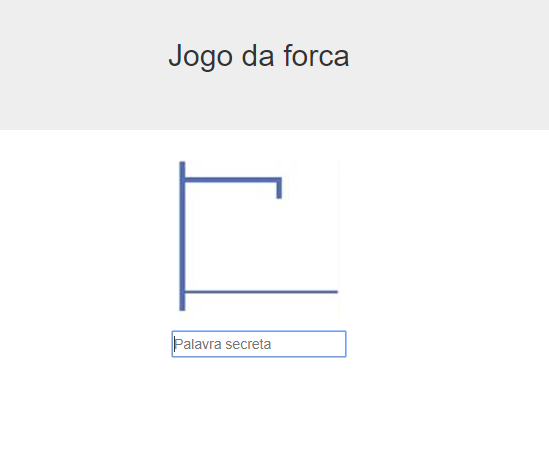
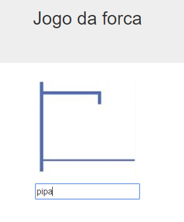
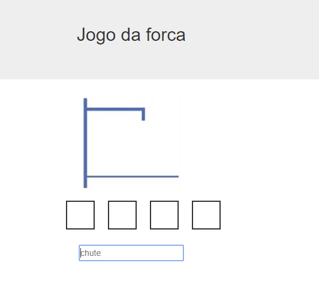

<h1>Imagens do Projeto Desenvolvido - Jogo da Forca (gallows)</h1>






----------------------------------------------------------------------------------------------------
<h1>Seção 01 - Introdução</h1>


Seja bem-vindo! Meu nome é Flávio Almeida (twitter: @flaviohalmeida) e muito provavelmente já nos encontramos em outros cursos da Alura. Desta vez, estou aqui para propor um desafio de nível intermediário. Você gosta de desafio?

O desafio é a construção de um jogo utilizando todo o seu conhecimento adquirido na carreira de Desenvolvedor JavaScript.

Um desafio
Para que o desafio realmente exista, adotaremos um fluxo um tanto diferente. Você primeiro receberá as instruções do que deve ser feito para só depois consultar opcionalmente a solução do instrutor. Caberá a você decidir o quanto se dedicará ao problema a ser resolvido antes de consultar o gabarito. Aliás, a solução do instrutor é uma entre as dezenas de soluções possíveis e a melhor solução será aquela desenvolvida por você! Vai encarar?

Colocando em prática seu conhecimento adquirido
A boa notícia é que você pode recorrer a qualquer momento aos cursos que compões a carreira desenvolvedor javascript. Na data de criação deste treinamento, são eles:

HTTP: Entendendo a web por baixo dos panos

JavaScript: Programando na linguagem da web

Curso jQuery: Domine a biblioteca mais popular do mercado

Curso jQuery: Avance na biblioteca mais popular do mercado parte 2

Expressões regulares: Capturando textos de forma mágica

Nossas carreiras evoluem e não se preocupe se novos cursos forem introduzidos na carreira, você só precisará focar nos que foram listados anteriormente para concluir o desafio. E falando em desafio, que desafio é esse?

O projeto
Nós criaremos um jogo da forca. Em um primeiro momento, pode lhe parecer que o escopo do projeto é pequeno, mas você verá que precisará da bagagem adquirida na carreira desenvolvedor javascript.

Agora que você já sabe até onde chegaremos, faça o primeiro exercício obrigatório do capítulo. Nele você baixará o projeto com as imagens e os scripts necessários que serão utilizados durante o curso. Uma maneira cômoda para baixá-los.

Sucesso e bom estudo, meus alunos.

A página gallows.html possui a seguinte estrutura. Ela exibe alguns elementos na tela e importa os CSS que utilizaremos, inclusive o script do jQuery:
```html
<!DOCTYPE html>
<html lang="pt-br">
<head>
    <meta charset="UTF-8">
    <meta name="viewport" content="width=device-width">
    <link rel="stylesheet" href="css/bootstrap.min.css">
    <link rel="stylesheet" href="css/sprite.css">
    <link rel="stylesheet" href="css/lacuna.css">
    <title>Jogo da Forca</title>
</head>
<body>
    <div class="jumbotron">
        <h2 class="text-center">Jogo da forca</h2>
    </div>
    <div class="container">

        <!-- div com a classe sprite -->
        <div class="sprite"></div>

        <ul class="lacunas text-center"></ul>

        <div class="text-center">
        <input id="entrada" 
            class="entrada"
            placeholder="Palavra secreta" autofocus>
        </div>
    </div>

    <script src="js/jquery.min.js"></script>
</body>
</html>
```
O nome gallows significa "forca" em inglês. Nada de mais, apenas para deixar o projeto mais chique.

Entrevistas de emprego
Não é raro o candidato a uma vaga precisar programar na frente de um avaliador para mostrar suas capacidades com determinada linguagem. Na maioria das vezes, o que é avaliado é a capacidade de organização do código do candidato. Para quem esta começando na carreira de programador JavaScript, este curso visa consolidar o que foi aprendido, mas também ensina uma maneira bem estrutura de organizar o código. Aproveite!

<h2>Orientações Gerais</h2>

Durante a criação do projeto, temos algumas regras que precisamos seguir. Vejamos:

A construção da aplicação será feita em etapas e o aluno não poderá pular, adiantar ou perverter a ordem estipulada em cada capítulo.

Durante cada etapa, haverá uma estrutura a ser seguida (nomes de funções, variáveis), mas a implementação da solução será responsabilidade do aluno.

jQuery deve ser usado para toda manipulação do DOM.

Preparados?

-----------------------------------------------------------------------------------------
<h1>Seção 02 - Sprite</h1>

<h2>Sprite - PARTE 1</h2>
O projeto que baixamos tem como finalidade definir uma estrutura comum a ser seguida durante todo o curso. Para a comodidade do desenvolvedor, ele já traz o jQuery e o Bootstrap para que possamos utilizá-los sem hiato em nossa aplicação. Todavia, vale destacar um arquivo muito especial, o gallows/img/sprite.jpeg, um sprite com os nove estágios do jogo da força:

sprite.jpeg
Sprite com os nove estágios do jogo da forca, gallows game
Orientações gerais
Não podemos simplesmente exibir a imagem na integra em gallows/index.html, pois não fará muito sentido para quem esta jogando. A ideia é começarmos exibindo o primeiro frame do sprite e pular para o próximo apenas quando o usuário errar o chute da letra da palavra secreta. Você não poderá usar canvas para animar o sprite, toda animação será feita através da adição e remoção de classes do mundo CSS através de uma lógica JavaScript.

Para que o aluno foque no essencial, o arquivo gallows/css/sprite.css já traz todas as classes necessárias para essa tarefa. Vamos escrutinar o arquivo:
```html
.sprite {
    background: url(../img/sprite.jpeg) no-repeat;
    width: 162.6px;
    height: 160.5px;
    margin: 0 auto;
}

.frame1 { background-position: 0 0; }

.frame2 { background-position: 25% 0; }

.frame3 { background-position: 50% 0; }

.frame4 { background-position: 75% 0; }

.frame5 { background-position: 100% 0; }

.frame6 { background-position: 0 100%; }

.frame7 { background-position: 25% 100%; }

.frame8 { background-position: 50% 100%; }

.frame9 { background-position: 75% 100%; }
```
A classe sprite é aquela que ao ser aplicada em um elemento container como uma div exibirá a imagem. Ela deve estar sempre acompanhada de uma classe que indique seu frame atual. Por exemplo, se quisermos exibir o quinto frame do sprite teremos:

<div class="sprite frame5"></div>
Para pularmos para o próximo frame basta substituirmos a classe frame5 por frame6 e assim por diante. É possível realizar as mudanças adicionando e removendo as classes manualmente através da inspeção de elementos do DOM para podermos visualizar o resultado que desejamos.

Padrão a seguir
Neste capítulo, isolaremos toda a lógica de operação do sprite no arquivo gallows/js/sprite.js. Você precisará seguir uma regra ao implementar sua solução.

REGRA: seu sprite deve ser criado através da função createSprite. Ela deve receber como parâmetro o seletor CSS do elemento container na qual os frames do sprite serão apresentados. Seu retorno será um objeto com a função nextFrame(). Para cada chamada da função, o próximo frame deverá ser exibido, inclusive a função deverá cuidar para nunca exceder o limite de 9 frames utilizados pela aplicação.

Por fim, seu gallows/index.html deverá estar desta forma, usando um temporizador para exibir cada frame a cada meio segundo. Um verdadeiro teste para verificar se a sua implementação de createSprite funciona como da maneira especificada:
```html
<!DOCTYPE html>
<html lang="pt-br">
<head>
    <meta charset="UTF-8">
    <meta name="viewport" content="width=device-width">
    <link rel="stylesheet" href="css/bootstrap.min.css">
    <link rel="stylesheet" href="css/sprite.css">
    <link rel="stylesheet" href="css/lacuna.css">
    <title>Jogo da Forca</title>
</head>
<body>
    <div class="jumbotron">
        <h2 class="text-center">Jogo da forca</h2>
    </div>
    <div class="container">

        <!-- div com a classe sprite -->
        <div class="sprite"></div>
        <ul class="lacunas text-center"></ul>

        <div class="text-center">
        <input id="entrada" 
            class="entrada"
            autofocus>
        </div>
    </div>
    <script src="js/jquery.min.js"></script>
    <script src="js/sprite.js"></script>
    <script>

        var sprite = createSprite('.sprite');
        setInterval(function () {
            sprite.nextFrame();
        }, 500);

    </script>
</body>
</html>
```
Antes de continuar, certifique-se de que a estrutura do seu HTML esteja igual ao que acabei de modificar. Sua única responsabilidade será criar o arquivo sprite.js na pasta correta e implementá-lo para que o comportamento esperado seja atingido.

<h2>Gabarito - PARTE 1</h2>
Dentro do arquivo gallows/js/sprite.js vamos criar a função createSprite(). Ela receberá o seletor do elemento que exibirá os frames do nosso sprite. Inclusive, já vamos buscar o elemento e guardar na variáve $el. Alguns programadores utilizam o prefixo $ para indicar que a variável guarda um jQuery Object, padrão que utilizarei:

function createSprite(selector) {

    var $el = $(selector);   
}
Utilizaremos o inglês durante a construção do nosso script. Evite misturar inglês com o português dentro de um mesmo script.

Excelente, temos o elemento do DOM encapsulado pelo jQuery que precisaremos iteragir e aplicar cada frame do sprite, alias, vamos aproveitar e criar um array que guardará uma string com o nome de cada frame declarado em sprite.css:
```html
function createSprite(selector) {

    let $el = $(selector);

    var frames = [
        'frame1', 'frame2', 'frame3', 'frame4', 'frame5',
        'frame6', 'frame7', 'frame8', 'frame9'
    ];
}
```
É importante sabermos qual é o frame atual, inclusive o útimo frame, pois não podemos exceder a quantidade de frames do array.
```html
function createSprite(selector) {

    var $el = $(selector);

    var frames = [
        'frame1', 'frame2', 'frame3', 'frame4', 'frame5',
        'frame6', 'frame7', 'frame8', 'frame9'
    ];

    var current = 0;

    var last = frames.length -1;    
}
```
Quando a função createSprite() for invocada, logo de cara, precisará adicionar a primeira classe que representa um frame em nosso elemento do DOM. Fazemos isso facilmente através do jQuery com o método addClass():
```html
function createSprite(selector) {

    var $el = $(selector);

    var frames = [
        'frame1', 'frame2', 'frame3', 'frame4', 'frame5',
        'frame6', 'frame7', 'frame8', 'frame9'
    ];

    var current = 0;

    var last = frames.length -1; 

    $el.addClass(frames[current]);  
}
```
Agora, vamos definir a função nextFrame(), aquela que ao ser chamada mudará o estado de current para o próximo frame disponível. Não basta ele adicionar a classe do próximo frame, ele precisa também remover a classe anterior:
```html
function createSprite(selector) {

    var $el = $(selector);

    var frames = [
        'frame1', 'frame2', 'frame3', 'frame4', 'frame5',
        'frame6', 'frame7', 'frame8', 'frame9'
    ];

    var current = 0;

    var last = frames.length -1; 

    $el.addClass(frames[current]);  

    function nextFrame() {

        $el.removeClass(frames[current])
            .addClass(frames[++current]);
    }
}
```

<h2>Gabarito - PARTE 2 - Melhorando a legibilidade</h2>
Qual é a intenção do código dentro da função nexFrame()? Não é mover do frame atual para o próximo? Podemos deixar isso claro em nosso código extraindo esse trecho para uma função:
```html
function createSprite(selector) {

    var $el = $(selector);

    var frames = [
        'frame1', 'frame2', 'frame3', 'frame4', 'frame5',
        'frame6', 'frame7', 'frame8', 'frame9'
    ];

    var current = 0;

    var last = frames.length - 1;

    $el.addClass(frames[current]);

    // pode ter qualquer frame como origem e qualquer frame como destino!

    function moveFrame (from, to) {

        $el.removeClass(from)
            .addClass(to);
    }

    function nextFrame() {

        /* 
            Usou o pré-incremento ++current, incrementa current antes de 
            passar para a função moveFrame
        */

        moveFrame(frames[current], frames[++current]);
    }
}
```
Agora que já temos a função nextFrame() pronta, precisamos fazer com que createFrame retorne um objeto JavaScript que possua essa função. Fazemos isso desta forma:
```html
function createSprite(selector) {

    var $el = $(selector);

    var frames = [
        'frame1', 'frame2', 'frame3', 'frame4', 'frame5',
        'frame6', 'frame7', 'frame8', 'frame9'
    ];

    var current = 0;

    var last = frames.length -1; 

    $el.addClass(frames[current]);  

    function moveFrame (from, to) {

        $el.removeClass(from)
            .addClass(to);
    }

    function nextFrame() {

        moveFrame(frames[current], frames[++current]);
    }

    return {
        nextFrame: nextFrame
    };
}
```

<h2>Gabarito - PARTE 3 - Revisão Closure</h2>
Vale recapitular um conceito importante do JavaScript, o conceito de closure. O objeto retornado por createSprite guarda em uma de suas propriedades a função nextFrame() criada internamente em createSprite. Tanto isso é verdade que nossa intenção é usar a função desta forma:

// exemplo apenas
var sprite = createSprite('.sprite');
sprite.nextFrame();
Isso só funcionará, porque a função sprite.nextFrame() tem acesso ao contexto de createSprite() e a todas as variáveis e funções declaradas neles mesmo depois de createSprite() ter terminado de executar. Sendo assim, a chamada de sprite.nextFrame() que chama por debaixo dos panos moveFrame() e que modifica ao estado da variável current está se valendo deste recurso da linguagem JavaScript.

<h2>Gabarito - PARTE 4 - a lógica do hasNext()</h2>
Isso já é suficiente para podermos ver a exibição de cada sprite a cada meio segundo. Todavia, há um problema ainda. Não podemos exceder a quantidade de frames definida no array. Isso significa que ao toda vez que nextFrame() for chamado, ele precisará verificar se ainda há o próximo frame. Havendo, mudamos para o próximo frame, caso contrário, ficamos no frame atual, no caso, o último frame do sprite que apresenta a forca completa.

Vamos criar a função hasNext():
```html
function createSprite(selector) {

    var $el = $(selector);

    var frames = [
        'frame1', 'frame2', 'frame3', 'frame4', 'frame5',
        'frame6', 'frame7', 'frame8', 'frame9'
    ];

    var current = 0;

    var last = frames.length - 1;

    $el.addClass(frames[current]);

    function moveFrame (from, to) {

        $el.removeClass(from)
            .addClass(to);
    }

    function hasNext() {

        return current + 1 <= last;
    }

    function nextFrame() {

        if (hasNext()) moveFrame (frames[current], frames[++current]);
    }

    return { nextFrame: nextFrame };
}
```
Excelente, nosso sprite ao chegar ao último frame fica parado. Por fim, podemos organizar um pouco melhor nosso código movendo para o início do bloco da função createSprite as funções utilitárias que criamos:
```html
function createSprite(selector) {

    function hasNext() {

        return current + 1 <= last;
    }

    function moveFrame (from, to) {

        $el.removeClass(from)
            .addClass(to);
    }

    function nextFrame() {

        if (hasNext()) moveFrame (frames[current], frames[++current]);
    }

    var $el = $(selector);

    var frames = [
        'frame1', 'frame2', 'frame3', 'frame4', 'frame5',
        'frame6', 'frame7', 'frame8', 'frame9'
    ];

    var current = 0;

    var last = frames.length - 1;

    $el.addClass(frames[current]);

    return { nextFrame: nextFrame };
}
```

<h2>Gabarito - PARTE 5 - revisão function declaration vs function expression</h2>
Excelente, terminamos nosso sprite. Todavia, mudarei ligeiramente o código. Todas as funções que criamos foram criadas através de function declaration. Isto é, usamos a palavra reservada function seguida do nome da função. Há outra forma de definirmos funções através de *function expression. Essa forma consiste em atribuir para a variável o corpo de uma função. Alterando todo o nosso código temos:
```html
var createSprite = function(selector) {

    var hasNext = function() {

        return current + 1 <= last;
    }

    var moveFrame = function(from, to) {

        $el.removeClass(from)
            .addClass(to);
    }

    var nextFrame = function() {

        if (hasNext()) moveFrame (frames[current], frames[++current]);
    }

    var $el = $(selector);

    var frames = [
        'frame1', 'frame2', 'frame3', 'frame4', 'frame5',
        'frame6', 'frame7', 'frame8', 'frame9'
    ];

    var current = 0;

    var last = frames.length - 1;

    $el.addClass(frames[current]);

    return { nextFrame: nextFrame };
}
```
A troca de function declaration para function expression foi uma questão de gosto deste instrutor. Todavia, há uma ligeira diferente entre as duas abordagem que revisarei aqui.

Quando criarmos uma função através de function declaration, mesmo que tenhamos definido a função no meio ou no final do nosso script elas serão sempre içadas para o topo do script. Se declaramos uma função dentro da outra, elas serão içadas para o início da função. Esse procedimento se chamada function hoisting (içamento de função). Vejamos um exemplo menos:
```html
exibeNome();

function exibeNome() {

    alert('Flávio Almeida');
}
```
O código acima funciona como esperado, porque antes que o interpretador execute nosso código, ele modificará a sua estrutura para:
```html
function exibeNome() {

    alert('Flávio Almeida');
}

exibeNome();
```
Todavia, se mudarmos a declaração do nosso código para function expression ele não funcionará:
```html
exibeNome(); // não funcionará, exibeNome é undefined

var exibeNome = function() {

    alert('Flávio Almeida');
}
```
Isso acontece porque o JavaScript iça também para o topo as declarações de variáveis, mas apenas sua declaração, sem qualquer inicialização. Para o interpretador JavaScript seu código ficará estará assim:
```html
var exibeNome; // içou a declaração da variável

exibeNome(); // repare que não há qualquer valor

exibeNome = function() {

    alert('Flávio Almeida');
}
```
Com este exemplo, fica claro a diferença entre as duas abordagens. Este instrutor prefere a segunda forma porque força o desenvolvedor a declarar as expressão de função antes do seu uso, o que é mais compreensível. Além disso, essa forma abre espaço para outras melhorias que fogem o escopo do ECMASCRIPT 5 e entram no escopo do ES2015 (ES6). No final do curso teremos um bônus no qual eu migrarei todo código para ES2015 para que o aluno veja como essa atualização do JavaScript pode ajudá-lo a escrever um código ainda melhor, além de indicar quais cursos de outras carreiras o aluno deve procurar para adiquirir esse conhecimento.

Por fim, o setInterval proposto para testar nosso sprite funcionará como esperado. Ao final do teste, você pode removê-lo.

<h2>Sprite - PARTE 2</h2>
Até este ponto temos uma maneira isolada de controlar as mudanças de frame do nosso sprite. Todavia, você ainda precisará:

Implementar a função reset() para voltar nosso sprite para o estado inicial que é a exibição do primeiro frame.
Implementar a função isFinished() que deve retornar true ou false para sabermos que o sprite chegou ao fim, isto é, se chegou até o seu último frame válido.
O papel da função reset()
Para testar a função reset(), vamos apagar a tag script com nosso teste do setInterval. A ideia é executar as seguintes instruções através do console do navegador:


        var sprite = createSprite('.sprite');
        sprite.nextFrame();
        sprite.nextFrame();
        sprite.nextFrame();
        sprite.reset(); // volta a exibir o primeiro frame
        sprite.nextFrame(); // vai para o próximo frame
O papel da função isFinished()
Para testar o isFinished(), faremos no console do Navegador:


        var sprite = createSprite('.sprite');
        sprite.nextFrame();
        sprite.nextFrame();
        sprite.isFinished(); // false
        sprite.nextFrame();
        sprite.nextFrame();
        sprite.nextFrame();
        sprite.nextFrame();
        sprite.nextFrame();
        sprite.nextFrame();
        sprite.nextFrame();
        sprite.isFinished(); // true
Mãos na massa!

<h2>Gabarito</h2>
Vamos criar a função reset(). Seu papel será substituir a classe do frame atual pelo frame inicial. Além disso, deve mudar o estado de current para 0. Não podemos esquecer de adicionar a função reset no objeto retornado por createSprite():
```html
var createSprite = function(selector) {

    var hasNext = function() {

        return current + 1 <= last;
    };

    var moveFrame = function(from, to) {

        $el.removeClass(from).addClass(to);
    };

    var nextFrame = function() {

        if (hasNext()) moveFrame(frames[current], frames[++current]);
    };

    var reset = function() {

        moveFrame(frames[current], frames[0])
        current = 0;
    };

    var $el = $(selector);

    var frames = [
        'frame1', 'frame2', 'frame3', 'frame4', 'frame5',
        'frame6', 'frame7', 'frame8', 'frame9'
    ];

    var current = 0;

    var last = sprites.length - 1;

    $el.addClass(frames[current]);

    return { nextFrame: nextFrame, reset: reset };
}
```
Para testarmos a função reset(), vamos alterar gallows/index.html e deixar apenas a instrução que chama createSprite(). Como a variável esta no escopo global, vamos acessá-la através do terminal. Nosso HTML ficará assim:
```html
<!DOCTYPE html>
<html lang="pt-br">
<head>
    <meta charset="UTF-8">
    <meta name="viewport" content="width=device-width">
    <link rel="stylesheet" href="css/bootstrap.min.css">
    <link rel="stylesheet" href="css/sprite.css">
    <link rel="stylesheet" href="css/lacuna.css">
    <title>Jogo da Forca</title>
</head>
<body>
    <div class="jumbotron">
        <h2 class="text-center">Jogo da forca</h2>
    </div>
    <div class="container">

        <!-- div com a classe sprite -->
        <div class="sprite"></div>
        <ul class="lacunas text-center"></ul>

        <div class="text-center">
        <input id="entrada" 
            class="entrada"
            autofocus>
        </div>
    </div>
    <script src="js/jquery.min.js"></script>
    <script src="js/sprite.js"></script>
    <script>

        var sprite = createSprite('.sprite');
    </script>
</body>
</html>
```
Agora, no console do navegador, podemos fazer assim:

sprite.nextFrame();
sprite.nextFrame();
sprite.nextFrame();
sprite.reset();
sprite.nextFrame();
Agora só falta a função isFinihed, aquela que indica se o sprite chegou ao fim ou não.

```html
var createSprite = function(selector) {

    var hasNext = function() {

        return current + 1 <= last;
    };

    var moveFrame = function(from, to) {

        $el.removeClass(from).addClass(to);
    };

    var nextFrame = function() {

        if (hasNext()) moveFrame(frames[current], frames[++current]);
    };

    var reset = function() {

        moveFrame(frames[current], frames[0])
        current = 0;
    };

    // nova função!

    var isFinished = function() {

        return !hasNext();
    };  

    var $el = $(selector);

    var frames = [
        'frame1', 'frame2', 'frame3', 'frame4', 'frame5',
        'frame6', 'frame7', 'frame8', 'frame9'
    ];

    var current = 0;

    var last = sprites.length - 1;

    $el.addClass(frames[current]);

    // adicionou isFinihed no objeto retornado
    return { nextFrame: nextFrame, reset: reset, isFinished: isFinished };
}
```
Para testar, faremos a mesma coisa no console:

sprite.nextFrame();
sprite.nextFrame();
sprite.nextFrame();
sprite.nextFrame();
sprite.nextFrame();
sprite.nextFrame();
sprite.nextFrame();
sprite.nextFrame();
sprite.nextFrame();
sprite.isFinished();


<h1>Seção 03 - Lógica do Jogo</h1>

<h2>Jogo - PARTE 1</h2>

Nosso projeto fará uma separação marcante entre a lógica do jogo e sua apresentação (manipulação de DOM) e neste capítulo você precisará abordar o primeiro, a lógica do jogo. Não se preocupe caso você nunca tenha realizado essa divisão antes, pois a estrutura mínima necessária será passada para você. É importante que você não se afaste dessa estrutra. Já a implementação da lógica dentro dessa estrutura será de sua responsabilidade.

Crie o arquivo gallows/js/jogo.js e importe-o logo após do script sprite.js em gallows/index.html. Antes de liberá-lo para a implementação do código, siga os meus passos a seguir.

Estrutura: separação entre a lógica e sua apresentação
A primeira coisa que farei é usar a mesma estratégia que usamos com sprite.js, a diferença é que escreverei os nomes de todas as funções em português:

A API publica do nosso jogo, isto é, as funções que podem ser chamadas no objeto retornado por criaJogo() deverá ter essa estrutura:
```html
var criaJogo = function() {

    // recebe a palavra secreta e deve atribuí-la à variável `palavraSecreta`. Vai para a próxima etapa
    var setPalavraSecreta = function (palavra) {
        console.log('falta implementar');    
    };

    // retorna as lacunas do jogo. Importante para quem for exibí-las.
    var getLacunas = function () {
        console.log('falta implementar');    
    };

    // retorna a etapa atual do jogo
    var getEtapa = function () {
        console.log('falta implementar');    
    };
};
```
Se você como programador achar que é necessário criar mais funções por uma questão de manutenção e legibilidade fique à vontade.

Excelente, mas ainda precisamos fazer mais coisa. Para que você entenda com clareza até onde eu quero chegar, abrirei no navegador o projeto com esta parte já implementada. A página só importa jogo.js e nada mais. É através do console do navegador que interagiremos com nosso jogo.

Primeiro, vamos criar nosso jogo:

var jogo = criaJogo();
Excelente, temos uma variável jogo que guarda um objeto JavaScript que possui uma série de funções que dizem respeito ao jogo. Sabemos que um dos primeiro passos que o jogador executará é informar a palavra secreta. Esse passo é feito em nossa API de jogo através da chamada da função jogo.setPalavraSecreta():

var jogo = criaJogo();
console.log(jogo.getEtapa()); // 1
jogo.setPalavraSecreta('calopsita');
Internamente, a função setPalavraSecreta deve atribuir o palavra recebida como parâmetro e guardá-la na variável palavraSecreta, além disso, deve criar as lacunas em branco. Lembre-se que o tamanho do array lacunas deve ter o mesmo tamanho da palavra secreta informada. Por fim, o jogo deve ir para a próxima etapa, que é a leitura dos chutes. Como você implementará essa parte fica ao seu critério, mas o importante é que siga a estrutura aqui definida. Inclusive, podemos testar se o array de lacunas foi criado corretamente através da função getLacunas():

var jogo = criaJogo();
console.log(jogo.getEtapa()); // 1
jogo.setPalavraSecreta('calopsita');
console.log(jogo.getEtapa()); // 2
console.log(jogo.getLacunas()); // ['', '', '', '', '', '', '', '', '']
Ótimo, mas para que possamos acessar essas funções através de um objeto a função iniciaJogo deve retornar um objeto com essas funções. Por fim, a estrutura mínima de inciaJogo() ficará assim:
```html
var criaJogo = function() {

    var setPalavraSecreta = function (palavra) {
        console.log('falta implementar');    
    };

    var getLacunas = function () {
        console.log('falta implementar');    
    };

    var getEtapa = function () {
        console.log('falta implementar');    
    };

    return {

        setPalavraSecreta: setPalavraSecreta, 
        getLacunas: getLacunas,
        getEtapa: getEtapa
    };
};
```
A lógica do nosso jogo ainda esta longe de terminar, mas isso é o suficiente para este vídeo. Você deve chegar até este ponto. Lembre-se que você poderá consultar minha resposta, mas faça isso depois de tentar resolver o problema primeiro.

<h2>Gabarito</h2>
Uma solução possível é a seguinte:
```html
var criaJogo = function () {

    var etapa = 1;
    var lacunas = [];
    var palavraSecreta = '';

    // adiciona uma lacuna em branco para cada letra da palavraSecreta
    var criaLacunas = function () {
        for (let i = 0; i < palavraSecreta.length; i++) {
            lacunas.push('');
        }
    };

    // muda o estado da variável etapa para indicar a próxima e última etapa
    var proximaEtapa = function () {

        etapa = 2;
    };

    // guarda a palavra secreta, cria as lacunas e vai para a próxima etapa
    var setPalavraSecreta = function (palavra) {

        palavraSecreta = palavra;
        criaLacunas();
        proximaEtapa();
    };

    // única maneira de termos acesso às lacunas fora da função `criaJogo()`
    var getLacunas = function () {

        return lacunas;
    };

    // permite consultar em qual etapa o jogo se encontra
    var getEtapa = function () {

        return etapa;
    };

    /* 
    Tornou acessível apenas as funções que fazem sentido serem chamadas por quem utilizar nosso jogo. 
        A função `proximaEtapa()` é de uso interno e só foi criada para melhorar a legibilidade e manutenção do código, a 
        mesma coisa para a função `criaLacunas()`. 
    */    
    return {
        setPalavraSecreta: setPalavraSecreta, 
        getLacunas: getLacunas,
        getEtapa: getEtapa
    }
};
```

<h2>Outra maneira para preencher lacunas</h2>
Para criarmos um array de lacunas, fizemos:
```html
var criaLacunas = function () {
    for (let i = 0; i < palavraSecreta.length; i++) {
        lacunas.push('');
    }
};
```
No entanto, podemos evitar o loop for da seguinte maneira:
```html
var criaLacunas = function () {

    lacunas = Array(palavraSecreta.length).fill('');
};
```
Quando fazemos Array(palavraSecreta.length) estamos criando um array com o mesmo tamanho da string palavraSecreta. Todavia, todos os elementos serão undefined. Resolvemos isso facilmente através da função fill():

Array(palavraSecreta.length).fill('')
Uma forma mais enxuta e com estética mais funcional do que a primeira.

<h2>Jogo - PARTE 2</h2>
Nosso jogo já consegue chegar até a segunda etapa. Sabemos que é nesta etapa que o jogador informa o seu chute e que nosso jogo tem que ser capaz de preencher corretamente seu array lacunas com a letra informada, inclusive exibir o próximo sprite da forca caso ele erre. Nesse sentido, nossa função criaJogo() precisará receber como parâmetro um sprite. Vamos aproveitar e adicionar o esqueleto da função processaChute, aquela que lerá o chute do jogador e atualizará lacunas:

// recebe sprite como parâmetro
```html
var criaJogo = function (sprite) {

    var etapa = 1;
    var lacunas = [];
    var palavraSecreta = '';

    var criaLacunas = function () {

        for (let i = 0; i < palavraSecreta.length; i++) {
            lacunas.push('');
        }
    };

    var proximaEtapa = function () {

        etapa = 2;
    };

    var setPalavraSecreta = function (palavra) {

        palavraSecreta = palavra;
        criaLacunas();
        proximaEtapa();
    };

    var getLacunas = function () {

        return lacunas;
    };

    var getEtapa = function () {

        return etapa;
    };

    // preencher lacuna ou exibe o próximo sprite. Retorna true ou false caso o jogador tenha acertado
    var processaChute = function() {
        console.log('falta implementar');

    };

    // adicionou na propriedade do objeto
    return {
        setPalavraSecreta: setPalavraSecreta, 
        getLacunas: getLacunas,
        getEtapa: getEtapa,
        processaChute: processaChute
    }
};
```
Separando dependências
Talvez você esteja se perguntando porque eu não chamei criaSprite('.sprite) dentro de criaJogo() evitando assim passar um parâmetro para esta função. Essa abordagem permite a troca do sprite utilizado pela aplicação. Hoje, usamos o sprite de uma forca, talvez alguém queria usar outro sprite com uma conotação menos sombria. Sendo assim, quem criar um sprite com as mesmas funções que definimos ao criar nosso primeiro sprite poderá utilizá-lo em nosso jogo sem ter que mexer em sua lógica.

Mais uma vez, abrirei o projeto com esta parte pronta e os testes que devem ser realizados para que possamos ver qual será o resultado esperado:
```html
<!DOCTYPE html>
<html lang="pt-br">
<head>
    <meta charset="UTF-8">
    <meta name="viewport" content="width=device-width">
    <link rel="stylesheet" href="css/bootstrap.min.css">
    <link rel="stylesheet" href="css/sprite.css">
    <link rel="stylesheet" href="css/lacuna.css">
    <title>Jogo da Forca</title>
</head>
<body>
    <div class="jumbotron">
        <h2 class="text-center">Jogo da forca</h2>
    </div>
    <div class="container">
        <div class="sprite"></div>
        <ul class="lacunas text-center"></ul>

        <div class="text-center">
        <input id="entrada" 
            class="entrada"
            placeholder="Palavra secreta" autofocus>
        </div>
    </div>

    <script src="js/jquery.min.js"></script>
    <script src="js/sprite.js"></script>
    <script src="js/jogo.js"></script>
    <script>
        var jogo = criaJogo(createSprite('.sprite'));
        jogo.setPalavraSecreta('calopsita');
        console.log(jogo.getLacunas()); // ['', '', '', '', '', '', '', '', '']
        jogo.processaChute('a');
        console.log(jogo.getLacunas()); // ['', 'a', '', '', '', '', '', '', 'a']
        jogo.processaChute('c');
        console.log(jogo.getLacunas()); // ['c', 'a', '', '', '', '', '', '', 'a']
        jogo.processaChute('z'); // próximo sprite deve ser exibido
    </script>
</body>
</html>
```

<h2>Gabarito</h2>
Dentro da função processaChute, declararei três variáveis. A primeira receberá uma expressão regular criada a partir do chute informado pelo jogador. Nessa expressão, utilizo o modificador gi. O modificador g é para realizar uma pesquisa global, isto é, mesmo que ele faça o match da expressão na primeira letra, a expressão continuará sendo aplicada até o fim do texto, no caso, nosso alvo será palavraSecreta. O modificador i é para indicar que não estamos levando em consideração na comparação se a letra esta em maiúscula ou minúscula. A variável resultado guardará o resultado na nossa expressão regular e por fim acertou será um marcador para sabermos se o jogador acertou ou não a letra.
```html
var processaChute = function (chute) {

    var exp = new RegExp(chute, 'gi');
    var resultado;    
    var acertou = false;
};
```
Declaração de variáveis mais sucinta
Todavia, podemos simplificar a declaração dessas variáveis da seguinte maneira:
```html
var processaChute = function (chute) {

    var exp = new RegExp(chute, 'gi')
        , resultado
        , acertou = false;
};
```
Vejam que só precisei declarar var uma única vez. Muito bem, agora precisamos utilizar o poder da expressão regular. Não basta sabermos se a letra que o jogador chutou existe ou não em palavraScreta, precisamos saber em qual posição ela esta para que possamos atualizar o array de lacunas nesta posição com o chute.

Faremos um teste no console do navegador vermos como utilizaremos a expressão:

palavraSecreta = 'calopsita';
exp = new RegExp('a', 'gi');
exp.exec(palavraSecreta) // saída ["a", index: 1, input: "calopsita"]
exp.exec(palavraSecreta) // saída ["a", index: 8, input: "calopsita"]
exp.exec(palavraSecreta) // null, não encontrou mais nada
Como podemos ver, a cada chamada de exp.exec() recebemos um objeto JavaScript com uma série de propriedades. Uma delas é a posição na qual o chute aparece, ou seja, o index. A cada chamada de exp.exec() recebemos um novo match até que seja retornado null para indicar que a avaliação chegou ao fim.

Com base no que cabamos de constatar no console, vamos utilizar um while para automatizar esse processo:
```html
var processaChute = function (chute) {

    var exp = new RegExp(chute, 'gi')
        , resultado
        , acertou = false;

    while (resultado = exp.exec(palavraSecreta)) {
        lacunas[resultado.index] = chute;
    }
};
```
Enquando o while estiver sendo executado, é porque há match. Então, em seu bloco, acessamos a posição lacunas[resultado.index] e nela atribuímos o chute. Perfeito, pois essa abordagem conseguirá preencher todas as lacunas de um determinado chute. E o erro? Precisamos saber no final do bloco while se houve algum erro ou não e, caso haja, precisaremos exibir o próximo frame do sprite da forca. Para isso faremos o seguinte:
```html
var processaChute = function (chute) {

    var exp = new RegExp(chute, 'gi')
        , resultado
        , acertou = false;

    while (resultado = exp.exec(palavraSecreta)) {
        acertou = true;
        lacunas[resultado.index] = chute;
    }

    if (!acertou) {
        sprite.nextFrame();
    }
};
```
O valor de acertou só será true se houver match, caso contrário, continuará como false. Se o usuário não acertou, chamamos sprite.nexFrame().

Todavia, podemos enxugar um pouco mais nosso código com duas mudanças:
```html
var processaChute = function (chute) {

    var exp = new RegExp(chute, 'gi')
        , resultado
        , acertou = false;

    while (resultado = exp.exec(palavraSecreta)) {

        acertou = lacunas[resultado.index] = chute;
    }

   if (!acertou) sprite.nextFrame();
};
```
A primeira é a instrução acertou = lacunas[resultado.index] = chute;. Nela, em uma tacada só, estamos atribuindo o chute à sua respectiva posição no array lacunas e guardamos o valor de lacunas na variável acertou. Em JavaScript, qualquer string diferente de branco como '' é considerado true. Outra mudança que fizemos foi remover o bloco da condição if. Aliás, podemos fazer a mesma coisa com o while:
```html
var criaJogo = function (sprite) {

    var etapa = 1;
    var lacunas = [];
    var palavraSecreta = '';

    var criaLacunas = function () {

        for (let i = 0; i < palavraSecreta.length; i++) {
            lacunas.push('');
        }
    };

    var proximaEtapa = function () {

        etapa = 2;
    };

    var setPalavraSecreta = function (palavra) {

        palavraSecreta = palavra;
        criaLacunas();
        proximaEtapa();
    };

    var getLacunas = function () {

        return lacunas;
    };

    var getEtapa = function () {

        return etapa;
    };

    var processaChute = function (chute) {

        var exp = new RegExp(chute, 'gi')
            , resultado
            , acertou = false;

        while (resultado = exp.exec(palavraSecreta)) 
            acertou = lacunas[resultado.index] = chute;

        if (!acertou) sprite.nextFrame();
    };

    return {
        setPalavraSecreta: setPalavraSecreta,
        getLacunas: getLacunas,
        getEtapa: getEtapa,
        processaChute: processaChute
    }
};
```
<h2>Jogo - PARTE 3</h2>

Nosso jogo ainda não sabe dizer se jogador ganhou ou perdeu, muito menos reiniciar a partida. Vamos adicionar o esqueleto de três novas funções: ganhou, perdeu, ganhouOuPerdeu, reinicia:
```html
var criaJogo = function (sprite) {

    var etapa = 1;
    var lacunas = [];
    var palavraSecreta = '';

    var criaLacunas = function () {

        for (let i = 0; i < palavraSecreta.length; i++) {
            lacunas.push('');
        }
    };

    var proximaEtapa = function () {

        etapa = 2;
    };

    var setPalavraSecreta = function (palavra) {

        palavraSecreta = palavra;
        criaLacunas();
        proximaEtapa();
    };

    var getLacunas = function () {

        return lacunas;
    };

    var getEtapa = function () {

        return etapa;
    };

    var processaChute = function (chute) {

        var exp = new RegExp(chute, 'gi')
            , resultado
            , acertou = false;

        while (resultado = exp.exec(palavraSecreta))
            acertou = lacunas[resultado.index] = chute;

        if (!acertou) sprite.nextFrame();
    };


    // novas funcionaliades que precisamos implementar

    var ganhou = function () {
        console.log('falta implementar');
    };

    var perdeu = function () {
        console.log('falta implementar');
    };

    var ganhouOuPerdeu = function () {
        console.log('falta implementar');
    };

    var reinicia = function () {
        console.log('falta implementar');
    };

    // adicionou novas propriedades
    return {
        setPalavraSecreta: setPalavraSecreta,
        getLacunas: getLacunas,
        getEtapa: getEtapa,
        processaChute: processaChute,
        ganhou: ganhou,
        perdeu: perdeu,
        ganhouOuPerdeu: ganhouOuPerdeu, 
        reinicia: reinicia
    }
};
```
Como você deve implementar a lógica dessas funções? Dessa vez não haverá dicas e você precisará usar o bom senso para resolver essa questão. Como de costume, vou demonstrar como essas funções devem se comportar realizando testes através do console com esta parte já implementada. Inclusive, você pode usar a mesma lógica de teste aqui para verificar seu código:
```html
<!DOCTYPE html>
<html lang="pt-br">
<head>
    <meta charset="UTF-8">
    <meta name="viewport" content="width=device-width">
    <link rel="stylesheet" href="css/bootstrap.min.css">
    <link rel="stylesheet" href="css/sprite.css">
    <link rel="stylesheet" href="css/lacuna.css">
    <title>Jogo da Forca</title>
</head>
<body>
    <div class="jumbotron">
        <h2 class="text-center">Jogo da forca</h2>
    </div>
    <div class="container">
        <div class="sprite"></div>
        <ul class="lacunas text-center"></ul>

        <div class="text-center">
        <input id="entrada" 
            class="entrada"
            placeholder="Palavra secreta" autofocus>
        </div>
    </div>

    <script src="js/jquery.min.js"></script>
    <script src="js/sprite.js"></script>
    <script src="js/jogo.js"></script>
    <script>
        var jogo = criaJogo(createSprite('.sprite'));
        console.log(jogo.getEtapa()); // 1
        jogo.setPalavraSecreta('calopsita');
        console.log(jogo.ganhouOuPerdeu()); // false
        jogo.processaChute('c');
        jogo.processaChute('a');
        jogo.processaChute('l');
        jogo.processaChute('o');
        jogo.processaChute('p');
        jogo.processaChute('s');
        jogo.processaChute('i');
        jogo.processaChute('t');
        console.log(jogo.ganhouOuPerdeu()); // true
        console.log(jogo.ganhou()); // true
        console.log(jogo.perdeu()); // true
        jogo.reinicia();
        console.log(jogo.getLacunas());
        console.log(jogo.getEtapa());
        jogo.setPalavraSecreta('calopsita');
        jogo.processaChute('z');
        jogo.processaChute('z');
        jogo.processaChute('z');
        jogo.processaChute('z');
        jogo.processaChute('z');
        jogo.processaChute('z');
        jogo.processaChute('z');
        jogo.processaChute('z');
        jogo.processaChute('z');
        console.log(jogo.ganhouOuPerdeu()); // true
        console.log(jogo.ganhou()); // false
        console.log(jogo.perdeu()); // true

    </script>
</body>
</html>
```

<h2>Gabarito</h2>
Vamos começar pela implementação da função ganhou. Como saberemos se o jogador ganhou ou não? Basta verificarmos se lacunas não possui nenhum item com o valor ''. Podemos fazer isso facilmente com auxílio da função some() que todo array possui no ECMASCRIPT 5 em diante. Ela funcina da seguinte maneira. Se algum (some) item do array retornar true para a condição que definimos no callback passado para a função, ela parará imediatamente de iterar e retornará true como resposta. Se o array for iterado até o fim e a condição não for atendida, será retornado false.
```html
    var ganhou = function () {

        return lacunas.length 
            ? !lacunas.some(function(lacuna) {
                return lacuna == '';
            })
            : false;
    };
```
Para cada lacuna do array verificamos se ela é igual a ''. Se for, é porque o array de lacunas esta incompleto e some() retornará true. Se não houver nenhuma lacuna com o valor '' o retorno de some será false. Todavia, precisamos inverter o resultado, pois para sabermos se o jogador ganhou, false deve ser considerado true, pois nenhuma lacuna em branco foi encontrada.

Para sabermos se o jogador perdeu, basta consultarmos sprite.isFinished(). Lembre-se que esta função retorna true caso o sprite já tenha chegado ao fim:
```html
var perdeu = function () {

    return sprite.isFinished();
};
```
Agora fica fácil implementar a função ganhouOuPerdeu():

```html
var ganhouOuPerdeu = function () {

    return ganhou() || perdeu();
};
```
Por fim, a função reinicia() deve alterar o estado da aplicação para o mesmo estado quando iniciamos o jogo:
```html
var reinicia = function () {

    etapa = 1;
    palavraSecreta = '';
    lacunas = [];
    sprite.reset();
};
```
Veja que foi necessário chamar sprite.reset() para fazer com que ele volte para o primeiro sprite.

Nosso código final ficará assim:
```html
var criaJogo = function (sprite) {

    var etapa = 1;
    var lacunas = [];
    var palavraSecreta = '';

    var criaLacunas = function () {

        for (let i = 0; i < palavraSecreta.length; i++) {
            lacunas.push('');
        }
    };

    var proximaEtapa = function () {

        etapa = 2;
    };

    var setPalavraSecreta = function (palavra) {

        palavraSecreta = palavra;
        criaLacunas();
        proximaEtapa();
    };

    var getLacunas = function () {

        return lacunas;
    };

    var getEtapa = function () {

        return etapa;
    };

    var processaChute = function (chute) {

        var exp = new RegExp(chute, 'gi')
            , resultado
            , acertou = false;

        while (resultado = exp.exec(palavraSecreta))
            acertou = lacunas[resultado.index] = chute;

        if (!acertou) sprite.nextFrame();
    };

    var ganhou = function () {

        return lacunas.length 
            ? !lacunas.some(function(lacuna) {
                return lacuna == '';
            })
            : false;
    };


    var perdeu = function () {

        return sprite.isFinished();
    };

    var ganhouOuPerdeu = function () {

        return ganhou() || perdeu();
    };

    var reinicia = function () {

        etapa = 1;
        palavraSecreta = '';
        lacunas = [];
        sprite.reset();
    };

    return {
        setPalavraSecreta: setPalavraSecreta,
        getLacunas: getLacunas,
        getEtapa: getEtapa,
        processaChute: processaChute,
        ganhou: ganhou,
        perdeu: perdeu,
        ganhouOuPerdeu: ganhouOuPerdeu,
        reinicia: reinicia
    }
};
```

----------------------------------------------------------------------------------------------------------
<h1>Seção 04 - A lógica de apresentação</h1>

<h2>Apresentação - PARTE 1</h2>

Padrão a seguir
Chegou a hora de implementarmos a lógica de apresentação do jogo, até porque, precisamos exibir para o usuário o estado do jogo para que ele possa interagir com ele.

Usaremos a mesma estratégia que já utilizamos anteriormente. Vamos criar o arquivo gallows/js/controller.js.

Separando dependências, mais uma vez
Nele, criaremos a função criaController que receberá como parâmetro um objeto que representa nosso jogo. Lembre-se que já criamos a função criaJogo() que gera esse objeto para nós.
```html
var criaController = function (jogo) {

    var $entrada = $('#entrada');
    var $lacunas = $('.lacunas');

};
```
Nossa função declara em seu escopo as variáveis $entrada e $lacunas. O prefixo $ é utilizado para deixar claro para quem esta lendo o código que elas armazenam objetos criados através do jQuery. Não é a toa que utilizamos $('#entrada') e $('.lacunas') para selecionarmos o campo de entrada do jogador e a lista de lacunas. Fica evidente que o primeiro é para podermos capturar o que o jogador digitou, já o segundo, não tão evidente assim, é a <ul class="lacunas">, aquela que receberá dinamicamente elementos do tipo <li> que exibirão cada item do array de jogo.getLacunas().

Da mesma maneira que fizemos no capítulo anterior, seguem as funções que precisaremos implementar. Elas lidarão com a captura da palavra secreta, exibição das lacunas com base nessa palavra e mudará o texto da propriedade placeholder de $entrada para que estejamos visualmente preparados para entrarmos na etapa de chute:
```html
var criaController = function (jogo) {

    var $entrada = $('#entrada');
    var $lacunas = $('.lacunas');

    // consulta jogo.getLacunas() e exibe para o usuário cada lacuna 

    var exibeLacunas = function () {
        console.log('falta implementar');
    };

    // muda o texto do placeHolder do campo de entrada    
    var mudaPlaceHolder = function (texto) {

        console.log('falta implementar');
    };

    // passa para jogo.setPalavraSecreta() o valor digitado pelo jogador e chama o a função `exibeLacunas()` e `mudaPlaceHolder()` definidas no controller. 

    var guardaPalavraSecreta = function () {

        console.log('falta implementar');
    };

    // faz a associação do evento keypress para capturar a entrada do usuário toda vez que ele teclar ENTER
    var inicia = function () {

        console.log('falta implementar');
    };

    // retorna um objeto com a propriedade inicia, que deve ser chamada assim que o controller for criado. 
    return { inicia: inicia };
};
```
O ponto de partida é a função inicia(). Ela deve ser capaz de adicionar o evento keypress em $entrada. Todavia, só podemos computar o evento se o usuário pressionar a tela ENTER. Além disso, ele deve ser inteligente para saber em qual etapa do jogo estamos para lidar diferentemente com a entrada do usuário, pois pode ser que ele esteja na primeira etapa (palavraSecreta) ou segunda etapa (chute).

O papel da função inicia()
Nesse sentido, já temos o código de inicia() pronto, como ponto de partida. O código inicial deve estar assim:
```html
var criaController = function (jogo) {

    var $entrada = $('#entrada');
    var $lacunas = $('.lacunas');

    var exibeLacunas = function () {
        console.log('falta implementar');
    };

    var mudaPlaceHolder = function (texto) {

        console.log('falta implementar');
    };

    var guardaPalavraSecreta = function () {

        console.log('falta implementar');
    };

    var inicia = function () {

        $entrada.keypress(function (event) {
            if (event.which == 13) {
                switch (jogo.getEtapa()) {
                    case 1:
                        alert('etapa 1 - falta implementar');
                        break;
                    case 2:
                        alert('etapa 2 - falta implementar');
                        break;
                }
            }
        });
    }
    return { inicia: inicia };
};
```
O arquivo gallows/index.html:
```html
<!DOCTYPE html>
<html lang="pt-br">
<head>
    <meta charset="UTF-8">
    <meta name="viewport" content="width=device-width">
    <link rel="stylesheet" href="css/bootstrap.min.css">
    <link rel="stylesheet" href="css/sprite.css">
    <link rel="stylesheet" href="css/lacuna.css">
    <title>Jogo da Forca</title>
</head>
<body>
    <div class="jumbotron">
        <h2 class="text-center">Jogo da forca</h2>
    </div>
    <div class="container">
        <div class="sprite"></div>
        <ul class="lacunas text-center"></ul>

        <div class="text-center">
        <input id="entrada" 
            class="entrada"
            placeholder="Palavra secreta" autofocus>
        </div>
    </div>

    <script src="js/jquery.min.js"></script>
    <script src="js/sprite.js"></script>
    <script src="js/jogo.js"></script>
    <script src="js/controller.js"></script>
    <script>
        var sprite = createSprite('.sprite');
        var jogo = criaJogo(sprite);
        criaController(jogo);
    </script>
</body>
</html>
```
O mesmo código pode ser escrito da seguinte maneira, sem a necessidade de se declarar as variáveis sprite e jogo:
```html
<script>
    criaController(criaJogo(createSprite('.sprite'))).inicia();
</script>
```
Talvez essa estégica seja melhor para alguns:
```html
<script>
    criaController(
        criaJogo(
            createSprite('.sprite')
        )
    ).inicia();
</script>
```
Já somos capazes de ver o alert sendo exibido toda vez que clicarmos enter.

<h2>Gabarito</h2>
Vamos começar pela função guardaPalavraSecreta:
```html
var guardaPalavraSecreta = function () {

    // passa para o jogo o chute digitado pelo usuário
    jogo.setPalavraSecreta($entrada.val().trim());

    // limpa o campo de entrada 

    $entrada.val('');

    // exibe para o usuário as lacunas de jogo.getLacunas();
    exibeLacunas();

    // muda o texto do placeholder para `chute`.
    mudaPlaceHolder('chute');
};
```
Fica evidente que precisamos implementar as funções exibeLacunas() e mudaPlaceHolder(). Vamos implementar a última primeiro, devido a sua brevidade:
```html
var mudaPlaceHolder = function (texto) {

    $entrada
        .val('')
        .attr('placeholder', texto);
};
```
Usamos val('') para limpar o campo e attr() para mudarmos o valor de um atributo através do jQuery.

Agora, vamos para a implementação de exibeLacunas().

Sabemos que $lacunas é o jQuery Object que aponta para o elemento <ul class="lacunas"> de index.html. Precisamos adicionar dinamicamente as lacunas, mas antes de qualquer operação, faremos $lacunas.empty(). A função empty() remove todos os elementos filhos de um elemento pai. Estamos realizando este processo para garantirmos que toda vez que exibeLacunas for chamado, ele removerá todos os elementos já existentes para exibir elementos atualizados:
```html
var exibeLacunas = function () {

    $lacunas.empty();

};
```
Agora, vamos iterar em jogo.getLacunas() e para cada lacuna criaremos dinamicamente uma <li> com a classe lacuna e com texto o valor da lacuna que estamos iterando:
```html
    var exibeLacunas = function () {

        $lacunas.empty();
        jogo.getLacunas().forEach(function (lacuna) {
            $('<li>')
                .addClass('lacuna')
                .text(lacuna)
                .appendTo($lacunas);
        });
    };
```
Vamos entender essas instruções. Através de forEach, estamos iterando na lista retornada por jogo.getLacunas(). Para cada lacuna, criamos uma <li> dinamicamente através de $('<li>'). Vejam, não é um seletor CSS, mas uma tag passada como parâmetro para a função do jQuery e essa mudança já é suficiente para que o JQuery entenda que estamos criando um novo elemento. Em seguida, encadeamos as funções addClass e text para adicionarmos a classe lacuna e o texto da lacuna que estamos iterando. Por fim, através de appendTo indicamos em qual elemento do DOM desejamos adicionar o novo item que criamos, no caso, queremos adicionar em $lacunas, aquele elemento do DOM que referencia <li class="lacunas"> que inicializamos logo no início da chamada de iniciaController.

Excelente, isso já é suficiente para entrarmos com a palavra secreta e vermos as lacuans em branco sendo exibidas, inclusive a alteração do valor do place holder.

Nosso código final ficará assim:
```html
var criaController = function (jogo) {

    var $entrada = $('#entrada');
    var $lacunas = $('.lacunas');

    var exibeLacunas = function () {

        $lacunas.empty();
        jogo.getLacunas().forEach(function (lacuna) {
            $('<li>')
                .addClass('lacuna')
                .text(lacuna)
                .appendTo($lacunas);
        });
    };

    var mudaPlaceHolder = function (texto) {

        $entrada
            .val('')
            .attr('placeholder', texto);
    };

    var guardaPalavraSecreta = function () {

        jogo.setPalavraSecreta($entrada.val().trim());
        $entrada.val('');
        exibeLacunas();
        mudaPlaceHolder('chute');
    };

    var inicia = function () {

        $entrada.keypress(function (event) {
            if (event.which == 13) {
                switch (jogo.getEtapa()) {
                    case 1:
                        guardaPalavraSecreta();
                        break;
                    case 2:
                        leChute();
                }
            }
        });
    }

    return { inicia: inicia };
};
```
Menos é mais
Por incrível que parece, utilizamos muito pouco e pontualmente o jQuery. Quando o assunto é manipulação de DOM, menos é sempre mais!

<h2>Apresentação - PARTE 2</h2>
Chegou a hora de lidarmos com o chute. Para isso, precisaremos criar a função leChute. O esqueleto do nosso código com tudo o que já fizemos até agora fica assim:

var criaController = function (jogo) {

    var $entrada = $('#entrada');
    var $lacunas = $('.lacunas');

    var exibeLacunas = function () {

        $lacunas.empty();
        jogo.getLacunas().forEach(function (lacuna) {
            $('<li>')
                .addClass('lacuna')
                .text(lacuna)
                .appendTo($lacunas);
        });
    };

    var mudaPlaceHolder = function (texto) {

        $entrada
            .val('')
            .attr('placeholder', texto);
    };

    var guardaPalavraSecreta = function () {

        jogo.setPalavraSecreta($entrada.val().trim());
        $entrada.val('');
        exibeLacunas();
        mudaPlaceHolder('chute');
    };

    // esqueleto da função

    var leChute = function () {

       console.log('falta implementar');
    };


    var inicia = function () {

        $entrada.keypress(function (event) {
            if (event.which == 13) {
                switch (jogo.getEtapa()) {
                    case 1:
                        guardaPalavraSecreta();
                        break;
                    case 2:
                        // chama a função
                        leChute();
                        break;
                }
            }
        });
    }

    return { inicia: inicia };
};
A implementação de leChute ainda não entrará no mérito se o jogador acertou ou não. Ela deve ser capaz de exibir as lacunas atualizadas com o chute do jogador caso ele tenha acertado ou atualizar o sprite caso tenha errado. Lembre-se que a lógica de acertou ou erro foi definida em jogo.

<h2>Gabarito</h2>
A função leChute não possui qualquer lógica, a não ser a operação de leitura da entrada do usuário. Ela delega para outras funções o restante das operações:
```html
var leChute = function () {

    // lê a entrada do usuário
    jogo.processaChute($entrada.val().trim().substr(0, 1));

    // limpa a entrada do usuário
    $entrada.val('');
    // solicita ao jogo que processe o chute. Se errou, o próprio jogo solicita ao sprite que vá para o próximo frame

    // exibe as lacunas para refletir possíveis acertos
    exibeLacunas();
}
```
O código final ficará assim:
```html
var criaController = function (jogo) {

    var $entrada = $('#entrada');
    var $lacunas = $('.lacunas');

    var exibeLacunas = function () {

        $lacunas.empty();
        jogo.getLacunas().forEach(function (lacuna) {
            $('<li>')
                .addClass('lacuna')
                .append(lacuna)
                .appendTo($lacunas);
        });
    };

    var mudaPlaceHolder = function (texto) {

        $entrada
            .val('')
            .attr('placeholder', texto);
    };

    var guardaPalavraSecreta = function () {

        jogo.setPalavraSecreta($entrada.val().trim());
        $entrada.val('');
        exibeLacunas();
        mudaPlaceHolder('chute');
    };

    var leChute = function () {

        var chute = $entrada.val().trim().substr(0, 1);
        $entrada.val('');
        jogo.processaChute(chute);
        exibeLacunas();
    };

    var inicia = function () {

        $entrada.keypress(function (event) {
            if (event.which == 13) {
                switch (jogo.getEtapa()) {
                    case 1:
                        guardaPalavraSecreta();
                        break;
                    case 2:
                        leChute();
                        break;
                }
            }
        });
    }

    return { inicia: inicia };
};
```

<h2>Apresentação - PARTE 3</h2>
Até agora, visualmente, o jogador não sabe se ganhou ou perdeu. Este teste deve ser feito a cada chute. Aliás, já temos a função leChute e só precisamos adicionar nesta função a lógica de acertou ou perdeu nela. Você utilizará a função alert() para exibir a mensagem de sucesso ou fracasso. Por fim, independente se o jogador ganhou ou perdeu, reiniciaremos o jogo. Mãos na massa!

<h2>Gabarito</h2>
Vamos começar pela função reinicia():
```html
    var reinicia = function () {

        // limpa todas as lacunas
        $lacunas.empty();
        // volta para a mensagem da etapa 1
        mudaPlaceHolder('Palavra secreta');
        // solita ao jogo que reinicia 
        jogo.reinicia();
    };
```
Agora, vamos implementar a lógica de ganhou ou perda em leChute():
```html
    var leChute = function () {

        var chute = $entrada.val().trim().substr(0, 1);
        $entrada.val('');
        jogo.processaChute(chute);
        exibeLacunas();

        if (jogo.ganhouOuPerdeu()) {
            if (jogo.ganhou()) {
                alert('Ganhou!');
            } else if (jogo.perdeu()) {
                alert('Uma pena, tente novamente.');
            }
            reinicia();
        }
    };
```
Resolvendo o problema da atualização do DOM
No entanto, apesar de funcional, dependendo do navegador, pode ser que as mensagens sejam exibidas antes da atualização na tela do último chute realizado pelo usuário. Para evitarmos que isso aconteça, atrasar a exibição das mensagens em 200 milissegundos será suficiente para que o último chute seja renderizado. Nosso código final ficará assim:
```html
var criaController = function (jogo) {

    var $entrada = $('#entrada');
    var $lacunas = $('.lacunas');

    var exibeLacunas = function () {

        $lacunas.empty();
        jogo.getLacunas().forEach(function (lacuna) {
            $('<li>')
                .addClass('lacuna')
                .text(lacuna)
                .appendTo($lacunas);
        });
    };

    var mudaPlaceHolder = function (texto) {

        $entrada
            .val('')
            .attr('placeholder', texto);
    };

    var guardaPalavraSecreta = function () {

        jogo.setPalavraSecreta($entrada.val().trim());
        $entrada.val('');
        exibeLacunas();
        mudaPlaceHolder('chute');
    };

    var leChute = function () {

        var chute = $entrada.val().trim().substr(0, 1);
        $entrada.val('');
        jogo.processaChute(chute);
        exibeLacunas();

        if (jogo.ganhouOuPerdeu()) {

            setTimeout(function () {
                if (jogo.ganhou()) {
                    alert('Ganhou!');
                } else if (jogo.perdeu()) {
                    alert('Uma pena, tente novamente.');
                }
                jogo.reinicia();
                reinicia();
            }, 200);
        }
    };

    var reinicia = function () {

        $lacunas.empty();
        mudaPlaceHolder('Palavra secreta');
        jogo.reinicia();
    };

    var inicia = function () {

        $entrada.keypress(function (event) {
            if (event.which == 13) {
                switch (jogo.getEtapa()) {
                    case 1:
                        guardaPalavraSecreta();
                        break;
                    case 2:
                        leChute();
                        break;
                }
            }
        });
    }

    return { inicia: inicia };
};
```

<h2>Lidando com dados inválidos</h2>
Nossa aplicação esta pronta, mas o que acontecerá se o usuário teclar ENTER sem definir a palavra secreta, inclusive na hora do chute? Nossa aplicação não se comportará bem, entrará em um loop infinito e travará. Para resolver isso, podemos colocar uma lógica de validação em nosso jogo.

Nas funções processaChute e setPalavaSecreta podemos lançar uma exceção:
```html
var processaChute = function (chute) {
   if(!chute.trim()) throw Error('Chute inválido');
   // código posterior omitido
};
var setPalavraSecreta = function (palavra) {
   if(!palavra.trim()) throw Error('Palavra inválida');
   // código posterior omitido
};
```
Agora, toda vez que o usuário executar a operação inválida, a aplicação não travará e será exibida no console a mensagem de erro. Mas será que podemos exibí-la para ele?

Podemos capturar no controller os erros lançados pelas funções com uso do try e catch. Nosso código ficará assim:
```html
var criaController = function (jogo) {

    var $entrada = $('.entrada');
    var $lacunas = $('.lacunas');

    var exibeLacunas = function () {
        $lacunas.empty();
        jogo.getLacunas().forEach(function (lacuna) {
            $('<li>')
                .addClass('lacuna')
                .text(lacuna)
                .appendTo($lacunas);
        });
    };

    var mudaPlaceHolder = function (texto) {

        $entrada.attr('placeholder', texto);
    };

    var guardaPalavraSecreta = function () {

        try {
            jogo.setPalavraSecreta($entrada.val().trim());
            $entrada.val('');
            mudaPlaceHolder('chuta');
            exibeLacunas();
        } catch(err) {
            alert(err.message);
        }

    };

    var reinicia = function() {

        jogo.reinicia();
        $lacunas.empty();
        mudaPlaceHolder('palavra secreta');
    };

    var leChute = function () {

        try {
            jogo.processaChute($entrada.val().trim().substr(0, 1));
            $entrada.val('');
            exibeLacunas();

            if(jogo.ganhouOuPerdeu()) {

                setTimeout(function() {
                    if(jogo.ganhou()) {
                        alert('Parabéns, você ganhou');
                    } else if (jogo.perdeu()) {
                        alert('Que pena, tente novamente')
                    }
                    reinicia();                    
                }, 200);
            }
        } catch(err) {
            alert(err.message);
        }
    };

    var inicia = function () {

        $entrada.keypress(function (event) {
            if (event.which == 13) {
                switch (jogo.getEtapa()) {
                    case 1:
                        guardaPalavraSecreta();
                        break;
                    case 2:
                        leChute();
                        break;
                }
            }
        });
    };

    return { inicia: inicia };
};
```
Todavia, lembre-se que código assíncrono não pode ser capturado com try e catch, porque ele roda fora da pilha de execução do nosso código.

<h2>Com fácil manutenção, podemos deixar ainda melhor nossa aplicação</h2>

Nossa aplicação esta pronta, mas ela pode ficar ainda melhor. Por exemplo, podemos recusar uma palavra secreta se ela não tiver um tamanho mínimo, ou quem sabe aumentarmos a dificuldade do jogo pulando de dois em dois frames no lugar de um. O mais importante neste ponto é reconhecer onde essas alterações seriam necessárias e pela estrutura do nosso problema isso fica fácil.

Lembre-se que o maior tempo de vida de uma aplicação é sua fase de manutenção e, escrever um código fácil de ler e de manter, é garantir a longo prazo o sucesso da aplicação.

Outro ponto interessante, é como isolamos a lógica do jogo sem misturá-la com manipulação de DOM, fica mais fácil testar o core do nosso jogo em ferramentas de testes como Jasmine. Inclusive a Alura possui curso dessa ferramenta!

----------------------------------------------------------------------------------------------
<h1>Seção 05 - Bônus: indo além com ES2015(ES6)</h1>

Apesar de a carreira na qual este projeto faz parte não abordar ES2015 (ES6) podemos modificar nosso código para que use alguns dos recursos desta nova versão. Alura possui cursos de ES6 que podem agregar ainda mais no seu cabedal de conhecimento. Aqui, faremos um preview do que você pode aprender conosco.

let e const
A partir do ECMASCRIT 2015 (ES6) foi introduzida duas novas sintaxes para substituir declaração de variáveis com var, são elas let e const. Todavia, quais problemas elas vêm resolver?

Vejamos um simples exemplo:
```html
for(var i = 1; i <= 10; i++) {
    console.log(i);
}
```
console.log(i); // qual será o valor de i?
No exemplo anterior, qual será o valor da última instrução? Se você respondeu 11 acertou. Em linguagens como C ou Java i não seria acessível fora do bloco do for, diferente em JavaScript, pois variáveis declaradas com var possuem escopo de função e não de bloco, mesmo quando declaradas dentro de um bloco.

Outro ponto a destacar de var é que variáveis declaradas com elas podem ser redeclaradas sem que o interpretador reclame (a não ser que o "use strict"; seja adicionado no script ativando um modo mais criterioso). Vejamos:
```html
var nome = 'cangaceiro';
nome = 'Flávio';
var nome = 'Almeida'; // é aceito!
```
Podemos resolver esses dois problemas que acabamos de ver declarando as variáveis com let:
```html
for(let i = 1; i <= 10; i++) {
    console.log(i);
}
```
console.log(i); // erro, não é acessível fora do bloco fort
let nome = 'cangaceiro';
nome = 'Flávio';
let nome = 'Almeida'; // erro, não pode declarar novamente uma variável que já foi declarada
Excelente, e onde entra o const nessa história? Quando usado, ele não permite que seja mais utilizado o perador = para atriburi um novo valor a variável. Vejamos:

const ID = 10;
ID = 100; // erro, não pode atribuir um novo valor
Como não podemos usar o operador = mais de uma vez, somos obrigados a atribuir o valor da variável, ou seja, somos obrigado a declará-la e inicializá-la ou teremos um erro.

Então, dentro do que acabamos de ver, podemos usar let e const em diversos pontos do nosso código. Vejamos:
```html
const criaJogo = function(sprite) {

    let etapa = 1;
    let lacunas = [];
    let palavraSecreta = '';

    const criaLacunas =  function() {

        for (let i = 0; i < palavraSecreta.length; i++) {
            lacunas.push('');
        }
    };

    const proximaEtapa = function() {
        etapa = 2;
    };

    const setPalavraSecreta = function (palavra) {

        palavraSecreta = palavra;
        criaLacunas();
        proximaEtapa();
    };

    const getLacunas = function () {

        return lacunas;
    };

    const getEtapa = function () {

        return etapa;
    }

    const processaChute = function(chute) {
        // atenção, precisou separar const e var, porque resultado não é inicializada
        const exp = new RegExp(chute, 'gi');
        var resultado
            ,acertou = false;

        while (resultado = exp.exec(palavraSecreta))
            acertou = lacunas[resultado.index] = chute;

        if (!acertou) sprite.nextFrame();
    };

    const ganhou = function() {

        return !lacunas.some(function(lacuna) {
            return lacuna == ''
        });
    };

    const perdeu = function () {

        return sprite.isFinished();
    };

    const ganhouOuPerdeu = function () {

        return ganhou() || perdeu();
    };

    const reinicia = function () {

        etapa = 1;
        palavraSecreta = '';
        lacunas = [];
        sprite.reset();
    };

    return {
        setPalavraSecreta: setPalavraSecreta,
        getLacunas: getLacunas,
        getEtapa: getEtapa, 
        processaChute: processaChute, 
        ganhou: ganhou,
        perdeu: perdeu,
        ganhouOuPerdeu: ganhouOuPerdeu,
        reinicia: reinicia
    };
};
```
Faz sentido nossas declarações de funções serem declaradas com const porque não queremos que alguém acidentalmente atribua um novo valor para elas. Já a variável current que precisa ser incrementada precisa ser declarada com let, isto porque tanto o pós e pré incrementos são um atalho para o uso do operador =.

Agora, podemos ver outro recurso do ES2015 (ES6) que pode nos ajudar a escrever um código mais enxuto.

Arrow function
Excelente, mas podemos lançar mão das arrow functions que inicialmente é uma forma mais sucinta de declarar funções, mas nos cursos avançados de JavaScript aqui da Alura que abordam esse recurso você verá que há algumas diferenças. Todavia, para nosso programa, entender que são uma forma sucinta já é suficiente.

Veja como uma de nossas funções declaradas com arrow function (se você não declarou as funções como expressão, não poderá usar arrow function, ou seja, não há function declaration com arrow function, apenas function expression):
```html
const perdeu = () => {

    return sprite.isFinished();
};
```
Agora, a processaChute:
```html
const processaChute = (chute) => {

    const exp = new RegExp(chute, 'gi');
    var resultado
        ,acertou = false;

    while (resultado = exp.exec(palavraSecreta))
        acertou = lacunas[resultado.index] = chute;

    if (!acertou) sprite.nextFrame();
};
```
Quando uma arrow function possui apenas um parâmetro, podemos omitir os parânteses:
```html
const processaChute = chute => {

    const exp = new RegExp(chute, 'gi');
    var resultado
        ,acertou = false;

    while (resultado = exp.exec(palavraSecreta))
        acertou = lacunas[resultado.index] = chute;

    if (!acertou) sprite.nextFrame();
};
```
Uma outra característica é quando o bloco de uma arrow function possui apenas uma instrução, podemos remover seu bloco e colocar a instrução diretamente sem a necessidade de utilizar return que já é considerado implicitamente nesta forma abreviada de declaração. Vejamos como perdeu() ficará:

const perdeu = () => sprite.isFinished();
Nosso código com arrow function fica assim:
```html
const criaJogo = sprite => {

    let etapa = 1;
    let lacunas = [];
    let palavraSecreta = '';

    const criaLacunas = () => {

        for (let i = 0; i < palavraSecreta.length; i++) {
            lacunas.push('');
        }
    };

    const proximaEtapa = () => etapa = 2;

    const setPalavraSecreta = palavra => {

        palavraSecreta = palavra;
        criaLacunas();
        proximaEtapa();
    };

    const getLacunas = () => lacunas;

    const getEtapa = () => etapa;

    const processaChute = chute => {

        const exp = new RegExp(chute, 'gi');
        var resultado
            ,acertou = false;

        while (resultado = exp.exec(palavraSecreta))
            acertou = lacunas[resultado.index] = chute;

        if (!acertou) sprite.nextFrame();
    };

    const ganhou = () => !lacunas.some(lacuna => lacuna == '');

    const perdeu = () => sprite.isFinished();

    const ganhouOuPerdeu = () => ganhou() || perdeu();

    const reinicia = () => {

        etapa = 1;
        palavraSecreta = '';
        lacunas = [];
        sprite.reset();
    };

    return {

        setPalavraSecreta: setPalavraSecreta,
        getLacunas: getLacunas,
        getEtapa: getEtapa, 
        processaChute: processaChute, 
        ganhou: ganhou,
        perdeu: perdeu,
        ganhouOuPerdeu: ganhouOuPerdeu,
        reinicia: reinicia
    };
};
```
Atalho para declaração de objetos literais
Vamos lançar nosso olhar para a última instrução de criaJogo(), aquela que retorna um objeto com algumas propriedades:
```html
return {
    setPalavraSecreta: setPalavraSecreta,
    getLacunas: getLacunas,
    getEtapa: getEtapa, 
    processaChute: processaChute, 
    ganhou: ganhou,
    perdeu: perdeu,
    ganhouOuPerdeu: ganhouOuPerdeu,
    reinicia: reinicia
};
```
Quando declaramos um objeto com a sintaxe {} estamos declarando-o na forma literal. ES2015 (ES6) criou um atalho que pode ser usado toda vez que o nome da propriedade é igual ao nome da variável que será atribuída a propriedade. Nesse caso, basta declararmos a propriedade no objeto:
```html
return {
    setPalavraSecreta,
    getLacunas,
    getEtapa, 
    processaChute, 
    ganhou,
    perdeu,
    ganhouOuPerdeu,
    reinicia
};
```

<h2>O código do Sprite</h2>

Não há grandes novidades. Basta utilizarmos let e const onde se aplicarem e transformarmos nossas function expressions em arrow functions, inclusive usar o atalho para declaração de objetos na forma literal.
```html
const createSprite = selector => {

    const hasNext = () => current + 1 <= last;

    const moveFrameTo = (from, to) =>
        $el.removeClass(sprites[from])
            .addClass(sprites[to]);

    const nextFrame = () => {

        if (hasNext()) moveFrameTo(current, ++current);
    }

    const reset = () => {

        moveFrameTo(current, 0)
        current = 0;
    }

    const isFinished = () => !hasNext();

    const $el = $(selector);

    const sprites = [
        'frame1', 'frame2', 'frame3', 'frame4', 'frame5',
        'frame6', 'frame7', 'frame8', 'frame9'
    ];

    let current = 0;

    const last = sprites.length - 1;

    $el.addClass(sprites[current]);

    return { nextFrame, reset, isFinished };
}
```

Muito mais enxuto não?

<h2>O código do controller</h2>
Migrar o arquivo controller.js é aplicar as mesmas melhorias que realizamos nos scripts anteriores:
```html
const criaController = jogo => {

    const $entrada = $('#entrada');
    const $lacunas = $('.lacunas');

    const exibeLacunas = () => {

        $lacunas.empty();
        jogo.getLacunas().forEach(lacuna =>
            $('<li>')
                .addClass('lacuna')
                .text(lacuna)
                .appendTo($lacunas));
    };

    const mudaPlaceHolder = texto => 
        $entrada
            .val('')
            .attr('placeholder', texto);

    const guardaPalavraSecreta = () => {

        jogo.setPalavraSecreta($entrada.val().trim());
        $entrada.val('');
        exibeLacunas();
        mudaPlaceHolder('chute');
    };

    const leChute =  () => {

        var chute = $entrada.val().trim().substr(0, 1);
        $entrada.val('');
        jogo.processaChute(chute);
        exibeLacunas();

        if (jogo.ganhouOuPerdeu()) {

            setTimeout(() => {
                if (jogo.ganhou()) {
                    alert('Ganhou!');
                } else if (jogo.perdeu()) {
                    alert('Uma pena, tente novamente.');
                }
                jogo.reinicia();
                reinicia();
            }, 200);
        }
    };

    const reinicia = () => {

        $lacunas.empty();
        mudaPlaceHolder('Palavra secreta');
        jogo.reinicia();
    };

    const inicia = () => {

        $entrada.keypress(event => {

            if (event.which == 13) {
                switch (jogo.getEtapa()) {
                    case 1:
                        guardaPalavraSecreta();
                        break;
                    case 2:
                        leChute();
                        break;
                }
            }
        });
    }

    return { inicia: inicia };
};
```

