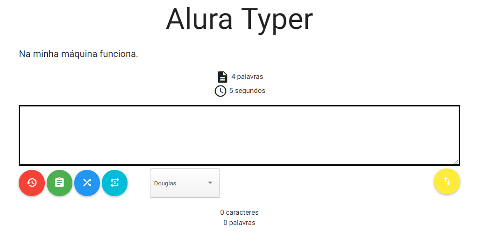
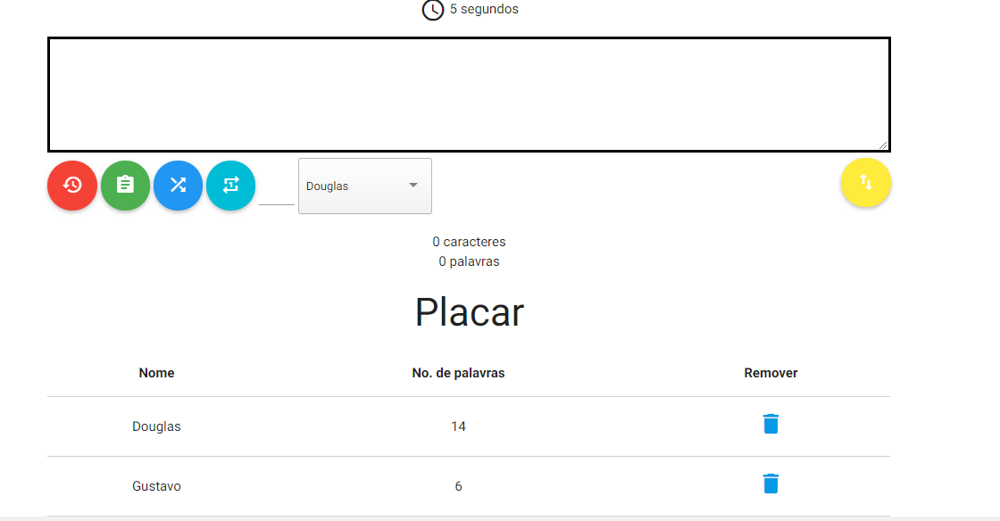
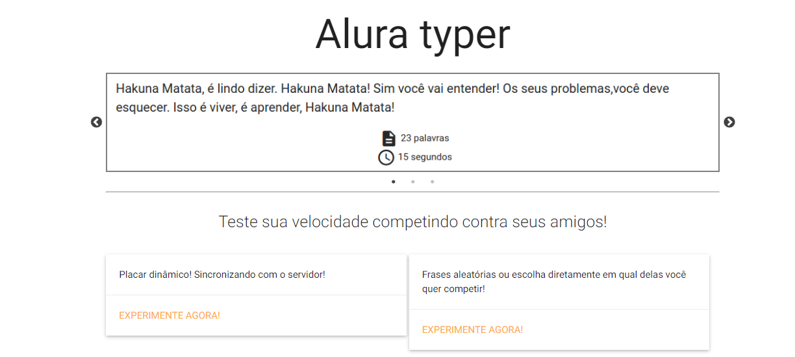
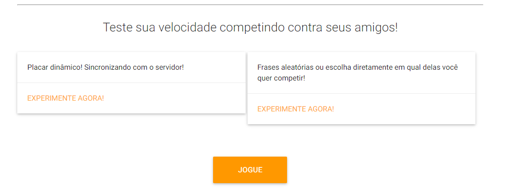

<h1>Imagens do Projeto</h1>






-------------------------------------------------------------------------
<h1>Seção 01 - Animaões com jQuery</h1>

<h2>Introdução</h2>

Seja bem-vindo ao módulo 2 do curso de jQuery. Aqui nós daremos continuidade ao nosso jogo Alura Typer. Nesse módulo focaremos em animações, de fade in, fade out, scroll, slide up e slide down. Vamos aprender a fazer AJAX utilizando as funções do jQuery, então nós iremos fazer requisições GET, POST, buscar e enviar dados para um servidor.

Também iremos ver os problemas mais comuns que os desenvolvedores encontram quando estão trabalhando com AJAX, de onde eles vêm e como nós os resolvemos. Além disso, estudaremos também alguns plug-ins do jQuery para melhorar algumas funcionalidades da nossa aplicação, logo veremos como adicionamos um plug-in no nosso projeto.

Tudo isso será visto ao longo deste módulo 2 do curso de jQuery, então vamos dar continuidade aos nossos estudos e colocar as mãos na massa!

<h2>Mostrando o placar</h2>

Quando começamos o jogo, no nosso placar não há nenhuma informação relevante para o usuário. O jogo poderia ser iniciado com o placar escondido, e com um botão para mostrá-lo ou escondê-lo. Então vamos dar essa opção ao usuário, ele que escolherá se quer ver o placar ou não.

Vamos começar adicionando um novo botão, do lado do botão de reiniciar. Então, na página principal.html, dentro da div botoes, adicionamos o botão:
```html
<div class="botoes">
    <a id="botao-reiniciar" class="btn-floating btn-large waves-effect waves-light red">
        <i class="material-icons">restore</i>
    </a>
    <!-- NOVO BOTÃO AQUI -->
    <a id="botao-placar" class="btn-floating btn-large waves-effect waves-light green">
        <i class="material-icons">assignment</i>
    </a>
</div>
```
Como queremos que o jogo comece com o placar escondido, precisamos alterar o seu CSS, mais precisamente a propriedade display. Então, no estilos.css, adicionamos:

.placar {
    display: none;
}
Agora, quando clicarmos no botão que adicionamos acima, o placar é mostrado. Para fazer isso, precisamos implementar um código JavaScript, e como esse código é referente ao placar, vamos adicioná-lo ao arquivo placar.js. Como o placar será mostrado quando clicarmos no botão, precisamos escutar o seu evento de click:

$("#botao-placar").click(mostraPlacar);
Agora precisamos implementar a função mostraPlacar, que como o nome já diz, será a função responsável por mostrar o placar:

$("#botao-placar").click(mostraPlacar);

function mostraPlacar() {

}
Uma das formas de mostrarmos o placar, é justamente alterar novamente a sua propriedade CSS display de none para block. Já sabemos como alterar uma propriedade CSS com o jQuery:

$("#botao-placar").click(mostraPlacar);

function mostraPlacar() {
    $(".placar").css("display", "block");
}
Agora podemos abrir a página principal.html no navegador, clicar no botão para mostrar o placar e perceber que o placar realmente é mostrado. Mas se clicarmos novamente no botão, o que acontece? Nada! O ideal é que se clicarmos novamente no botão, o placar seja escondido novamente. Logo, ao clicarmos no botão, se o placar estiver escondido, ele será exibido, se não estiver, ele será escondido.

Poderíamos fazer uma condição if para verificar o valor atual do display e invertê-lo. Mas como esse recurso de mostrar e esconder é tão comum, o jQuery já facilitou a nossa vida, criando a função show. Com isso não precisamos mais alterar o CSS no JavaScript:

$("#botao-placar").click(mostraPlacar);

function mostraPlacar() {
    $(".placar").show();
}
E para esconder algo, existe a função oposta, a hide:

$("#botao-placar").click(mostraPlacar);

function mostraPlacar() {
    $(".placar").hide();
}
Só que mais uma vez teríamos que fazer um if para verificar quando chamar a função show e quando chamar a função hide. Só que mais uma vez o jQuery facilita a nossa vida, criando a função toggle. Ela é semelhante à função toggleClass, que vimos no último módulo, que adiciona ou remove uma classe. Só que a toggle adiciona ou esconde um elemento:

$("#botao-placar").click(mostraPlacar);

function mostraPlacar() {
    $(".placar").toggle();
}
Agora nossa funcionalidade está pronta! Mas ela pode ficar ainda melhor. Podemos reparar que quando clicamos no botão para exibir o placar, nosso texto é deslocado levemente para a esquerda. Isso porque quando o placar é adicionado, a barra de rolagem do navegador também aparece, ocupando um espaço e deslocando o texto. Podemos resolver isso mexendo novamente no CSS, para que o espaço da barra de rolagem já venha na página, independente se houver placar ou não. Logo, adicionamos o seguinte código no estilos.css:

body {
    overflow: scroll;
}
Para melhorar mais ainda, podemos melhorar a exibição do placar, porque atualmente ele aparece de maneira abrupta na página. Podemos animar essa transição, deixando-a mais suave. Para isso, podemos ver a função slideDown, que tem a mesma funcionalidade que a função show, mas realiza a transição de uma maneira mais suave:

$("#botao-placar").click(mostraPlacar);

function mostraPlacar() {
    $(".placar").slideDown();
}
Podemos reparar agora que o placar é mostrado aos poucos, de uma maneira mais lenta. Se queremos deixar mais suave ainda, podemos passar um tempo em milissegundos por parâmetro para a função:

$("#botao-placar").click(mostraPlacar);

function mostraPlacar() {
    $(".placar").slideDown(600);
}
Além do slideDown, analogamente temos o slideUp, para mostrar um elemento. No nosso caso queremos alternar entre essas duas funções, para isso existe a função slideToggle:

$("#botao-placar").click(mostraPlacar);

function mostraPlacar() {
    $(".placar").slideToggle(600);
}
Agora conseguimos concluir a nossa nova funcionalidade!

O que aprendemos?
Como exibir um elemento com a função show e ocultá-lo com a função hide.
Como alternar entre as funções show e hide com a função toggle.
Como exibir e ocultar um elemento de uma maneira mais suave, com as funções slideDown e slideUp, respectivamente.
Como alternar entre as funções slideDown e slideUp com a função slideToggle.

<h2>Removendo com fade</h2>
Um outra funcionalidade da nossa aplicação que precisa de uma pequena animação é a remoção de linhas do placar. Quando removemos alguma linha do placar, é uma remoção abrupta, a linha desaparece, e não suavemente.

Para melhor experiência do usuário, o ideal seria que a linha fosse esmaecendo aos poucos, até chegar num ponto em que ela desapareça.

A função que é responsável por remover as linhas da tabela é a removeLinha, dentro do placar.js. Logo, é nela que precisamos alterar a nossa funcionalidade.

O jQuery já possui uma função que vai diminuindo a opacidade de um elemento aos poucos, até o seu total desaparecimento, essa função é a fadeOut. Então vamos utilizá-la no lugar a função remove:

function removeLinha() {
    event.preventDefault();
    $(this).parent().parent().fadeOut();
}
Podemos reparar agora que o elemento vai desaparecendo aos poucos, mas será que ele é removido mesmo? Podemos inspecionar o HTML da tabela, e para nossa surpresa a linha continua lá, o que mudou foi que o seu display está com valor none. Ou seja, o fadeOut vai removendo a opacidade do elemento até um ponto e depois modifica a sua propriedade display, fazendo com que o elemento desapareça da tela, mas continue no HTML.

Não é exatamente isso que queremos, queremos que o elemento também seja removido do HTML, então vamos chamar a função remove logo após a função fadeOut. Para melhorar a semântica do nosso código, vamos também exportar a linha a ser removida para uma variável:

function removeLinha() {
    event.preventDefault();
    var linha = $(this).parent().parent();

    linha.fadeOut();
    linha.remove();
}
Podemos testar novamente o nosso código, mas parece que o fadeOut não está funcionando! Na verdade, ele está acontecendo, só que o JavaScript imediatamente chama a função remove, não esperando o término do fadeOut acontecer. O certo é só chamarmos a função remove após a função fadeOut* terminar. E nós conseguimos fazer isso!

Primeiro, passamos um tempo em milissegundos por parâmetro para a função fadeOut, esse será o tempo de execução da função:

function removeLinha() {
    event.preventDefault();
    var linha = $(this).parent().parent();

    linha.fadeOut(1000);
    linha.remove();
}
E aguardamos 1 segundo para executar a função remove. Nós fazemos isso através da função , que recebe dois parâmetros: a função que desejamos executar após determinado tempo, e o próprio tempo que será aguardado para executar a função:

function removeLinha() {
    event.preventDefault();
    var linha = $(this).parent().parent();

    linha.fadeOut(1000);
    setTimeout(function() {
        linha.remove();
    }, 1000);
}
Então temos sempre que ter em mente que devemos remover um elemento após realizar o fadeOut, já que essa função só faz com que o elemento desapareça da tela, mas ainda fique no HTML da página.

Assim como existem o slideUp, slideDown e slideToggle, existem funções semelhantes que executam o fade, o fadeIn, fadeOut e fadeToggle, respectivamente.

O que aprendemos?
A função fadeOut, que vai esmaecendo o elemento até o ponto dele desaparecer, mas ele continua no HTML.


<h2>Melhorando a usabilidade</h2>
Já conseguimos ocultar e mostrar um placar através de um botão, mas o que acontece se clicarmos diversas vezes no botão, sem parar? A animação é realizada na mesma quantidade de vezes que o botão foi clicado. Logo, temos aqui um comportamento meio esquisito, mas como resolvemos isso? Nós paramos a animação antes de começar uma nova!

Como assim? Antes de realizarmos a animação, paramos a que estiver acontecendo através da função stop do jQuery. Essa função faz exatamente o que precisamos, a animação que estiver acontecendo no momento é interrompida, e uma próxima é iniciada. Então, no arquivo placar.js, a função mostraPlacar ficará assim:

function mostraPlacar() {
    $(".placar").stop().slideToggle(600);
}
Agora, ao clicarmos diversas vezes no botão do placar, a animação não será executada várias vezes, só será executada a última animação que nós chamamos!

O que aprendemos?
A função stop, para controlar melhor as nossas animações.

<h2>Animando o scroll</h2>

Um usuário que não conheça o nosso jogo, que esteja jogando pela primeira vez, pode ter a impressão de que, no momento que o jogo acaba, nada acontece. Seria muito bom que o placar seja aberto sempre que um jogo acabar, assim o usuário pode visualizar imediatamente a sua pontuação.

Só que não adianta apenas exibirmos o placar para o usuário, pois as pontuações ficam no final da página. O ideal seria que o placar seja aberto, e a página automaticamente seja scrollada para baixo, para a exibição completa do mesmo.

Se queremos fazer isso no momento em que o jogo termine, ou seja, no momento que a pontuação seja inserida no placar, precisamos alterar a função inserePlacar, no arquivo placar.js. Primeiramente queremos que o placar seja aberto, logo vamos dar um slideDown nele, como já fizemos anteriormente:

function inserePlacar() {
    var corpoTabela = $(".placar").find("tbody");
    var usuario = "Douglas"
    var numPalavras = $("#contador-palavras").text();

    var linha = novaLinha(usuario, numPalavras);
    linha.find(".botao-remover").click(removeLinha);

    corpoTabela.append(linha);

    // NOVA LINHA AQUI
    $(".placar").slideDown(500);
}
Agora toda vez que um jogo é finalizado, o placar é aberto. Falta apenas a página ser scrollada para baixo. Vamos separar essa feature em uma nova função, chamada scrollPlacar:

function scrollPlacar() {

}
Antes de darmos scroll para algum lugar, precisamos saber aonde esse lugar está na página, precisamos de uma referência. E para isso existe a função offset do jQuery. Ela nos dá a posição em que determinado elemento se encontra na página.

Se queremos achar em que posição o placar se encontra, basta selecionarmos-o e chamar a função offset:

$(".placar").offset();
Essa função nos retorna a distância em que o elemento está do topo e da esquerda da página. Se acessarmos o valor do topo (top), teremos o valor exato para onde queremos scrollar a página. Então, voltando à função scrollPlacar, obteremos esse valor:

function scrollPlacar() {
    var posicaoPlacar = $(".placar").offset().top;
}
Agora precisamos animar a nossa página. Para isso, precisamos ver primeiramente o que queremos animar. Queremos que a página inteira scrolle para baixo, página inteira, em outras palavras, significa que queremos que o body inteiro seja animado.

Para animar algo, utilizamos a função animate do jQuery. Ela recebe dois parâmetros, um objeto que contém as propriedades CSS a serem animadas e os seus valores, e o tempo de duração da animação. Vamos por partes, primeiro vamos dizer que a animação deve durar 1 segundo (1000 milissegundos):

function scrollPlacar() {
    var posicaoPlacar = $(".placar").offset().top;

    $("body").animate(
    {

    }, 1000);
}
Para conseguirmos fazer o scroll do body, utilizaremos a propriedade scrollTop, ela recebe um valor em pixels, que representa a posição da nossa página para onde desejamos scrollar a página.

Queremos que a página desça até a posição do placar, certo? E já temos acesso a esse valor, só que ele não está em pixels, ele é apenas um número! Então vamos concatenar esse valor à sigla px:

function scrollPlacar() {
    var posicaoPlacar = $(".placar").offset().top;

    $("body").animate(
    {
        scrollTop: posicaoPlacar + "px"
    }, 1000);
}
Ótimo, agora com a função scrollPlacar pronto, precisamos chamá-la logo depois que o placar é aberto, na função inserePlacar:

function inserePlacar() {
    var corpoTabela = $(".placar").find("tbody");
    var usuario = "Douglas"
    var numPalavras = $("#contador-palavras").text();

    var linha = novaLinha(usuario, numPalavras);
    linha.find(".botao-remover").click(removeLinha);

    corpoTabela.append(linha);

    $(".placar").slideDown(500);
    scrollPlacar();
}
Podemos abrir o jogo e verificar o novo comportamento. Assim que o jogo é finalizado quando o tempo se esgota, o placar é aberto e a página é posicionada, é scrollada até o placar.

O que aprendemos?
A trabalhar com a função animate, para animar qualquer propriedade do CSS.

<h2>Existem 1000 maneiras de se fazer...</h2>
Hélio criou a seguinte classe em um dos arquivos css do projeto:

.invisivel {
  display: none;
}
Ele também criou a seguinte estrutura HTML que possui uma lista de promoções:

```html
  <button id="botao-promocao">Promoções</button>
  <ul class="promocoes">
    <li>Bermuda de algodão</li>
    <li>Sandália de borracha</li>
  </ul>
  <script="jquery.js">
```
Ele deseja ora ocultar e ora exibir a lista de promoções toda vez que clicar no botão de promoções. Ou seja, se ele clicar no botão com a lista sendo exibida, a lista deve ser ocultada, se ele clicar com ela oculta, ela deve ser exibida.

Marque todas as opções abaixo que possui um código funcional que realiza a tarefa desejada por Hélio.
R:$('#botao-promocao').click(function() {

  var promocoes = $('.promocoes');
  if(promocoes.is(':visible')) {

    promocoes.hide();
  } else {
    promocoes.show();
  }

});
 
O jQuery possui a função is que permite consultar uma pseudo class. Toda vez que um elemento esta com display diferente de none ele ganha a pseudo classe :visible . A função is retorna true caso o elemento esteja visível. Se ele estiver visível, precisamos escondê-lo e isso é feito através da função hide. Para exibir o elemento, é usada a função show.

Alternativa correta
$('#botao-promocao').click(function() {

  $('.promocoes').toggleClass('invisivel');

});
 
A função toogleClass (não confundir com a função toggle) adiciona uma classe caso ela não exista no elemento. Se existir, ela remove a classe.

Alternativa correta
$('#botao-promocao').click(function() {

  $('.promocoes').toggle();

});
 
A função toggle é um atalho para as funções hide e show. Quando ela é chamada para um elemento visível, o elemento fica invisível. Quando é chamada para um elemento invisível, ela torna o elemento visível.

Alternativa correta
$('#botao-promocao').click(function() {

  var promocoes = $('.promocoes');
  if(promocoes.hasClass('invisivel')) {

    promocoes.removeClass('invisivel');
  } else {
    promocoes.addClass('invisivel');
  }

});
 
Esta correta! o jQuery possui a função hasClass que retorna true se um elemento possui ou não uma classe. Na condição, removemos a classe invisivel caso o elemento já a tenha e a adicionamos caso ele não a tenha. Todo esse processo é feito a cada clique do usuário.

Todas a opções estão corretas! Existem 1000 maneiras de se atingir um mesmo objetivo. Contudo, há sempre aquela que escrevemos menos.

<h2>Escondendo ou exibindo de maneira elegante</h2>
Suzana criou um código HTML para exibir uma lista de funcionários do mês. Quando a página é carregada, ela deve estar escondida e quando um botão for clicado, ela deve ser exibida lentamente de cima para baixo, para dar aquele ar de suspense. Com certeza se ela fosse exibida totalmente assim que o botão fosse clicado não haveria mistério.

Segue o HTML:
```html
  <button id="botao">Clique para saber os funcionários do mês!</button>
  <ul class="funcionarios invisivel">
    <li>Douglas Quintanilha</li>
    <li>Flávio Almeida</li>
    <li>Hugo Roque</li>
  </ul>
  <script="jquery.js">
```
A lista já começa escondida devido à presença da classe invisivel. Segue a definição da classe:

.invisivel {
  display: none;
}
Qual das opções abaixo implementa corretamente o efeito de exibição procurado por Suzana?
DICA: Há novidades que você não viu no vídeo e para isso precisará testar o código. A resposta do instrutor explicará as novidades para engrandecer o conhecimento!

R: $('#botao').click(function() {

    $('.funcionarios').slideDown(2000);
});
 
A função slideDown aceita recebe como parâmetro um tempo em milissegundos. Neste exemplo, a transição demorará dois segundos para ser concluída.

<h2>Fade que não</h2>
Onde está o meu fade?
Luciano decidiu fazer um teste. Ele criou uma lista e toda vez que um item dessa lista receber um clique duplo ele deve ser removido.
```html
<ul>
	<li>A</li>
	<li>B</li>
	<li>C</li>
</ul>
<script src="jquery.js"></script>
<script>
	$('li').dblclick(function(){
		$(this).remove();
	});
</script>

Lembre-se que no evento this será uma referência para a li clicada. Contudo, essa referência será um elemento do DOM. Elementos nativos do DOM não possuem os métodos de jQuery, foi por isso que this foi promovido a um objeto do jQuery através de $(this) para então podermos chamar a função remove().

Luciano então decidiu aplicar o fade:
```html
<ul>
    <li>A</li>
    <li>B</li>
    <li>C</li>
</ul>
<script js="jquery.js"></script>
<script>
    $('li').dblclick(function() {
        $(this).fadeOut().remove();
    })
</script>
```
O problema dessa solução é que o elemento é removido antes do fade ser processado, sendo assim, o evento visual continua como no código anterior, com a linha sendo removida abruptamente.

Qual das opções abaixo garante que o método remove será chamado ao término do efeito de fade?

$('li').dblclick(function() {

    var $this = $(this);

    $this.fadeOut(function() {
        $this.remove();
    })
});
 
Para evitar de ter que fazer duas vezes $(this) Suzana decidiu guardar o this promovido para jQuery Object na variável $this. O prefixo $ deixa claro para ela que é um jQuery Object e não um this ordinário.

Para que a remoção seja feito só depois do efeito de fadeOut ter terminado, ela passou uma função para a função fadeOut. Essa função é chamada só quando fadeOut termina. Sendo assim, na função ela pôde chamar $this.remove() com a certeza que o efeito de fadeOut já foi processado.


<h2>Onde está o erro?</h2>

Geraldo, assistindo o vídeo do treinamento criou aquela função que realiza o scroll suave do placar:

function scrollPlacar() {

    var posicaoPlacar = $('.placar').offset().top;

    $('body').animate({ scrollTop: posicaoPlacar}, 1000);
}
O problema que o código não esta funcionando. Consegue identificar o problema? Não é necessário responder, a ideia é que você enxergue o ponto que precisa ser alterado. A seguir, você verá a solução na resposta do instrutor.
R:O erro é que o valor do offset não foi passado com uma unidade de medida, no caso px:

function scrollPlacar() {

    var posicaoPlacar = $('.placar').offset().top;

    $('body').animate({ scrollTop: posicaoPlacar + 'px'}, 1000);
}

<h2>Menu ioiô</h2>
João está montando um menu de dropdown em seu site de receitas, aonde ele exibe as opções do menu quando o usuário coloca o mouse sobre o mesmo, e esconde assim que ele tira o mouse. Ele está se aproveitando dos eventos de mouseenter e de mouseleave para diagnosticar quando o usuário está com o mouse sobre o título do menu ou não. Este é o código de seu menu:

```html
<h1 id="dropdown">Menu</h1>
<ul style="display: none;" id="opcoes">
    <li>Massas</li>
    <li>Carnes</li>
    <li>Saladas e Vegetais</li>
</ul>
```
E o JS que controla a animação:

$("#dropdown").mouseenter(function() {
    $("#opcoes").slideDown();
});

$("#dropdown").mouseleave(function() {
    $("#opcoes").slideUp();
});
O menu de João funciona corretamente, porém quando o usuário passa várias vezes em um curto espaço de tempo com o mouse sobre o Menu, ele fica subindo e descendo continuamente, pois os eventos de abrir e fechar o menu são acionados diversas vezes. João gostaria que o menu dele só respondesse a última iteração com o usuário e que o menu não apresentasse este efeito de ioiô quando o usuário não está interagindo com ele.

Qual código abaixo ajuda o João a melhorar seu menu ?

$("#dropdown").mouseenter(function() {
    $("#opcoes").stop().slideToggle();
});

$("#dropdown").mouseleave(function() {
    $("#opcoes").stop().slideToggle();
});

A função .stop() serve para interromper uma animação antes de começar a próxima. Quando utilizamos a chamada de .stop() antes de invocar o proxímo .slideUp/Down , fazemos com que a animação anterior seja interrompida antes de dar início a próxima, o que impede que várias animações fiquem encadeadas uma nas outras e crie um menu que fica subindo e descendo constantemente caso o usuário acione repetidas vezes os eventos.

<h2>Controlando o esmaecer</h2>
Qual dos códigos abaixo configura corretamente o efeito de fadeIn para que dure 1,5 segundos, e o evento de fadeOut para que dure 4 segundos?
R:$("#elemento").fadeIn(1500);
$("#elemento").fadeOut(4000);
Conseguimos configurar a duração das funções de animação do jQuery passando para elas velocidade, em formato de número, para a função. Então se desejamos que um fade dure 2 segundos, devemos informar 2000 milissegundos, pois a animações do jQuery trabalham com milissegundos como unidade de medida.

Também é possível passar outros parâmetros para as funções de animação, como objetos que configuram mais especificamente como a animação deve se comportar, conseguindo até mesmo configurar certas funções para serem executadas ao fim de uma animação. Você pode conferir mais sobre estes detalhes na documentação.
http://api.jquery.com/fadein/

----------------------------------------------------------------------------------------
<h1>Seção 02 - Buscando frases via Ajax</h1>

<h2>Trocando as frases</h2>
Já melhoramos bastante a usabilidade do nosso jogo. O que podemos fazer agora é disponibilizar outras frases para o usuário poder digitar, além da atual que já está por padrão.

Atualmente, se o usuário quiser digitar outra frase, ele tem que ir até o HTML da página e modificá-lo, além de ter que reiniciar a página e perder os scores que estão no placar. O que queremos fazer aqui é disponibilizar algumas frases em um servidor, e o usuário ir trocando-as clicando em um botão, por exemplo, assim ele poderá ver como ficará o seu placar em frases diferentes, isso será bastante útil para diversificar o nosso jogo.

Selecionando frases aleatórias
Primeiramente, temos que adicionar o botão que alterará a frase do jogo. Ele ficará dentro da div botoes, na página principal.html:

```html
<div class="botoes">
    <!-- outros botões -->
    <a id="botao-frase" class="btn-floating btn-large waves-effect waves-light blue">
        <i class="material-icons">shuffle</i>
    </a>
</div>
```
Por enquanto esse botão não faz nada, para ele fazer algo precisamos implementar seu código JavaScript. Como esse código é referente à parte de frases do nosso jogo, vamos continuar mantendo a prática de separar o código em arquivos para cada parte do jogo. Então vamos criar o arquivo frase.js e já importá-lo na página principal.html:
```html
<!-- restante da página -->
    <script src="js/jquery.js"></script>
    <script src="js/materialize.min.js"></script>
    <script src="js/main.js"></script>
    <script src="js/placar.js"></script>
    <script src="js/frase.js"></script>

</body>
</html>
```
Dentro do arquivo frase.js, quando clicarmos no botão, vamos chamar a função fraseAleatoria:

$("#botao-frase").click(fraseAleatoria);

function fraseAleatoria() {

}
Mas como faremos para gerar essa frase aleatória? Vamos buscar a frase em um servidor, que estará rodando na nossa própria máquina, e nesse servidor terão diversas frases. Ou seja, faremos uma requisição para o servidor, mas de modo assíncrono (sem atrapalhar o fluxo da nossa aplicação), utilizando AJAX.

Para isso, o primeiro passo é subir o servidor, que já está disponibilizado no projeto, dentro da pasta alura-typer/servidor. É um servidor Node.js, que iremos subir na nossa máquina, e esse servidor irá subir a nossa aplicação.

Atenção: Se você não tiver o Node.js instalado na sua máquina, não se preocupe, NESTE EXERCÍCIO há um passo a passo ensinando sua instalação em diversos sistemas operacionais.

Com o Node.js instalado, para subir o servidor, abrimos o terminal e entramos dentro da pasta alura-typer/servidor. Depois é só digitar o seguinte comando:

npm start
Podemos reparar que o terminal ficará travado, mas isso significa que o servidor está funcionando! Para acessar a página, abrimos a URL http://localhost:3000/principal.html.

A página é a mesma, só que ao invés de abrirmos diretamente o seu arquivo HTML, agora estamos utilizando o servidor, mas qual é a vantagem disso? É que agora temos todo um back-end pronto, com frases prontas e salvas no banco de dados, podemos acessar e visualizar essas frases através da URL http://localhost:3000/frases.

O que queremos é consumir essas frases e disponibilizá-las para o usuário, selecionando uma delas cada vez que o botão de frases for clicado, que por sua vez chamará a função fraseAleatoria, ela irá no servidor, buscará uma das suas frases e a disponibilizará na página para o usuário. Vamos fazer isso no próximos vídeo!

Oque aprendemos?
Como levantar o servidor que será responsável por rodar nossa aplicação
Conhecendo o repositório de frases

<h2>Ajax com get</h2>
A função fraseAleatoria será a responsável por fazer uma requisição ao nosso servidor (http://localhost:3000/frases) e pegar uma frase, para podermos modificar o HTML da nossa página com essa nova frase.

O jQuery disponibiliza diversas funções para fazermos requisições AJAX, mas nós utilizaremos aqui a $.get, por quê? Dentre os tipos de requisições HTTP, como POST, DELETE, PUT, fazemos um GET quando acessamos o servidor no navegador, através da URL http://localhost:3000/frases. Então faremos um GET na função também, justamente para a URL mencionada:

function fraseAleatoria() {
    $.get("http://localhost:3000/frases");
}
Mas com o retorno da função, precisamos fazer algo. E passamos o que queremos fazer como segundo parâmetro da função:

function fraseAleatoria() {
    $.get("http://localhost:3000/frases", trocaFraseAleatoria);
}
Nada nos impede de passar uma função anônima como parâmetro:

function fraseAleatoria() {
    $.get("http://localhost:3000/frases", function() {

    });
}
Mas no caso chamaremos a função trocaFraseAleatoria, que iremos implementar agora:

function fraseAleatoria() {
    $.get("http://localhost:3000/frases", trocaFraseAleatoria);
}

function trocaFraseAleatoria() {

}
Para a função trocaFraseAleatoria ter acesso aos dados retornados pela requisição, é disponibilizado um argumento para a função com o próprio retorno da requisição, esse argumento é o data:

function fraseAleatoria() {
    $.get("http://localhost:3000/frases", trocaFraseAleatoria);
}

function trocaFraseAleatoria(data) {

}
A fim de testes, vamos imprimir esse argumento data e verificar o seu conteúdo:

function fraseAleatoria() {
    $.get("http://localhost:3000/frases", trocaFraseAleatoria);
}

function trocaFraseAleatoria(data) {
    console.log(data);
}
Recarregamos a página http://localhost:3000/principal.html e clicamos no botão de trocar a frase. Abrimos o console e verificamos o que foi impresso: um array com vários objetos dentro! Cada objeto tem um _id, um tempo e uma frase. Viu como é simples? Agora é só trabalharmos com esse array para modificar o HTML!

Exibindo uma nova frase para o usuário
Dentro da função, temos que pegar o campo da frase e substituir o seu texto. Primeiramente vamos substituir o seu texto pela primeira frase do array data:

function trocaFraseAleatoria(data) {
    var frase = $(".frase");
    frase.text(data[0]);
}
Mas data[0] é um objeto, certo? Lembra que cada objeto tem um _id, um tempo e uma frase? Precisamos da propriedade texto, então vamos pegá-la:

function trocaFraseAleatoria(data) {
    var frase = $(".frase");
    frase.text(data[0].texto);
}
Recarregamos a página e clicamos no botão, a frase é trocada! Só que sempre que clicarmos no botão, será exibida sempre a mesma frase, precisamos exibir uma aleatória, mas como?

Selecionando uma frase aleatória
Não queremos pegar sempre o primeiro item do array, e sim um item aleatório. Temos 10 itens no nosso array, então precisamos selecionar um número de 0 a 9, que representará uma frase no array data. Para isso, o JavaScript possui uma função que retorna um número aleatório, a Math.random:

function trocaFraseAleatoria(data) {
    var frase = $(".frase");
    var numeroAleatorio = Math.random();
    frase.text(data[0].texto);
}
O retorno dessa função é sempre um número aleatório entre 0 e 1. Mas nós queremos um número de 0 a 9, que é o tamanho do nosso array. Para obter esse número, basta multiplicar o número gerado pelo próprio tamanho do array:

function trocaFraseAleatoria(data) {
    var frase = $(".frase");
    var numeroAleatorio = Math.random() * data.length;
    frase.text(data[0].texto);
}
Mesmo o número já estando na faixa que queremos, ele ainda possui muitas casas decimais, precisamos arrendondá-lo. E o JavaScript também nos auxilia nisso, através da função Math.floor, que arredonda o número para baixo:

function trocaFraseAleatoria(data) {
    var frase = $(".frase");
    var numeroAleatorio = Math.floor(Math.random() * data.length);

    frase.text(data[0].texto);
}
Agora basta pegar o item do array correspondente à posição do numeroAleatorio:

function trocaFraseAleatoria(data) {
    var frase = $(".frase");
    var numeroAleatorio = Math.floor(Math.random() * data.length);

    frase.text(data[numeroAleatorio].texto);
}
Podemos recarregar a página e gerar as frases. Agora conseguimos, ao clique de um botão, trocar as frases do nosso jogo!

O que aprendemos ?
Como fazer uma requisição AJAX com jQuery
Buscando dados com AJAX
Como gerar um número aleatório no Javascript
Como está estruturado a url /frases
A buscar uma frase aleatória com AJAX

<h2>Arrumando tempo e texto</h2>
Agora que já conseguimos exibir uma frase aleatória para o usuário, falta atualizarmos a contagem de palavras da nova frase e o seu tempo de digitação (que também está no servidor). Para a contagem de palavras, já temos uma função pronta, a atualizaTamanhoFrase, do arquivo main.js. Então basta chamá-la dentro da função trocaFraseAleatoria

function trocaFraseAleatoria(data) {
    var frase = $(".frase");
    var numeroAleatorio = Math.floor(Math.random() * data.length);

    frase.text(data[numeroAleatorio].texto);
    atualizaTamanhoFrase();
}
Podemos testar e ver que agora a contagem está sendo atualizada! Falta atualizar agora o tempo de digitação.

Já que temos uma função específica para atualizar o tamanho da frase, vamos criar uma também para atualizar o tempo de digitação, dentro do arquivo main.js. Ela receberá o tempo por parâmetro:

function atualizaTempoInicial(tempo) {
    $("#tempo-digitacao").text(tempo);
}
E na função trocaFraseAleatoria, vamos chamar essa nova função, passando o tempo do array por parâmetro:

function trocaFraseAleatoria(data) {
    var frase = $(".frase");
    var numeroAleatorio = Math.floor(Math.random() * data.length);

    frase.text(data[numeroAleatorio].texto);
    atualizaTamanhoFrase();
    atualizaTempoInicial(data[numeroAleatorio].tempo);
}
Para o tempo de digitação continuar se o jogo for reiniciado, a função precisa atualizar também o tempoInicial, ele tem que ser igual ao tempo:

function atualizaTempoInicial(tempo) {
    tempoInicial = tempo;
    $("#tempo-digitacao").text(tempo);
}
Podemos reparar também que os marcadores não estão corretos, mesmo quando digitamos corretamente a frase, a borda do campo continua vermelha. Isso porque estamos pegando a frase somente quando inicializamos o marcador. Logo, temos que pegar a frase quando digitamos alguma coisa. Então vamos mover a seleção da frase para dentro da função on input:

function inicializaMarcadores() {
    campo.on("input", function() {
        var frase = $(".frase").text();

        // restante do código
    });
}
A mesma coisa acontece com o tempo de digitação, ele não está decrescendo corretamente. Precisamos pegá-lo dentro da função one focus

function inicializaCronometro() {
    campo.one("focus", function() {
        var tempoRestante = $("#tempo-digitacao").text();

        // restante do código
    });
}
Agora sim, tudo corrigido e o nosso jogo está funcionando corretamente!

O que aprendemos ?
Adaptando nosso sistema para funcionar com os dados do AJAX
Corrigindo o tempo de cada frase

<h2>(Obrigatório) Instalando e subindo o servidor</h2>

Preparando o ambiente
Nosso foco é aprender jQuery, porém alguns recursos da biblioteca necessitam de um servidor web rodando localmente em sua máquina. Para que você não perca o foco do jQuery e não caia em questões de infraestrutura que dizem respeito a um servidor web, disponibilizamos o projeto com tudo necessário para subir um servidor web localmente, inclusive com todas as depêndencias necessárias já baixadas.

É importante destacar que o uso do servidor a partir de agora não é opcional, pois ele já possui registrado todos os endpoints que serão consumidos pela nossa aplicação AluraTyper. Porém, para que o servidor funcione, é necessário ter o Node.js instalado em sua máquina.

O Node.js é um ambiente JavaScript multiplataforma disponível para Linux, Mac e Windows. Para instalá-lo, siga as instruções abaixo referentes a sua plataforma (versão 4.X):

Instalando no Linux (Ubuntu)
No Ubuntu, através do terminal (permissão de administrador necessária) execute o comando abaixo:

sudo apt-get install -y nodejs
Instalando no Windows
Baixe o instalador clicando no grande botão install diretamente da página do Node.js. Durante a instalação, você apenas clicará botões para continuar o assistente. Não troque a pasta padrão do Node.js durante a instalação a não ser que você saiba exatamente o que está fazendo.

Instalando no MAC
O homebrew é a maneira mais recomendada para instalar o Node.js em sua máquina, através do comando:

brew update
brew install node
Não usa homebrew? Sem problema, baixe o instalador clicando no grande botão install diretamente da página do Node.js.

Rodando o servidor
Depois do Node.js ter sido instalado, dentro da pasta do projeto alura-typer que você descompactou anteriormente, você deve encontrar a pasta servidor, navegue até ela e dentro dela execute o comando:

npm start
Repare que seu terminal ficará aguardando indefinidamente, sinal de que o servidor está escutando. Agora é só abrir o navegador no endereço http://localhost:3000/principal.html. A página do seu Alura Typer será exibida!

A partir daqui toda vez que você começar a trabalhar no seu projeto, deve utilizar o npm start dentro da pasta servidor para subir o servidor web!

<h2>Para levantar o servidor....</h2>

Neste treinamento precisamos inicializar um servidor, que vai conter toda a estrutura de dados do nosso backend. Fazemos isto navegando até uma pasta e depois rodando um comando específico.

Qual a pasta e qual comando devemos utilizar para levantar o servidor web que será utilizado no AluraTyper ?

R: pasta: /alura-typer/servidor/
comando: npm start
 
Como vamos trabalhar bastante com requisições AJAX neste módulo, precisamos levantar nosso servidor web. Fazemos isto navegando pelo terminal até a pasta /alura-typer/servidor/ e inicializando o servidor com o comando npm start. O terminal irá congelar, mas isto é normal, só significa que ele está rodando corretamente, devemos deixá-lo aberto enquanto estamos utilizando a aplicação.

Devemos sempre acessar a página do Alura Typer através do endereço localhost:3000/principal.html.

<h2>Mas para que AJAX?</h2>
Quais as vantagens de utilizarmos requisições AJAX ? Marque todas as alternativas que se adequarem.

R:  AJAX nos permite carregar apenas uma parte do conteúdo da página, fazendo com que o site do usuário fique mais leve , e por consequência mais rápido na hora de carregar.

 
Alternativa correta, é muito comum encontrarmos sites que abusam desta técnica, conhecida como Infinte Scrolling, ou scroll infinito em português claro. O Facebook, por exemplo, carrega apenas uma parte das postagens de seu mural, e quando o usuário vai se aproximando do fim da página ele carrega mais postagens assincronamente e os adiciona embaixo das já existentes! Um uso muito esperto do AJAX, assim o usuário não precisa carregar todas as postagens de todos os seus amigos antes de abrir a página!

Alternativa correta
Com o AJAX também conseguimos enviar dados para o servidor sem depender de um form do HTML.

 
Alternativa correta, com AJAX conseguimos enviar dados para servidor tanto via POST como com GET também, vamos ver isto nos capítulos a seguir!

Alternativa correta
Com requisições AJAX conseguimos trazer novos dados para o usuário sem que ele precise trocar de página.

 
Alternativa correta, podemos buscar dados do servidor e alterar a página sem trocar de página, o que trás um dinamismo as nossas páginas.

Alternativa correta
Com AJAX, conseguimos realizar requisições HTTP paralelamente ao nosso Javascript, sem interromper seu funcionamento, visto que estas requisições são assíncronas.

 
Alternativa correta, o AJAX, como a própria sigla( Asynchronous Javascript and XML) diz é assíncrono, ou seja, ele envia a requisição de modo paralelo ao nosso Javascript, sem travá-lo esperando a resposta.

Alternativa correta
O AJAX nos permite criar aplicações como Chat's e notificações, pois não precisamos recarregar a página para trocar dados.

 
Alternativa correta, hoje em dia notificações são muito comuns na Web, e elas são feitas através de requisições assíncronas no navegador. Já imaginou um chat aonde temos que recarregar a página toda vez para ver se chegou uma nova mensagem ? Seria uma péssima experiência para o usuário!

Com AJAX conseguimos atualizar os dados da página com novas informações mesmo após o usuário já ter carregado a página.

 
Alternativa correta, assim como fazemos com a troca de frases na aplicação, com requisições AJAX conseguimos trazer novas informações e atualizar dados da página. Um bom exemplo deste uso são os sites de e-commerce, que conseguem buscar o endereço quando informamos o CEP, isso tudo sem trocar a página.

Como você pode ver, muito da Web hoje em dia utiliza requisições AJAX, então dominá-las e saber fazer bem o seu uso é essencial para um desenvolvedor moderno!

<h2>E o verbo é...</h2>
Vimos neste capítulo que ao subir nosso servidor local temos acesso a uma lista de frases através do endereço localhost:3000/frases. Sabemos que por debaixo dos panos o navegador utiliza um verbo do HTTP para buscar os dados e exibí-los na tela.

Contudo, se fizermos isso em nossa aplicação Alura Typer nossa página recarregará e nossa aplicação desaparecerá. É por isso que ao invés de pedirmos esses dados através do navegador, pedimos através do JavaScript, mais notadamente através de uma requisição ajax. Essa requisição não recarrega a tela, contudo é responsabilidade do programador obter os dados retornados e atualizar a página programaticamente através de JavaScript sem perturbar o fluxo da aplicação.

Qual das opções abaixo possui a função do jQuery que corresponde ao acesso feito através de localhost:3000/frases?

R:$.get('localhost:3000/frases')
O jQuery não faz apenas as mágicas que vimos, ele também serve de ponte de ligação do navegador com algum servidor.

<h2>Revisão</h2>
Durante a aula, o instrutor cria a função fraseAleatoria. Vejamos um esboço dela.

function fraseAleatoria() {

    $.get('http://localhost:3000/frases', function(retorno) {

        console.log(retorno[0].texto);
    });
}
Quando usamos $.get precisamos passar como primeiro parâmetro o endereço do que desejamos consumir via Ajax. O segundo parâmetro é aquela função que será chamada automaticamente por $.get assim que os dados retornarem do servidor. Esse retorno pode demorar um ou mais segundos, nunca sabemos quando ela será terminada, por isso dizemos que $.get executa um código assíncrono.

Contudo, temos a certeza que, assim que $.get terminar o próprio jQuery chamará por debaixo dos panos a função que passamos como segundo parâmetro em $.get. Ele não apenas a chamará, mas também passará para esta função os dados que vieram do servidor. É por isso que a função passada para $.get recebe um parâmetro, aliás, poderia ser qualquer nome, no caso foi escolhido o nome retorno. O importante é que tenha um parâmetro seja lá qual nome for para que tenhamos acesso ao valor retornado por $.get.

O servidor retorna um array que possui várias frases. Então, se quisermos pegar uma frase de retorno precisamos fazer retorno[0] indicando que queremos pegar o primeiro item do array. Como cada item é um objeto que possui a propriedade texto podemos fazer retorno[0].texto para saber o texto da frase.


<h2>Índice aleatório</h2>
Temos o seguinte código que declara um array com três frases:

var frases = ['Era uma vez...', 'Já se foi o dia...', 'Quando eu era...'];
Sabemos que através de um índice podemos pegar uma frase do array. Por exemplo, se quisermos a segunda frase, fazemos frases[1]. Contudo, em nossa aplicação precisaremos de um índice aleatório para pegarmos diferentes frases.

Qual das opções abaixo gera corretamente um índice de 0 a 2 que permite acessar uma das três frases aleatóriamente?

let frases = ['Era uma vez...', 'Já se foi o dia...', 'Quando eu era...'];
indiceAleatorio = Math.floor(Math.random() * frases.length);
console.log(frases[indiceAleatorio]);

A função Math.radom() gera um número aleatório 0.XXXXXXXXXXX. Multiplicando este valor por TRÊS podemos ter resultados como:

2.588878147813304
2.014619175605749
1.952490084285769
2.7141347835586345
1.3683070496055605
1.0116465073746952
1.9945331624835434
O problema é que queremos apenas o número decimal, nesse caso usamos Math.floor que arredonda o número para baixo, sendo assim, a aplicação de Math.floor nos valores acima resulta em :

2
2
1
2
1
1
1


<h2>Recebendo os dados</h2>
Quando realizamos uma requisição AJAX com GET, normalmente estamos interessados em buscar algum dado do servidor. Para que possamos utilizar o dado recebido via GET, devemos deixar isto bem claro no nosso Javascript.
Quais dos códigos abaixo faz uma requisição AJAX, utilizando um GET, para o endereço http://localhost:300/frase

<h2>Recebendo os dados</h2>
Quando realizamos uma requisição AJAX com GET, normalmente estamos interessados em buscar algum dado do servidor. Para que possamos utilizar o dado recebido via GET, devemos deixar isto bem claro no nosso Javascript.
Quais dos códigos abaixo faz uma requisição AJAX, utilizando um GET, para o endereço http://localhost:3000/frases e imprime corretamente os dados deste endereço no console?


R:$.get("http://localhost:3000/frases", imprimeConsole);
function imprimeConsole(dados){
    console.log(dados);
}

$.get("http://localhost:3000/frases",function(dados){
    console.log(dados);
});

Quando a função $.get vai retornar dados para que sejam utilizados pelo usuário, é preciso colocar nos argumentos da função que é chamada ao sucesso da requisição uma variável que irá conter os dados recebidos. Normalmente colocamos um nome sematântico, como dados ou data, para indicar que aquele é o resultado obtido da requisição AJAX:

// Como função anônima
$.get("http://localhost:3000/frases",function(dados){
    console.log(dados);
});
// Como função nomeada
$.get("http://localhost:3000/frases", imprimeConsole);
function imprimeConsole(dados){
    console.log(dados);
}


---------------------------------------------------------------------------------------------
<h1>Seção 03 - Tratando erros e melhorando a experiência</h1>

<h2>Lidando com erros</h2>
A nossa aplicação está funcionando e a próxima frase já está sendo carregada corretamente através de uma requisição AJAX.

Aqui pode vir uma dúvida: O que acontece se o servidor retorna um erro? Ou se a rede apresentasse algum problema na comunicação entre navegador e servidor? Em geral, como a nossa aplicação se comporta quando algo inesperado acontece?

Podemos simular um problema rapidamente para ver o comportamento, basta desligar o servidor e tentar carregar uma nova frase!

Ao testar podemos ver que a aplicação não mostra nenhum sinal ou mensagem ao usuário, ela fica passiva quando algum problema acontece. O erro aparece apenas no console do navegador:


No entanto o usuário (o jogador) não tem noção desse console pois ele é para o desenvolvedor. Temos que pensar como apresentar o erro de uma outra forma, mais amigável para o usuário!

Mensagem de erro
O primeiro passo é criar uma mensagem de erro dentro do HTML. Vamos adicionar um novo div logo abaixo do elemento p da frase:

<div class="center">
    <p id="erro">Ocorreu um erro, por favor tente novamente!</p>
</div>
E no nosso arquivo estilos.css vamos deixar o parágrafo vermelho e esconder a mensagem por padrão:

#erro{
    color: red;
    display: none;
}
Mensagem quando AJAX falha
A nossa mensagem deve aparecer quando a requisição AJAX realmente falha. Lembrando que executamos a requisição dentro do arquivo frase.jse é exatamente aí que vamos mexer agora. Mãos à obra!

Neste arquivo frase.js, na função fraseAleatoria vamos enfileirar a chamada da função fail à função .get. A fail recebe uma função anônima com o código que é executado quando um erro acontece:

function fraseAleatoria() {
    $.get("http://localhost:3000/frases2222", trocaFraseAleatoria) //URL errada para simular um problema
    .fail(function(){
        $("#erro").show(); //ao falhar mostra a mensagem de erro
    });
}
Ao testar a nossa aplicação com servidor desligado, a mensagem aparece pois a URL da função .get está errada. No entanto, a mensagem de erro fica visível para sempre - melhor seria se ela sumisse após de um determinado tempo.

Dentro da função fail vamos definir um timeout para chamar hide e esconder a mensagem de erro . Podemos ainda melhorar o código e, invés de chamar show e hide, usar a função toggle:


function fraseAleatoria() {
    $.get("http://localhost:3000/frases", trocaFraseAleatoria)
    .fail(function(){
        $("#erro").toggle();
        setTimeout(function(){
            $("#erro").toggle();
        },1500);
    });
}
Com a implementação da função fail garantimos que o usuário receba uma notificação em caso de erro, algo indispensável para qualquer aplicação mais robusta.

O que aprendemos?
A não deixar o usuário no escuro e exibir os erros para ele.
Como lidar quando o AJAX falha: a função .fail()
Exibindo erros para o usuário.

<h2>Implementando spinner</h2>

Um outro recurso interessante para nosso usuário é mostrar que estamos executando a requisição AJAX através de uma barra de progresso e outro recurso. Assim o usuário fica sabendo que a aplicação está trabalhando por baixo dos panos que é útil quando a rede ou servidor demora.

É muito comum, quando se usa AJAX, mostrar o componente spinner para indicar a execução como apresentado na imagem abaixo:


Aplicando o spinner
Na nossa aplicação, dentro da pasta public/img já existe um arquivo spinner.gif para esse propósito. Agora só falta mostrar essa imagem enquanto a requisição AJAX está sendo executada.

Vamos adicionar essa imagem dentro da div da mensagem de erro, mas antes do parágrafo do erro:
```html
<div class="center">
     
 <p id="erro">Ocorreu um erro, por favor tente novamente</p>
</div>
```
Ao atualizar a página já aparece a imagem. Agora só falta ativar e desativar programaticamente

Toggle do spinner
O spinner deve começar invisível, e ao executar a requisição AJAX, devemos mostrar e depois esconder.

Para começar invisível usamos o CSS, dentro do arquivo estilos.css:

#spinner{
    display: none;
}
Para mostrá-lo quando a requisição AJAX está sendo executada é preciso alterar o arquivo frases.js. O spinner deve aparecer ao clicar no botão (#botão-frase). No início da função fraseAleatoria colocaremos:

$("#spinner").toggle(); //mostrando o spinner
E depois da requisição AJAX devemos esconder o spinner. Importante é que sempre devemos esconder o spinner, tanto faz se a requisição concluiu com sucesso ou falhou.

Para tal o jQuery oferece uma nova função always que podemos chamar depois do fail. Segue o código completo da função fraseAleatoria:

function fraseAleatoria() {

    $("#spinner").toggle();

    $.get("http://localhost:3000/frases", trocaFraseAleatoria)
    .fail(function(){
        $("#erro").toggle();
        setTimeout(function(){
            $("#erro").toggle();
        },1500);
    })
    .always(function(){ //sempre escondendo o spinner
        $("#spinner").toggle();
    });
}
Ao testar podemos ver que aparece e desaparece o spinner, indicando ao usuário que a requisição AJAX está sendo executada. Repare também a nova função always para invocar um código sempre (erro ou sucesso) após da requisição AJAX.

O que aprendemos:
Melhorando a experiência do usuário
Criando um spinner na aplicação
A função .always() do jQuery


<h2>Pra que a rodinha?</h2>
Por que é bom para o usuário implementarmos a feature do spinner?
R: Para que o usuário tenha um feedback visual sobre o que está acontecendo, tendo assim uma melhor experiência, já que anteriormente ao clicar no botão ele não tinha resposta alguma.
A principal ideia de implementar um spinner como um elemento visual após uma requisição AJAX é informar ao usuário que o pedido dele está sendo processado, e exibir visualmente um ícone clássico que simboliza isto. É uma questão de melhorar a UX(User eXperience) do usuário na aplicação, algo que é muito importante na construção de qualquer sistema hoje em dia.

<h2>A ver navios...</h2>
Rita fez um pequeno teste para saber se realmente era capaz de capturar o retorno de uma requisição Ajax do tipo get e exibir uma frase para o usuário. Ela fez dessa forma:

```html

<p class="frase">...</p>
<script>
	$.get('http://localhost:3000/frases', function(retorno){
		var primeiraFrase = retorno[0];
		$('.frase').text(primeiraFrase);
	});
</script>
```

Contudo, assim que a página era carregada, a mensagem não era exibida. Depois de ter ficado a ver navios durante um bom tempo e de ter quebrado muito a cabeça foi quando ela percebeu que não havia iniciado o servidor disponibilizado para o treinamento. Depois de subir, seu código funcionou perfeitamente.

Qual das opções abaixo altera corretamente $.get para que exiba a mensagem 'Não foi possível obter a frase do servidor' no parágrafo da página?

$.get('http://localhost:3000/frases', function(retorno) {

    let primeiraFrase = retorno[0];
       $('.frase').text(primeiraFrase);

}).fail(function() {
    $('.frase').text('Não foi possível obter a frase do servidor');
});
É muito importante lidar com erros nas requisições Ajax porque diversas coisas podem acontecer como a nossa internet ter caído, endereço errado do serviço e até mesmo o servidor estar fora do ar.

<h2>Evitando instrução duplicada</h2>
Tatiana aprendeu a lidar com possíveis erros em requisições e escreveu o seguinte esboço de código:

```html
$.get('http://localhost:3000/frases', function(retorno){
	console.log("Requisição efetuada com sucesso");
	console.log("FIM");

}).fail(function(){
	console.log("Requisição fracassou!");
	console.log("FIM");
});	

```
Ela imprime uma mensagem de sucesso e uma mensagem de fracasso, contudo, veja que nos dois casos ela também imprime a mensagem "FIM" para indicar o fim da requisição.

Qual das opções abaixo altera o código de Tatiana para que exibe em um único lugar a mensagem FIM logo depois da mensagem de sucesso ou fracasso?

R: 
    console.log('requsição efetuada com sucesso');

}).fail(function() {

    console.log('requsição fracassou!');


}).always(function() {
    console.log('FIM');
});
A função passada para always será sempre chamada independente de a requisição foi bem ou mal sucedida.

--------------------------------------------------------------------------------------------------------
<h1>Seção 04 - Buscando dados com AJAX</h1>

Já implementamos o nosso spinner e está funcionando corretamente, vamos continuar aprender mais sobre AJAX.

O nosso usuário pode mudar a frase através do botão que escolhe uma frase aleatoriamente. Para melhorar ainda mais a experiência seria interessante se o usuário pudesse escolher a frase, sem depender do sorteio. A ideia é que o usuário coloque a id da frase e baseado nessa id carregaremos a frase do servidor, com AJAX!

Preparando o HTML
Antes de mais nada é preciso ter um novo botão e um input para digitar a id. No arquivo principal.html adicionaremos mais um botão usando a id botao-frase-id e a cor cyan

<a id="botao-frase-id" class="btn-floating btn-large waves-effect waves-light cyan">
    <i class="material-icons">repeat_one</i>
</a>
Repare a cor cyan e a id botao-frase-id da tag a.

Logo abaixo colocaremos o input para digitar a id da frase. Como aceitamos apenas números inteiros vamos usar o atributo type="number" com min="0":

<input type="number" min="0" id="frase-id">
E para ajustar o tamanho aplicamos um estilo no nosso arquivo CSS estilos.css:

#frase-id{
    width: 40px;
}


HTTP GET com Parâmetros
Com o HTML e CSS devidamente preparado falta realmente implementar a funcionalidade, ou seja, usar jQuery para enviar uma requisição AJAX. A ideia é que o usuário digite a id da frase no input e clique depois no botão para carregar essa frase.

Já que a funcionalidade tem a ver com frase vamos colocar o código dentro do arquivo frase.js, em uma nova função buscaFrase

//arquivo frase.js
function buscaFrase() {

    //fique a vontade para usar console.log()
}
Na função buscaFrase devemos executar uma requisição GET que não tem novidade para a gente. A novidade é que devemos enviar também o id da frase! Para tal, criamos um objeto JavaScript e o passamos para a função .get do jQuery:

//arquivo frase.js
function buscaFrase() {

    $("#spinner").toggle();

    var fraseId = $("#frase-id").val();
    var dados = {id : fraseId}; //criacao do objeto JS que guarda a id

    //passando objeto como segundo parametro
    $.get("http://localhost:3000/frases", dados, trocaFrase);
}
Dessa forma o jQuery enviar a id como parâmetro da requisição HTTP GET!

Para melhorar a usabilidade já vamos adicionar o spinner e o tratamento de erro como visto anterioramente:

//arquivo frase.js
function buscaFrase() {

    $("#spinner").toggle();
    var fraseId = $("#frase-id").val();

    var dados = {id : fraseId}; //criacao do objeto JS que guarda a id

    //passando objeto como segundo parametro
    $.get("http://localhost:3000/frases", dados, trocaFrase)
    .fail(function(){
        $("#erro").toggle();
        setTimeout(function(){
            $("#erro").toggle();
        },2000);
    })
    .always(function(){
        $("#spinner").toggle();
    });
}
Repare também que usamos uma função trocaFrase como terceiro parâmetro do $.get mas essa função não existe ainda! Vamos adicioná-la logo abaixo da função buscaFrase:

//arquivo frase.js
function trocaFrase(data) {

    console.log(data);

    var frase = $(".frase");
    frase.text(data.texto); //cuidado, texto com "o" no final 
    atualizaTamanhoFrase();
    atualizaTempoInicial(data.tempo);
}
E no início do arquivo não podemos esquecer de associar o botão com o evento click para executar a função buscaFrase quando o botão for acionado:

$("#botao-frase-id").click(buscaFrase);
A nossa função ficou bem parecida com a que busca todas as frases com a diferença que aprendemos como enviar dados através da função .get do jQuery.

O que aprendemos?
Como enviar dados com AJAX e jQuery
Permitindo o usuário buscar uma frase específica
Enviando dados junto da requisição
Implementando a troca de frase

<h2>Só quero uma fatia do bolo, não o bolo inteiro!</h2>

Alfredo hoje consegue obter uma lista de frases através de $.get como no exemplo abaixo:

$.get('http://localhost:3000/frases', function(retorno) {

    console.log(retorno); // imprime a lista de frases.

});
Contudo, ele quer obter a segunda frase. Para isso ele precisou alterar seu código para:


$.get('http://localhost:3000/frases', function(retorno) {

    console.log(retorno[1]); // imprime a segunda frase

});
Contudo, se tivéssemos 1.000.000 de frases? Teríamos que trazer uma quantidade de dados gigante para então acessar um dado específico.

Aprendemos que um servidor por estar configurado para aceitar um parâmetro na requisição get que indica para ele qual dado retornar ao invés de retornar uma lista inteira.

Qual das opções abaixo altera o código de Alfredo para que retorna a frase com id igual a 5?

R: var parametros = {id: 5}; // usamos id porque o servidor espera receber id. Quem define o nome do parâmetro é quem criou o servidor

$.get('http://localhost:3000/frases', parametros, function(retorno) {

    console.log(retorno); // imprime a frase!

});

Nesta altura do campeonato você já deve ter compreendido que para consumirmos dados de um servidor precisamos conhecer esse servidor. Geralmente quem construiu o servidor gera uma documentação que lista todos os endereços possíveis, quais verbos do HTTP usar e seus parâmetros. Se você é a pessoal que criou o servidor, fica mais fácil ainda saber os endereços e parâmetros.

<h2>Será que passei?</h2>
Teobaldo, programador front-end, consultou Tamarindo Junior, programador back-end, sobre as informações necessárias para poder acessar uma lista de candidatos aprovados no vestibular. Teobaldo recebeu um cartão com identificador 955 e quer verificar se foi aprovado.

endereço: http://candidatox.com.br/candidatos/resultado
verbo: get
parâmetro: candidatoId
retorno: "aprovado" ou "reprovado"
Com base nessa informação como ficaria a requisição Ajax de Teobaldo para saber se foi aprovado ou não?

R:A documentação fornecida pelo programador backend pode variar de empresa para empresa, mas tenha absoluta certeza que essa informação precisa ser passada. Não é obrigação do programador front-end adivinhar os endereços e quais parâmetros eles recebem.

R:$.get('http://candidatox.com.br/candidatos/resultado', { candidatoId: 955 }, function(retorno) {

    if(retorno == 'aprovado') {
        alert('APROVADO');
    } else {
        alert('REPROVADO');
    }
});

<h2>Qual erro da requisição?</h2>
Silvio construiu um pequeno sistema para gerenciar as contas de sua casa. O sistema possui um back end que escuta requisições HTTP do tipo GET, aceitando como parâmetro o ID da conta que ele quer consultar. O endereço de seu sistema é https://gerenciadodeconta.com.br/contas A tabela de IDs de Silvio é a seguinte:
 ______________________
|__ID__|_Conta_|_Orgão_|
|  1   | Água  | Cedae |
|  2   | Luz   | Light |
|  3   | Gás   |  CEG  |
|______|_______|_______|
O sistema deve retornar se a conta já foi paga ou não, e printar no console o resultado. Com todavia Silvio está com dificuldades em fazer a requisição AJAX correta para enviar o ID e imprimir os dados da resposta no console. Ele tentou fazer deste modo:

var contaDeAgua = 1;
$.get("https://gerenciadodecontas.com.br/contas", resultado, function(contaDeAgua){
    console.log(resultado);
});
Obviamente Silvio não fez os cursos da Alura, pois sua requisição está com vários erros. Selecione todas as opções abaixo que apontam erros da requisição de Silvio:

R: Silvio está tentando enviar o ID pelo parâmetro da função de sucesso, quando na verdade ao enviar um dado pelas funções do jQuery, devemos passá-lo como segundo parâmetro da função GET.
Silvio devia esperar o resultado do GET como argumento da função anônima, e não como segundo parâmetro da função $.get(). O segundo parâmetro é destinado aos dados que queremos enviar.
Se queremos enviar um dado com as funções do jQuery, como neste caso o ID da conta, ele deve ser uma String ou um objeto Javascript, e Silvio criou a variável contaDeAgua que é um número simples.
Para conseguirmos enviar dados via AJAX, com jQuery, sabemos que precisamos passar os dados como uma String ou um Objeto Javascript simples, como o segundo parâmetro da função $.get().

Também é preciso receber como parâmetro da função de sucesso uma variável que irá conter o retorno do GET.

A função de Silvio ficaria correta assim:

var contaDeAgua = 1;
var dados = {
    id: contaDeAgua
};
$.get("https://gerenciadodecontas.com.br/contas", dados, function(resultado){
    console.log(resultado);
});

-------------------------------------------------------------------------------------------------------
<h1>Seção 05 - Enviando dados com POST</h1>

<h2>Introdução</h2>
Apesar do nosso usuário já conseguir salvar o seu score atual no placar, toda vez que ele reinicia a aplicação o placar é zerado e ele perde todos os recordes de suas jogadas anteriores. Já que estamos trabalhando com um servidor agora, podemos disponibilizar para o usuário a opção de sincronizar no servidor os dados do placar, e carregar sempre estes dados ao abrir o AluraTyper.

Então para começar a habilitar esta possibilidade de sincronização, vamos colocar um botão de sincronismo na nossa seção de botões:

<!-- principal.html -->
<a id="botao-sync" class="btn-floating btn-large waves-effect waves-light yellow">
    <i class="material-icons">swap_vert</i>
</a>
Como este botão tem uma função de sincronização e é um pouco diferente das outras duas, vamos posicioná-lo do lado direito:

/* estilos.css */

#botao-sync{
    float: right;
}


Com o botão adicionado, vamos atrelar um evento de click, que vai chamar a função que será responsável por sincronizar o placar:

//placar.js
$("#botao-sync").click(sincronizaPlacar);

function sincronizaPlacar(){

}
Vamos começar esta funcionalidade.

Como salvar no servidor?
O nosso servidor além da url /frases também tem disponível a url /placar , que se você acessar pelo navegador (atráves de um GET) ele irá te mostrar os dados um placar salvo.

Placar visto via GET

Repare que o servidor salva o nome do usuário, o número de pontos que ele fez e um id qualquer do banco, que não precisamos nos preocupar.

No caso de enviarmos um POST, ele irá sobrescrever o placar do servidor com o placar enviado, salvando assim este último placar.

Vamos então implementar um POST para salvar os dados toda vez que o usuário clicar no botão sincroniza e um GET para carregar o placar quando o usuário entrar na página.

O que aprendemos?
A nova url do servidor /placar
Como fazer a sincronia do placar do usuário para que ele não perca os seus dados.

<h2>Salvando placar</h2>
Se o nosso objetivo é enviar o placar via POST para o servidor, para que ele sobreescreva o placar antigo e grave o atual, temos que enviar os dados em formato de dados correto, conforme é o esperado pelo servidor.

No nosso caso, devemos enviar um array de objetos Javascript, cada objeto contendo o nome de usuário e o número de palavras no placar. Vamos começar obtendo estes dados da nossa tabela do placar.

Vamos começar criando o array vazio dentro da função sincronizaPlacar() ;

function sincronizaPlacar(){
    var placar = [];
}
Lendo a tabela placar
Queremos ler todas as linhas do placar, para então colocá-las dentro do array, então vamos começar buscando todas as linhas da tabela:

function sincronizaPlacar(){
    var placar = [];

    var linhas = $("tbody>tr");
}
Já sabemos que a função seletora do jQuery aceita qualquer seletor CSS, e desta vez utilizamos o seletor de filho direto para obter todos os <tr>'s que são filhos de um <tbody>.

Percorrendo as linhas de modo inteligente: a função $.each()
Agora que temos todas as linhas, precisamos percorrer cada linha obtendo o nome de usuário e de palavras. Poderíamos utilizar um for tradicional do Javascript para percorrer o array linhas, porém vamos utilizar um recurso do jQuery que é a função each():

function sincronizaPlacar(){
    var placar = [];
    var linhas = $("tbody>tr");

    linhas.each(function(){

    });
}
A função each() executa a ação da função passada por parâmetro para cada item do array em que ela foi chamada, no caso, o array linhas. Uma vantagem dela é que não precisamos saber o tamanho do array que vamos percorrer, e ela também nos dá acesso ao próprio elemento que ela vai executar a função através do this.

Como o this neste caso é uma das linhas da tabela, queremos ter acesso ao conteúdo do primeiro e segundo <td>'s, pois são estes que guardam os nomes do usuário e o número de palavras.

Vamos criar variáveis para salvar os dois dados:

function sincronizaPlacar(){
    var placar = [];
    var linhas = $("tbody>tr");

    linhas.each(function(){
        var usuario =
        var palavras =

    });
}
Para buscar o <td> que é o primeiro filho do <tr> da iteração que estamos, podemos utilizar uma função conhecida nossa do jQuery, a função .find(), que faz as buscas nos elemento filhos. Porém não podemos utilizar o comando this.find(), pois o this neste caso é um objeto do Javascript que representa o elemento do HTML da linha, o <tr>. Precisamos empoderar este objeto Javascript e transformá-lo em um objeto jQuery atráves da função jQuery, assim ela terá acesso a função .find():

function sincronizaPlacar(){
    var placar = [];
    var linhas = $("tbody>tr");

    linhas.each(function(){
        var usuario = $(this).find();
        var palavras = $(this).find();

    });
}
Buscando nos filhos com seletores avançados
Mas pelo o que devemos buscar com a .find() ? Pelo primeiro e segundo <td>, que contêm os dados de usuário e número de palavras, respectivamente. Podemos utilizar qualquer seletor CSS nas funções de jQuery, tanto na função seletora ($) quanto na função .find(), e vamos nos aproveitar deste benefício para utilizar um seletor que nos retorna o td que é enésimo filho da linha: O seletor nth-child():

function sincronizaPlacar(){
    var placar = [];
    var linhas = $("tbody>tr");

    linhas.each(function(){
        var usuario = $(this).find("td:nth-child(1)");
        var palavras = $(this).find("td:nth-child(2)");

    });
}
Com isto vemos a importância de ter um bom domínio de CSS até mesmo para trabalhar com Javascript e jQuery, já que com isto conseguimos tirar maior proveito das nossas conhecidas funções de seleção.

Como queremos obter o texto e não o elemento em si, vamos utilizar a função .text() para obter o texto dos <td>'s.

function sincronizaPlacar(){
    var placar = [];
    var linhas = $("tbody>tr");

    linhas.each(function(){
        var usuario = $(this).find("td:nth-child(1)").text();
        var palavras = $(this).find("td:nth-child(2)").text();

    });
}
Montando o objeto a ser enviado
A estrutura que devemos enviar para o servidor é um array de objetos, então precisamos salvar os dados que obtemos de cada linha dentro um novo objeto:

function sincronizaPlacar(){
    var placar = [];
    var linhas = $("tbody>tr");

    linhas.each(function(){
        var usuario = $(this).find("td:nth-child(1)").text();
        var palavras = $(this).find("td:nth-child(2)").text();

        var score = {

        };

    });
}
Os objetos tem que ter duas propriedas, a primeira usuario, com o nome do usuario, e a segunda pontos com a quantidade de palavras digitadas:

function sincronizaPlacar(){
    var placar = [];
    var linhas = $("tbody>tr");

    linhas.each(function(){
        var usuario = $(this).find("td:nth-child(1)").text();
        var palavras = $(this).find("td:nth-child(2)").text();

        var score = {
            usuario: usuario,
            pontos: palavras            
        };

    });
}
Com um objeto por linha criado, basta adicioná-lo dentro do array placar utilizando a função push do Javascript:

function sincronizaPlacar(){
    var placar = [];
    var linhas = $("tbody>tr");

    linhas.each(function(){
        var usuario = $(this).find("td:nth-child(1)").text();
        var palavras = $(this).find("td:nth-child(2)").text();

        var score = {
            usuario: usuario,
            pontos: palavras            
        };

        placar.push(score);
    });
}
Fazendo um POST com Ajax: enviando o placar
Com os dados obtidos do placar, podemos começar a enviá-los para o nosso servidor. Precisamos realizar um AJAX,para que a página do usuário não recarregue, e tem que ser um POST para que os dados sejam gravados definitivamente.

Para realizar um post AJAX com jQuery , podemos utilizar a função $.post:

function sincronizaPlacar(){
    var placar = [];
    var linhas = $("tbody>tr");

    linhas.each(function(){
        var usuario = $(this).find("td:nth-child(1)").text();
        var palavras = $(this).find("td:nth-child(2)").text();

        var score = {
            usuario: usuario,
            pontos: palavras            
        };

        placar.push(score);

        $.post("http://localhost:3000/placar");
    });
}
Passamos o endereço para qual queremos fazer o POST, mas também precisamos passsar os dados que queremos enviar, neste caso o nosso placar, e uma função para ele executar após o sucesso da requisição.

O dado que queremos enviar é o array placar, porém já sabemos que só podemos enviar como dados das funções de AJAX do jQuery um Objeto ou uma String, por isso vamos colocar o nosso array placar dentro de um objeto antes de passá-lo para a função $.post:

function sincronizaPlacar(){
    var placar = [];
    var linhas = $("tbody>tr");

    linhas.each(function(){
        var usuario = $(this).find("td:nth-child(1)").text();
        var palavras = $(this).find("td:nth-child(2)").text();

        var score = {
            usuario: usuario,
            pontos: palavras            
        };

        placar.push(score);

    });

    var dados = {
        placar: placar
    };

    $.post("http://localhost:3000/placar", dados, function(){

    });
 }
Vamos adicionar uma mensagem de sucesso na função de conclusão da $.post:

function sincronizaPlacar(){
        ... //restante da função
        });
    $.post("http://localhost:3000/placar", dados, function(){
        console.log("Placar sincronizado com sucesso");
    });
}
Agora jogue algumas vezes o jogo para que se crie um placar, clique no botão sincronizar e acesse a URL http://localhost:3000/placar para ver se o seu novo placar foi salvo com sucesso!

O que aprendemos:
A importancia de dominar o CSS quando estamos trabalhando com JS e jQuery
Utilizando seletores avançados com a função find
A função $.each() para percorrer um array
O formato correto de enviar dados com as funções de AJAX
Enviando dados com a função $.post()


<h2>Obtendo placar</h2>
Agora que nosso placar já está sendo salvo no servidor, seria interessante que ele fosse carregado automáticamente assim que a página fosse aberta. Vamos começar a implementar isto criando a função atualizaPlacar():

//placar.js

function atualizaPlacar(){

}
Esta função será a responsável por fazer um GET para a url que contêm o placar, trazer os dados, e adicioná-los ao HTML assim que a página for carregada.

Buscando dados do placar
Vamos começar pelo get:

//placar.js

function atualizaPlacar(){
    $.get("http://localhost:3000/placar",function(){

    });
}
Queremos receber os dados do placar, então precisamos receber a variável data como argumento da função $.get(), pois ela que irá conter os dados que buscamos na URL:

//placar.js
function atualizaPlacar(){
    $.get("http://localhost:3000/placar",function(data){

    });
}
Iterando pelos dados recebidos
Sabemos que na data recebemos o array que contêm o placar, então para iterar por ele vamos utilizar a nossa conhecida função .each(), para ganhar acesso aos objetos individuais que contêm a pontuação de cada linha do placar:

function atualizaPlacar(){
    $.get("http://localhost:3000/placar",function(data){
        data.each(function(){

        });
    });
}
Se tentássemos executar o código acima, receberiámos um erro na cara, pois arrays do Javascript não tem acesso a função .each(), apenas objetos jQuery. Por isso, vamos envolver a variavel data com a função $ para transformá-la em objeto jQuery:

function atualizaPlacar(){
    $.get("http://localhost:3000/placar",function(data){
        $(data).each(function(){

        });
    });
}
Bom, se temos acesso a cada objeto dentro do array data, podemos construir linhas da tabela para inserir estes dados no HTML. Para a criar a linha , podemos utilizar a função novaLinha(usuario,palavras), que havíamos criado em um dos capítulos anteriores. Esta função já é capaz de receber o nome do usuário e o número de palavras e criar um linha HTML para ser adicionada ao placar, basta passarmos os dados do objeto que estamos iterando:

function atualizaPlacar(){
    $.get("http://localhost:3000/placar",function(data){
        $(data).each(function(){
            var linha = novaLinha(this.usuario, this.pontos);
        });
    });
}
Com a linha criada, podemos adicioná-la no HTML,dentro do <tbody>, com a função .append():

function atualizaPlacar(){
    $.get("http://localhost:3000/placar",function(data){
        $(data).each(function(){
            var linha = novaLinha(this.usuario, this.pontos);
            $("tbody").append(linha);
        });
    });
}
Carregando o placar junto da página
Fica faltando apenas chamar a função atualizaPlacar() assim que a página é carregada, dentro de main.js:

//main.js
$(function() {
    atualizaTamanhoFrase();
    inicializaContadores();
    inicializaCronometro();
    inicializaMarcadores();
    $("#botao-reiniciar").click(reiniciaJogo);

    atualizaPlacar();
});
Pronto! Agora o placar deve vir preenchido corretamente assim que a página for carregada!

O que aprendemos:
Como carregar o placar assim que a página abrir
Relembrando as funções: $.get, .each(), .append(), $(function(){})

<h2>Detalhe remoção</h2>
Agora que nosso placar está sendo carregado junto da página, ficou faltando apenas habilitar o evento de click nos ícones da lixeira, após as linhas serem inseridas no placar.

Para fazer isto, basta adicionarmos um evento de click no botão remover que fica dentro da linha gerada pela função novaLinha:

function atualizaPlacar(){
    $.get("http://localhost:3000/placar",function(data){
        $(data).each(function(){
            var linha = novaLinha(this.usuario, this.pontos);

            //modificado aqui
            linha.find(".botao-remover").click(removeLinha);

            $("tbody").append(linha);
        });
    });
}
Mais uma vez estamos reaproveitando funções que criamos anteriormente. Agora sim o nosso placar está carregando corretamente!

O que aprendemos:
A não esquecer de adicionar o evento de remoção quando criamos uma linha com a função novaLinha

<h2>Iterando com jQuery</h2>

Temos o seguinte HTML:
```html
<ul>
	<li>A</li>
	<li>B</li>
	<li>C</li>	
</ul>
```

Qual das opções abaixo seleciona todas as li's com $('li') e itera por cada uma delas imprimindo seu conteúdo no console usando $.each??

$('li').each(function() {
    var texto = $(this).text();
    console.log(texto);
});
É possível usar o each do jQuery para iterarmos em um array padrão do JavaScript:

var letras = ['a', 'b', 'c'];

$.each(letras, function() {

     console.log(this);
});
No exemplo anterior, passamos dois parâmetro para $.each. O primeiro a lista que desejamos iterar e o segundo a função que será chamada para cada item. A cada chamada this será a, depois, b e depois c.

Veja que each lembra a função forEach que todo array possui:

letras.forEach(function(letra) {
    console.log(letra);
});
Veja que diferente de $.each, o tradicional forEach recebe como parâmetro o elemento que esta iterando e não através de this como em $.each.


<h2>Enviando dados para o servidor</h2>

Thathiana sabe que deve acessar o endereço http://xyzzzww.com.br/produtos para enviar produtos. Só é possível enviar um por vez.

A estrutura de um produto é:

{ nome: 'XXXXX', preco: 0}
Qual das opções abaixo constrói corretamente a requisição Ajax que envia um produto?
R: $.post('http://xyzzzww.com.br/produtos', { nome: 'Guarará', preco: 4.50}, function() {

    alert('Produto enviado com sucesso');
});
O verbo/método post é usado quando desejamos enviar os dados para o servidor. Já o get quando queremos ler um dado.

---------------------------------------------------------------------------------------------------------
<h1>Seção 06 - Same Origin Policy e Cors</h1>

Agora que aprendemos bastante sobre AJAX é hora de conversar sobre um pequeno detalhe que é preciso se preocupar quando trabalhamos com AJAX.

Lembrando que nossa aplicação Alura Typer está hospedada no servidor que levantamos na linha de comando. Ou seja, na hora de acessar http://localhost:3000/principal.html o servidor deveria estar em pé para servir a página ao navegador

Também já mostrei para vocês que existe um outro servidor na rede que também está rodando a aplicação. Essa aplicação é a mesma, o mesmo código rodando, no entanto em uma máquina diferente e por isso é necessário trocar localhost pelo IP de maquina, no nosso caso 192.168.0.83

Acessando as frases com outro IP
Se a aplicação nessa outra máquina possui as mesmas funcionalidades, também podemos acessar /frases para ver todas as frases disponíveis. Não há mistério e funcionou. Ao acesssar http://192.168.0.83/frases aparece a lista de frases dessa aplicação.

Vamos pensar que devemos puxar as frases do outro servidor que não é o local. Isso é algo muito comum na web. Em outras palavras, queremos pegar dados de mais de um servidor! A nossa primeira ideia é simples: No arquivo frase.js, na função fraseAleatoria vamos usar o endereço do outro servidor:

//frase.js, na função fraseAleatoria
$.get("http://192.168.0.83/frases". trocaFraseAleatoria) 
//resto omitido
Como tem no outro servidor a mesma aplicação com mesmo código, o esperado é que a requisição funcione! Para nossa surpresa ela falha! O que funciona em uma aplicação não funciona na outra! Como assim?

Entendendo a Same Origin Policy
Ao analisar o console percebemos que o navegador simplesmente não permitiu a requisição para outro servidor. Isto é pois o navegador possui uma proteção que é chamada de Same Origin Policy.

Same Origin significa que por padrão o navegador não permite chamar um outro servidor que não é da mesma origem. Ou seja, se a aplicação foi carregada pelo localhost:3000, o navegador só permite requisições para localhost na porta 3000. Até o protocolo importa, por exemplo o navegador não permite mudar a origem do http para https.

Isso tudo existe para evitar fraudes e é uma forma de impedir que o usuário use um site que na verdade não representa a origem.

CORS - Cross-Origin Resource Sharing
Voltando para nossa aplicação, então é impossível carregar as frases do outro servidor? Não é, mas nesse caso é preciso configurar as outras origens no servidor. Aqui o outro servidor (não a origem que já funciona com AJAX) adiciona um cabeçalho na resposta HTTP e baseado nessa resposta o navegador permitir uma requisição para outra origem.

O cabeçalho é bem simples e faz parte do protocolo HTTP:

Access-Control-Allow-Origin: http://localhost:3000, http://192.168.0.83:3000
Essa forma de permitir chamar uma outra origem também é chamado de Cross-Origin Resource Sharing ou CORS.

Repare então que isso não é uma configuração do jQuery ou AJAX em geral. Isso é algo que o servidor precisa se preocupar e adicionar na resposta HTTP. Como nosso foco aqui é jQuery não vamos dar muitos detalhes pois depende muito da linguagem e framework utilizado no lado do servidor.

No nosso caso escrevemos a aplicação servidora em node.js (JavaScript) usando o framework Express. Para habilitar CORS com Express basta utilizar:

app.use(function(req, res, next) {
  res.header("Access-Control-Allow-Origin", "http://localhost:3000, http://192.168.0.83:3000");
  res.header("Access-Control-Allow-Headers", "Origin, X-Requested-With, Content-Type, Accept");
  next();
});
Mais infos sobre Express no link abaixo e nos nossos cursos sobre node.js!

http://enable-cors.org/server_expressjs.html

O que aprendemos?
Um dos erros mais famosos quando utilizamos AJAX
O que é o Same Origin Policy
A proteção do Javascript contra scripts maliciosos
O que é o CORS
CORS é uma configuração no servidor


<h2>O tal</h2>
Marlon realizou uma compra no site compradasgalaxias.com.br, mas sua mercadoria não foi entregue. Contudo, ele descobriu que o endereço compradasgalaxias.com.br/situacao aceita receber o parâmetro codigo. O código do seu pedido é 171. Ele teve a genial ideia de criar um programa em JavaScript que fica a cada 10 segundos realizando uma requisição para esse endereço para saber a situação de entrega.

Ele criou o arquivo teste.html e criou o seguinte código:

<script src="jquery.js">
<script>

    setInterval(function() {

        $.get('compradasgalaxias.com.br/situacao', { codigo : 171 }, function(retorno) {

            console.log(retorno);
        });

    }, 10000);
</script>
Quando ele abriu sua página teste.html ele reparou que de 10 em 10 segundos ele recebia a seguinte mensagem de erro no console:

No'Access-Control-Allow-Origin' header is present on the requested
resource.
Qual das afirmativas abaixo explica corretamente a razão desta mensagem de erro?
R:O endereço/porta no qual teste.html foi carregado é diferente do endereço/porta da requisição Ajax. Devido ao SOP (same-origin policy) só é possível realizar uma requisição Ajax para o mesmo endereço/porta no qual teste.html foi carregado.
O SOP pode parecer ruim num primeiro momento, mas ele é importante porque evita que um código malicioso carregado em um site pegue, por exemplo, seu número de cartão de crédito e envie para outro via Ajax.


<h2>Requisições Ajax e CORS</h2>
Marque todas as alternativas verdadeiras a respeito de CORS:
R: 
Significa CROSS ORIGIN RESOURCE SHARING ( compartilhamento de recurso entre diferentes origens)
É caracterizado por uma informação especial no header de resposta do servidor.
Veja o processo de habilitar ou não CORS é de responsabilidade do programador back-end. Sendo assim, o programador front-end pode solicitar sua habilitação, mas claro, quando o desenvolvedor back-end ver sentido nisso.

------------------------------------------------------------------------------------
<h1>Seção 07 - Plugins do jQuery</h1>

<h2>Slider com Slick</h2>
A nossa aplicação já cresceu bastante e usamos AJAX nela. Também já conseguimos controlar animações em nosso placar e recomeçar a lógica do nosso jogo. Toda essa parte está bem completa e usamos bastante a biblioteca jQuery.

Neste último capítulo vamos mostrar para vocês algumas coisas extras. Existem funcionalidades que outros desenvolvedores criaram, úteis para o dia a dia, oferecendo pequenas bibliotecas ou plugins para acrescentar valor e melhorar ainda mais o jQuery.

Para testarmos algumas funcionalidades extras disponibilizamos uma página index.html e a arquivo index.css que possuem algumas informações genéricas sobre a aplicação, imagens e um botão para chamar a página do jogo. Você pode baixar o arquivo ZIP aqui. Extraia e coloque essa página HTML dentro da pasta public e o CSS dentro da pasta public/css do seu projeto:


Depois suba o servidor e Acesse:

http://localhost:3000/index.html


Aplicando carrossel com slick
O que pretendemos fazer agora é melhorar um pouco essa página. É muito comum de ver nos sites e blogs por aí que as imagens ficam dentro de um carrossel ou slider. Vamos então pegar as imagens e melhorar a apresentação usando um efeito slide que fique passando suavemente. Para habilitar tal funcionalidade usaremos um plugin (biblioteca externa) para o jQuery.

Existem melhoras de plugins, até vários com o mesmo propósito. Nesse curso escolhemos o plugin slick:

http://kenwheeler.github.io/slick/

Acessando o link em cima você pode ver vários exemplos dele.


Aplicando slick
Então chegou a hora de usar esse plugin. Para aplicar, o primeiro passo é marcar o conteúdo do slider dentro de um div junto com o atributo class:
```html
<div class="slider">
    
    
    
</div>
```
Aqui usamos a classe slider mas pode ser usada qualquer outra.

O segundo passo é copiar o slick para o nosso projeto. O download está na página do slick mas também disponibilizamos a biblioteca aqui. Uma vez extraído o ZIP copie a pasta slick para a pasta public do seu projeto.

O terceiro passo é colocar a importação do CSS na página index.html:

<link rel="stylesheet" type="text/css" href="slick/slick.css"/>
<link rel="stylesheet" type="text/css" href="slick/slick-theme.css"/>
Obs: Para deixar redondo, colocaremos o nosso próprio CSS (index.css) depois da importação do slick.


O quarto passo é importar o arquivo JavaScript específico do slick. Na página index.html vamos adicionar a tag <script> logo depois da importação do jQuery:

<script src="slick/slick.min.js"></script>
Por fim, basta chamar o slick através de um script nosso. Como já aprendemos, isso deve estar dentro da função $(document).ready(..) do jQuery. Para tal, criaremos um novo arquivo dentro da pasta js do nosso projeto. Chamaremos o arquivo de slider.js:

//arquivo js/slider.js
$(function(){
    $(".slider").slick();
});
E claro que é preciso importar esse arquivo também na página index.html:

<script src="js/slider.js"></script>
Ao testar já devem aparecer as imagens, ainda um pouco cru pois está sem botões de navegação:


Personalizar o slick
Para deixar o nosso slider ainda melhor vamos alterar algumas propriedades dele. No site do slick tem exemplos que mostram como personalizar o slick. Vamos usar os "3 pontinhos" para facilitar o scroll, definir a velocidade e um scroll infinito, entre outras funcionalidades:

//arquivo js/slider.js
$(function(){
    $(".slider").slick( {
        dots: true,
        infinite: true,
        speed: 300,
        slidesToShow: 1,
        adaptiveHeight: true
    });
});
Ainda percebemos que as setas de navegação não estão aparecendo. Para ser correto, o slick já mostra as setas mas o padrão dele é usar a cor branca. Como nosso fundo também é branco, as setas não aparecem, razão suficiente para alterar o CSS.

No arquivo index.css adicionaremos as duas classes da seta e definiremos a cor preta. Além disso, vamos deixar a classe slider com altura automática para ajustar as imagens dinamicamente:

.slider {
    height: auto;
}

.slick-prev:before, .slick-next:before{
    color: black;
}
Ao testar, agora sim aparecem as setas.

Neste capítulo vimos nosso primeiro plugin do jQuery, o slick. Existem milhares de outros plugin e nos próximos capítulos veremos mais alguns.

<h2>Usuários com Selectize</h2>
Nessa aula vamos voltar para a nossa página do jogo, a principal.html. Como implementamos o jogo até agora, ela sempre está usando o mesmo usuário fixo no nosso código. O que queremos agora é escolher qual usuário está jogando. Para tal usamos um simples elemento <select> no HTML:

Logo abaixo dos botões, mas antes do botão amarelo, adicionaremos:

<div class="select-usuarios">
 <select id="usuarios">
    <option value="Douglas">Douglas</option>
    <option value="Flavio">Flavio</option>
    <option value="Nico">Nico</option>
 </select>
</div>
E para realmente aparecer na páginas devemos alterar um pouco o CSS pois a biblioteca materialize por padrão deixar o select invisível. Abrindo o arquivo estilos.css devemos adicionar:

.select-usuarios{
    display:inline-block;
}

#usuarios{
    display:block;
}


O select aparece na página mas ainda temos o problema que os nomes estão fixos no código HTML. E se o nome do usuário não faz parte da lista? Ideal seria uma lista dinâmica onde o usuário pode adicionar novos nomes quando quiser!

O plugin Selectize
Para melhorar o nosso select usaremos um novo plugin: Selectize

http://selectize.github.io/selectize.js/

Esse plugin tem várias funções interessantes, por exemplo, para trabalhar com tags, mostrar contatos mais importantes, selects cascatas e muito mais. No nosso caso vamos usar um select dinâmico para adicionar novos usuários mais facilmente, O que selectize chama de Single Input Select.

O Single Input Select não só adiciona novos nomes como também filtra os nomes existentes.

O primeiro passo é baixar o plugin na página de github:

https://github.com/selectize/selectize.js/tree/master/dist

Você pode baixar os arquivos pelo site como apresentado no video ou baixar o ZIP aqui.

Ao extrair o ZIP você encontrará dois arquivos. O selectize.js copie para a pasta public/js e o arquivo selectize.default.css para a pasta public/css/libs do seu projeto.

Aplicando selectize
O próximo passo é importar o CSS e JavaScript. Aqui não há novidade, no arquivo public/principal.html, na seção dos imports CSS adicione (antes do estilos.css):

<!-- public/principal.html-->
<link rel="stylesheet" href="css/libs/selectize.default.css">
E no final da página importe o JavaScript:

<!-- public/principal.html-->

<script src="js/selectize.js"></script>
Agora falta ainda realmente associar o nosso elemento <select> no HTML com o plugin Selectize. Isso é feito através de um pequeno JavaScript que adicionaremos no arquivo js/main.js. Nele procure a função de inicialização (document ready ) do jQuery e adicione:

//no main.js no final da função inicial do jQuery  
$("#usuarios").selectize({
    create: true,
    sortField: 'text'
});
Repare que estamos buscando o nosso select pela id (#usuarios) para chamar a função selectize, já passando duas propriedades:

create para permitir a criação de novos elementos
sortField para permitir a ordenação


Melhorando a visualização
O select já está melhor e funcional, no entanto com pouco espaço disponível. Para tal é preciso adicionar uma nova classe no nosso arquivo estilos.css para alterar a largura do select:

.selectize-input {
    width: 150px;
    vertical-align: middle;
}
Isso faz com que o select possua um tamanho de 150px e se alinhe melhor com os botões.


Alterando o usuário do Jogo
O select está pronto, no entanto, ainda não alteramos o nome do jogador quando jogamos. O nome" Douglas" continua "preso" no código (que chamamos de hardcoded).

Ao abrir o arquivo placar.js podemos ver o "culpado" dentro da função inserePlacar:

var usuario = "Douglas";
Para alterar isso basta selecionar o select pegando o valor do input:

var usuario = $("#usuarios").val();
Isso já é o suficiente para escolher e adicionar o placar desses usuários na tabela!

Nesse video vimos mais um plugin legal baseado no jQuery, mas o Selectize não para por ai! Vale explorar e testar os selects também!

<h2>Notificação com Tooltipster</h2>
Nesse vídeo vamos ver mais um plugin para melhorar a experiência do usuário. Quando o usuário estiver sincronizando o placar, estamos enviando os dados para o servidor mas não estamos dando nenhum feedback para o usuário. Infelizmente aparece apenas uma mensagem no console que é algo para o desenvolvedor e não destinado ao usuário final:


Plugin Tooltipster
Nas aulas anteriores usamos o Spinner para mostrar que uma requisição AJAX está sendo executada. Nesse capítulo veremos um novo plugin, o Tooltipster, para dar feedback ao usuário:

http://iamceege.github.io/tooltipster/

Esse plugin facilita dar feedback através desses pequenos balões que mostram alguma info:


Importando Tooltipster
Como os outros plugins, o Tooltipster precisa de um CSS e JavaScript, além do nosso jquery. Você pode baixar o tooltipster diretamente pelo site:

https://github.com/iamceege/tooltipster/archive/master.zip

Ou baixar o ZIP já com os arquivos específicos aqui:

Nesse ZIP você encontrará exatamente os dois arquivos (tooltipster.bundle.min.css e tooltipster.bundle.min.js) necessários.

Extraia o ZIP e mova:

o arquivo tooltipster.bundle.min.css para a pasta public/css/libs
o arquivo tooltipster.bundle.min.js para a pasta public/js
Além disso, é preciso importar os dois arquivos na página public/principal.html. Primeiro coloque o CSS do Tooltipster antes do nosso estilos.css:

<!-- principal.html-->

 <link rel="stylesheet" href="css/libs/tooltipster.bundle.min.css" />
E no final da página arquivo JavaScript:

 <script src="js/tooltipster.bundle.min.js"></script>
Preparando HTML
Para esse plugin funcionar no nosso HTML devemos aplicar a classe tooltip. Como queremos dar uma mensagem ao sincronizar devemos mexer no botão amarelo:

<a class="tooltip …..."> 

</a>
e ainda nessa tag adicionar o atributo title para definir a dica:

<a class="tooltip …..." title="Sincronizado com sucesso">

</a>
Segue uma vez o botão amarelo completo:

<a id="botao-sync" class="btn-floating btn-large waves-effect waves-light yellow tooltip" title="Sincronizado com sucesso">
         <i class="material-icons">swap_vert</i>
</a>
Ativando Tooltipster
Por fim devemos usar um pequeno JavaScript para realmente acionar a dica (Tooltip). Novamente vamos abrir o arquivo main.js e adicionar um código dentro da função inicial do jQuery.

Depois do código do plugin selectize adicione:

$(".tooltip").tooltipster();
Repare que selecionamos o elemento pela classe .tooltip para chamar a função tooltipster.

Já podemos testar a funcionalidade e mover o mouse em cima do botão amarelo aparece a mensagem "Sincronizado com sucesso". Ou seja, o plugin funciona mas a mensagem só deveria aparecer quando realmente houver uma sincronização. Em outras palavras, usamos o evento errado para mostrar o tooltip.


Alterando o evento
O evento padrão do tooltipster é o mouse over mas claro que podemos alterar isso. O tooltipster chama isso de trigger e oferece uma propriedade para alterar o evento. Aí vem um outro problema, não queremos usar nenhum evento ou trigger padrão. Ou seja, o tooltip não deve aparecer ao clicar ou dar um mouse-over. Devemos mostrar a mensagem quando a requisição AJAX terminou, por isso vamos personalizar o trigger:

$(".tooltip").tooltipster({
    trigger: "custom"
});
Isso já desabilita qualquer evento padrão e nossa mensagem não aparece mais. Para mostrar ela após a requisição AJAX vamos chamar o tooltip programaticamente dentro da função $.post. No arquivo placar.js logo após do comando console.log(..):

//placar.js
$.post("http://localhost:3000/placar", dados , function() {
    console.log("Placar sincronizado com sucesso");
    $(".tooltip").tooltipster("open"); //novo
});
Podemos testar isso e realmente aparece a mensagem após sincronizar. Legal, mas ela não desaparece mais :( Como mostramos a mensagem programaticamente também devemos fechar ela após um determinado tempo.

Fechando tooltip
Ainda bem que já conhecemos o AJAX com jQuery e já vimos que a função always é sempre executada, tanto no sucesso, tanto no erro. Vamos aproveitar ela e adicionar o código para fechar o tooltip.

Na função always também já vamos definir um pequeno timeout para esperar um pouco antes de fechar a mensagem:

//placar.js

$.post("http://localhost:3000/placar", dados , function() {
    console.log("Placar sincronizado com sucesso");
    $(".tooltip").tooltipster("open"); 
}).always(function(){ //novo
    setTimeout(function() {
    $(".tooltip").tooltipster("close"); 
}, 1200);
Ao testar e clicar no botão de sincronização a mensagem aparece e some depois de um tempo. Perfeito!

Mensagem de erro
Podemos personalizar ainda mais o Tooltipster e mostrar uma mensagem diferente quando a requisição AJAX falha. Lembrando que existe uma função fail que é chamada quando a requisição falha que usaremos para mostrar uma mensagem de erro através do Tooltipster:

//placar.js

$.post("http://localhost:3000/placar", dados , function() {
    console.log("Placar sincronizado com sucesso");
    $(".tooltip").tooltipster("open"); 
}).fail(function(){
    $(".tooltip").tooltipster("open").tooltipster("content", "Falha ao sincronizar"); 
}).always(function(){ //novo
    setTimeout(function() {
    $(".tooltip").tooltipster("close"); 
}, 1200);
});
Ao testar, e causar um erro, por exemplo com uma URI errado na função $.post deve aparecer a mensagem "Falha ao sincronizar"!

<h2>Não funcionou...</h2>
Rogério aprendeu a utilizar jQuery assistindo este treinamento e chegou no capítulo de plugins. Ele baixou o Slick para poder adicionar um Carrousel. O esboço do seu código é:

```html
<!DOCTYPE html>
<head>
    <!-- código anterior omitido -->
    <link rel="stylesheet" href="slick/slick.css"/>
    <link rel="stylesheet" href="slick/slick-theme.css"/>
</head>
<body>
    <!-- código anterior omitido -->

    <script src="slick/slick.min.js"></script>
    <script src="js/slider.js"></script> <!-- com o conteúdo apresentado no vídeo -->
    <script src="js/jquery.js"></script>
</body>
```
Contudo, seu código não funciona! Reflita sobre o possível erro antes de continuar. A seguir, você verá resposta do instrutor.

O problema é que o plugin e o script que utiliza o plugin foram carregados antes do jQuery. O jQuery precisa ser carregado antes para que o plugin se registre na biblioteca.

<h2>Selectize neles!</h2>
Verônica criou o seguinte select em sua aplicação:
```html
<select id="cartoes">
</select>
```
Sabemos que para algo ser exibido é necessário haver dentro da tag <select> tag's <option>. No entanto, ela quer que o usuário insira automaticamente novos nomes no select. Para isso ela utilizou o plugin Selectize.

Para utilizarmos o plugin é necessário importar seu css, e claro, seu script.

Qual das opções abaixo converte o select criado por Verônica em um select especial do Selectize ordenado e que permite inclusão de novas opções?

R: $('#cartoes').selectize({
    create: true,
    sortField: 'text'
});

<h2>Onde está o meu tooltip?</h2>
Herculano criou um pequeno teste para testar o plugin Tooltipster:

```html
<!DOCTYPE html>
<html>
    <head>
        <link rel="stylesheet" type="text/css" href="css/libs/tooltipster.bundle.min.css" />
    </head>

    <body>
        <p class="tooltip">Aguarde...</p>
        <button id="botao">Meu teste</button>


        <script src="js/jquery.js"></script >
        <script src="js/tooltipster.bundle.min.js"></script>
        <script>

            $('#botao').click(function() {

                $('.tooltip').tooltipster("open").tooltipster("Olá, sou uma mensagem do tolltipster"); 

            });

        </script>
    </body>
</html>
```
O esperado é que o botão da página, ao ser clicado, ative o tooltipster no parágrafo com a classe tooltip, mas isso não aconteceu. Consegue identificar o problema em seu código? Reflita bastante antes de continuar e veja a resposta do instrutor.

O problema está na chamada

$('.tooltip').tooltipster("open").tooltipster("Olá, sou uma mensagem do tolltipster")`.
O correto é

$('.tooltip').tooltipster("open").tooltipster("content", "Olá, sou uma mensagem do tolltipster")`.
Repare que faltou o parâmetro "content".

<h2>Finalização</h2>

Chegamos ao fim do nosso curso sobre jQuery. Espero que vocês tenham gostado e aprendido bastante na construção do nosso jogo.

Partimos do básico até o mais avançado, vendo como importar o jQuery e escolher a sua versão . Vimos como selecionar elementos pela id, classe ou nome. Usamos as funções .text() e .val(), aprendemos sobre eventos e como funcionam as requisições AJAX, seja POST ou GET e mais recentemente vimos alguns plugins que deixam o jquery ainda mais produtivo.

Acredito que cobrimos bastante conteúdo sobre essa biblioteca fantástica e você já está preparado para encarar novos desafios com jQuery.

Caso você queria praticar mais um pouco de jQuery, aconselho assistir ao outro curso aqui na Alura, focado manipulação de DOM:
Com ele você deve ganhar ainda mais fluência e segurança para encarar os seus projetos.

Se ficou com alguma dúvida, por favor abra uma pergunta no fórum. Estamos sempre presentes lá!

Agradeço ter assistido o curso comigo!