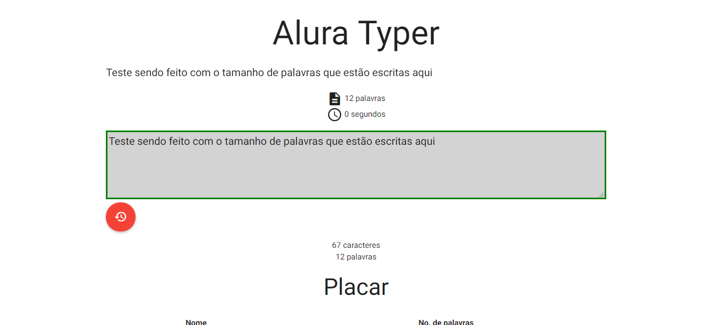
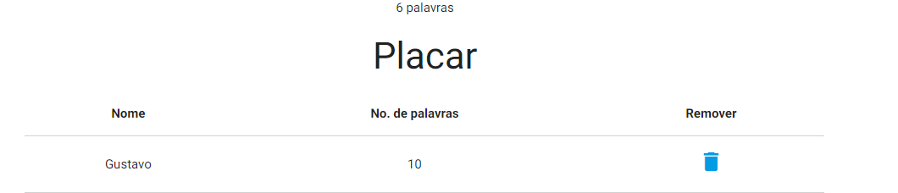
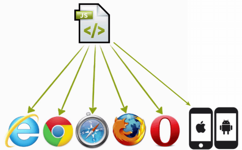
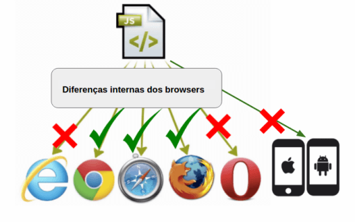
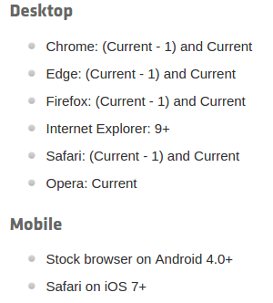
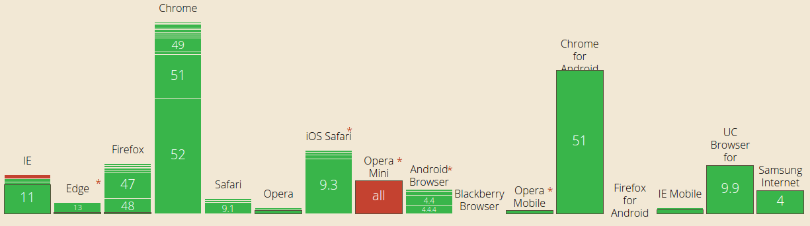

<h1>Imagens do Projeto feito seguindo o curso</h1>





-------------------------------------------------------------------------------------
<h1>Seção 01 - Introdução</h1>

<h2>Apresentação</h2>

Seja bem-vindo ao curso de jQuery da Alura! Nós vamos estudar essa framework famosa do mundo Front-end.

No curso, construiremos a aplicação "Alura Typer", um jogo que consegue medir a velocidade de digitação do usuário.

app alura typer

Enquanto o digitador escreve no campo de texto, é feita uma contagem das palavras e caracteres digitados pelo usuário.

Depois, o resultado é adicionado ao placar localizado mais abaixo, com o número de palavras escritas.

resultado alura typer

A aplicação vai ficar complexa... Vamos além da manipulação de DOM do jQuery!

Veremos como adicionar o ícone de remover com animação no placar, como fazer um ícone de scroll. Mostraremos ainda como fazer Ajax, acessar o servidor e buscar uma frase nova.

Abordaremos também como sincronizar o placar enviando os dados para o servidor, tudo usando as diversas funções da biblioteca do jQuery.

O curso será dividido em dois módulos, o primeiro vai focar na estruturação da aplicação. Mostraremos a maneira correta de utilizar o jQuery no projeto, além de apresentar as diferenças nas versões existentes e como importá-lo no projeto.

Falaremos sobre manipulação de DOM, como colocamos um elemento na página HTML e alteramos um atributo. Vamos fazer alterações no CSS, colocando e removendo um classe.

Nesta primeira, já falaremos sobre manipulação de DOM. Também falaremos sobre eventos: click, focus, input. Trabalharemos com eventos utilizando as funções do jQuery.

Na segunda parte do curso, abordaremos o assunto das animações, como fazemos Ajax, além de envio e recebimento de dados. Falaremos sobre os cuidados que devemos ter ao trabalhar com Ajax, apontando também as principais dificuldades - e com elas são resolvidas utilizando jQuery.

Conheceremos na segunda parte do curso, alguns plugins que melhoram as funcionalidades da aplicação.

A seguir, vamos construir a aplicação Alura Typer e dar início aos nossos estudos. Espero que vocês aproveitem o conteúdo do curso.

<h2>Introdução ao jQuery</h2>
Para ampliar as possibilidades de interação de nossos usuários com nossas páginas, recorremos a recursos avançados do CSS3, e do HTML5, mas que muitas vezes não são suficientes. Este é o caso de quando queremos, por exemplo, copiar a informação digitada pelo usuário em outro elemento de nossa página, ou até mesmo fazer uma validação antes de enviar um formulário.

Para atender casos como este, e outros ainda mais complexos, programamos em JavaScript, uma linguagem dinâmica compreendida pelo navegador.

Mas nos dias de hoje, sabemos que nossas páginas são acessadas por usuários de diversos dispositivos diferentes, passando pelo usuário comum de desktop até mesmo a um usuário que possui um celular rodando um sistema operacional antigo. Esta variedade de dispositivos traz também uma variedade de navegadores.



representação de código JS que dá suporte aos navegadores comuns como o Internet Explorer, Google Chrome, Safari, Mozilla Firefox e Opera

Esta variedade tornou o desenvolvimento do Javascript algo mais complexo, já que existem pequenas diferenças no seu modo de funcionamento em cada navegador, fazendo com que um código seja completamente funcional em um determinado navegador, mas com um mau funcionamento em outro.



representação de um código JS não funcionando em todos os browsers

Para o resgate: o framework jQuery
Neste cenário, que devemos garantir que o código JavaScript rode nos mais diversos navegadores, que entra o famoso framework jQuery.

Trata-se de uma biblioteca que possuí várias funções de uso bastante comum no dia a dia do desenvolvedor JavaScript. O jQuery nos garante que suas funções funcionarão em diversos browsers, e nos dá a garantia de que o código JavaScript funcionará em um navegador específico.

Ele age como um "tradutor", no sentido mais amplo da palavra, tornando o código JavaScript que era incompatível para certos navegadores em um código JavaScript funcional na maioria deles:


representação de que o código jQuery é compatível com diferentes browsers, incluindo mobile

Vantagens do jQuery
Além da grande vantagem de compatibilidade entre navegadores proporcionada pelo jQuery, os códigos se tornam muito mais sucintos.

jQuery: write less. do more.


Logo do jQuery

Traduzido livremente para o português, a mensagem indica que com jQuery, o desenvolvedor escreve menos e é capaz de fazer mais.

A segunda grande vantagem de utilizar o jQuery em seus projetos é o ganho de produtividade do desenvolvedor. Graças às funções sucintas, quando utilizamos o jQuery podemos reduzir o tamanho dos códigos JavaScript, como é demonstrado no seguinte trecho:

var paragrafos = document.querySelectorAll('p');
for( var i = 0;i < paragrafos.length; i++){
    paragrafos[i].textContent = "novo texto";
}
Este pedaço de código seleciona todos os parágrafos da página, itera por eles, e troca o texto para "novo texto". Utilizando o jQuery, conseguimos realizar a mesma funcionalidade, com um código menor, veja:

$('p').text('novo texto');
Conforme é a afirmação o lema, conseguimos escrever menos quando utilizamos jQuery.

Um exemplo que combina tanto a vantagem da compatibilidade com a da produtividade é o seguinte:

var cabecalho = document.getElementById("cabecalho");

if (cabecalho.attachEvent) {
    cabecalho.attachEvent("onclick", function (event) {
        alert("Você clicou no cabeçalho, usuário do IE!");
    });
} else if (cabecalho.addEventListener) {
    cabecalho.addEventListener("click", function (event){
        alert("Você clicou no cabeçalho!)
    }, false);
}
Escrevemos uma grande quantidade de código JavaScript para que o evento de click seja detectado tanto nos browsers antigos (como Internet Explorer), quantos nos atuais, por isso, ele faz a verificação com o if no começo.

Este mesmo código, utilizando do jQuery se torna mais enxuto:

$("#cabecalho").click(function (event) {
    alert("Você clicou no cabeçalho");
});
A quantidade de código escrito ficou reduzida e conseguimos manter a compatibilidade com os mais diversos navegadores.

O grande foco deste treinamento é mostrar como trabalhar com as diversas funções da biblioteca do jQuery e tornar você um desenvolvedor mais ágil, além de bem preparado para lidar com as diferenças entre navegadores.

O que aprendemos ?
Os navegadores e suas diferenças.
Por que utilizar o jQuery.
Quais as vantagens do jQuery.


<h2>Colocando o jQuery no projeto</h2>
Versões do jQuery
Agora que já entendemos as vantagens do jQuery e por que ele é um framework tão famoso, vamos discutir um pouco sobre suas versões.

Para utilizar o jQuery em nosso projeto, primeiro precisamos baixá-lo. O jQuery pode ser baixado em seu site oficial, o jquery.com. Assim que entramos no site, nos deparamos com um grande botão de download:

botão de download do jQuery

Ao acessar esta página, veremos uma grande quantidade links, sendo que cada um corresponde à uma versão diferente do jQuery. Vamos entendê-las:

listagem das versões do jQuery para download no site

O jQuery lançou recentemente sua nova versão, a versão 3, que trouxe mais rapidez em suas funções e reduziu o seu tamanho. Além destas melhorias, trouxe uma nova versão do jQuery, a slim version, que hoje é disponibilizada como alternativa à versão tradicional do jQuery.

A versão slim, como a própria tradução indica, é uma versão mais leve do jQuery. Ela não possui as funções de AJAX, nem de animações, sendo uma boa opção para desenvolvedores que não vão precisar destas funcionalidades.

Uma outra distinção a se fazer é entre as versões de desenvolvimento e de produção. As versões de produção têm o código minificado e reduzido, tornando-o mais compacto, e com isso, onerar menos a banda do usuário quando ele fizer o download do jQuery. Normalmente ela é utilizada quando finalizamos o projeto e vamos colocá-la no servidor de produção.

Já a versão de desenvolvimento é uma versão que mostra o código como completo do jQuery, permitindo ao desenvolvedor ver como uma ou outra função do jQuery foi implementada, permitindo-o debbugar em caso de algum comportamento inesperado.

Neste treinamento, utilizaremos a versão normal do jQuery, a versão 3.1.0 de desenvolvimento, já que queremos aprender o máximo de funções possíveis, inclusive sobre AJAX e animações. Não se preocupe em baixá-la, pois ela já foi disponibilizada para você na pasta do projeto que você fará o download.

O projeto AluraTyper
Para praticar o conhecimento que iremos adquirir de jQuery, iremos desenvolver a aplicação AluraTyper. O AluraTyper é um jogo que tem como objetivo medir a velocidade de digitação de seus usuários, e salvar seu recordes em um placar. Esta aplicação parece simples, mas irá envolver quase toda a biblioteca de funções do jQuery, nos fazendo passar desde o básico de manipulação de elementos até requisições assíncronas com AJAX.

Depois que você fizer o download do projeto, abra-o no seu editor de textos e você deve ver a seguinte estrutura:

alura-typer/
├── public
│   ├── css
│   ├── fonts
│   ├── img
│   ├── js
│   │   ├── jquery.js
│   └── principal.html
└── servidor
Por enquanto, ignoraremos a pasta servidor e vamos no focar apenas na pasta public.

Iniciando o projeto: HTML base
Nosso primeiro passo é escrever um HTML inicial para nossa aplicação, então, começaremos editando o arquivo principal.html, que se encontra na seguinte forma:


<!DOCTYPE html>
<html lang="pt-br"> 
<head> 
    <meta charset="UFT-8"> 
    <title>Document</title>
</head>
<body>

</body>
<htlm>
Iremos adicionar o título da nossa aplicação (Alura Typer). Dentro de <body>, escreveremos novamente o título que será exibido na página, entre <h1>. Criaremos a classe frase e escreveremos frase genérica "Loren ipsun", entre as tags <p> - que correspondem ao parágrafo. A criação da classe possibilita que esse elemento seja identificado e modificado posteriormente.

<!DOCTYPE html>
<html lang="pt-br">
<head> 
    <meta charset="UFT-8">
    <title>Alura Typer</title>
</head>
<body>
    <h1>Alura Typer</h1>
    <p class="frase">Lorem ipsum dolor sit am  et, consectetur adipiscing elit, sed do eiusmod tempor incididunt ut labore et dolore magna aliqua.</p>
</body>
</html>
Por fim, faremos os contadores que registrarão o número de caracteres e de palavras da frase. Criaremos no código a lista de informações, utilizando a classe informacoes e a tag <ul>. Dentro de <ul>, criaremos duas <li>s que correspondem ao número de palavras e a quantidade de segundos. Colocaremos alguns valores aleatórios, por enquanto.

<!DOCTYPE html>
<html lang="pt-br">
<head> 
    <meta charset="UFT-8">
    <title>Alura Typer</title>
</head>
<body>
    <h1>Alura Typer</h1>
    <p class="frase">Lorem ipsum dolor sit amet, consectetur adipiscing elit, sed do eiusmod tempor incididunt ut labore et dolore magna aliqua.</p>

    <ul class="informacoes">
        <li>30 palavras</li>
        <li>10 segundos</li>
    </ul>
</body>
</html>
Nosso objetivo inicial é que o nosso contador de palavras seja atualizado de acordo com a frase que está no HTML. Por exemplo, para a frase: "Alura: Cursos online de tecnologia que reinventam sua carreira.", ele deve mostrar 9 palavras, automaticamente.

Para criar esse nível de interatividade teremos que começar a utilizar o JavaScript com jQuery.

Para utilizamos o JavaScript em nosso projeto, primeiro devemos importá-lo utilizando a tag <script> no fim da tag <body>, no arquivo principal.html:
<code>
<!DOCTYPE html>
<html lang="pt-br">
<head> 
    <meta charset="UFT-8">
    <title>Alura Typer</title>
</head>
<body>
    <h1>Alura Typer</h1>
    <p class="frase">Lorem ipsum dolor sit amet, consectetur adipiscing elit, sed do eiusmod tempor incididunt ut labore et dolore magna aliqua.</p>

    <ul class="informacoes">
        <li>30 palavras</li>
        <li>10 segundos</li>
    </ul>

    <script src="js/main.js"></script>

</body>
</html>
</code>
Repare que importamos o script com o caminho js/main.js, já que ele está dentro da pasta /js.

Como o foco do treinamento é trabalhar com as funções do jQuery, vamos importar o jquery.js:
<code>
<!DOCTYPE html>
<html lang="pt-br">
<head> 
    <meta charset="UFT-8">
    <title>Alura Typer</title>
</head>
<body>
    <h1>Alura Typer</h1>
    <p class="frase">Lorem ipsum dolor sit amet, consectetur adipiscing elit, sed do eiusmod tempor incididunt ut labore et dolore magna aliqua.</p>

    <ul class="informacoes">
        <li>30 palavras</li>
        <li>10 segundos</li>
    </ul>

    <script src="js/jquery.js"></script>
    <script src="js/main.js"></script>

</body>
</html>
</code>
Nós importamos o jQuery acima de main.js, pois queremos utilizar a funções do jQuery. É muito importante prestar atenção na ordem de importação dos seus scripts .js, para evitarmos bugs no nosso projeto.

O que aprendemos?
As diferenças entre as versões do jQuery.
Versão slim vs versão normal.
Versão de produção vs versão de desenvolvimento.
O projeto Alura Typer.
Estrutura de pastas do nosso projeto.
O HTML básico do Alura Typer.


<h2>Primeiros passos com jQuery</h2>
Nosso objetivo é fazer com que o número de palavras de uma determinada frase seja contado e registrado automaticamente.

O primeiro passo é criar um arquivo JavaScript que conterá nosso código. Criaremos o arquivo main.js dentro da pasta /js.

Usaremos a função seletora do JQuary, que leva o próprio nome da framework. Essa função é responsável por selecionar no mundo JQuary. Dentro dessa função, passaremos um seletor CSS - sinal gráfico . - que retorna o objeto desejado. Neste caso, queremos o elemento que contém a classe frase. Salvaremos essa função em uma variável que chamaremos de frase.

var frase = jQuery(".frase");
console.log(frase);
Feito isso, podemos imprimir a frase. No console, veremos que dentro do conteúdo devolvido será a frase correspondente.

[p.frase, prevObject:  jQuery.fn.init[1]]
Veremos que o JQuery não retorna exatamente o uma frase, e sim um objeto JQuery que contém o objeto frase. Para imprimirmos exatamente texto da frase, teremos de utilizar outra função text()

var frase = jQuery(".frase").text();
console.log(frase);
A função nos retorna o conteúdo de texto do elemento em formato de string.

Queremos, também, contar o número de palavras que compõe uma determinada frase. Observemos a seguinte frase:

Alura: Cursos de tecnologia.

Sabemos que ela tem quatro palavras, pois conseguimos mentalmente diferenciar que cada palavra é separada por um espaço, e por isso, conseguimos contá-las. Vamos adotar uma estratégia similar no código JavaScript responsável por fazer a contagem: quebraremos a nossa frase pelos espaços dela, e em seguida, vamos contar as palavras restantes.

Ao invés de escreveremos a função inteira jQuery, podemos utilizar o atalho $.

Para quebrar uma string em espaços, podemos utilizar a conhecida função .split() do JavaScript tradicional, que nos retorna um array com as palavras separadas. Como queremos separar pelo espaço em branco(" "), passaremos ele como parâmetro em split():

var frase = $(".frase").text();
var numPalavras = frase.split(" ");
console.log(numPalavras);
Como reterno teremos:

["Alura:", "Cursos", "de", "tecnologia"]

Como a variável numPalavras é um array, podemos nos aproveitar da propriedade length dos arrays para nos dizer o tamanho do array, que coincide com o tamanho da frase recém dividida:

var frase = $(".frase").text();
var numPalavras = frase.split(" ").length;
console.log(numPalavras);
Recebemos como retorno o número correspondente à quantidade de palavras, que é 4.

Quantificando o número de palavras
Agora que conseguimos quantificar o número de palavras da frase digitada, precisamos alterar o indicador de palavras para que ele seja atualizado. No arquivo principal.html, o primeiro passo é conseguir selecionar o elemento HTML que contém esta informação, para isso, envolveremos o número do indicador com uma tag <span>, ficando mais fácil acessá-lo:

<!DOCTYPE html>
<html lang="pt-br">
<head> 
    <meta charset="UFT-8">
    <title>Alura Typer</title>
</head>
<body>
    <h1>Alura Typer</h1>
    <p class="frase">Lorem ipsum dolor sit amet, consectetur adipiscing elit, sed do eiusmod tempor incididunt ut labore et dolore magna aliqua.</p>

    <ul class="informacoes">
        <li><span id ="tamanho-frase"19</span> palavras</li>
        <li>15 segundos</li>
    </ul>

    <script src="js/jquery.js"</script>
    <script src="js/main.js"></script>


</body>
</html>
Selecionaremos span no main.js, utilizando a função $:

var frase = $(".frase").text();
var numPalavras = frase.split(" ").length;

var tamanhoFrase = $("#tamanho-frase");
Note que, como queremos selecionar usando id do elemento, utilizaremos o seletor correspondente do CSS: a tralha (#).

Com o elemento selecionado, modificaremos o valor de texto para adicionar o número de palavras da frase, que está na variável numPalavras. Para isto vamos utilizar a função .text() do jQuery novamente, porém, passando um parâmetro desta vez. No caso, especificaremos que queremos modificar o valor de texto do atributo:

var frase = $(".frase").text();
var numPalavras = frase.split(" ").length;

var tamanhoFrase = $("#tamanho-frase");
tamanhoFrase.text(numPalavras);
Ao reiniciar sua página, você deve notar que nosso indicador atualizou-se para o valor de palavras da frase. Conseguimos fazer a contagem automática de palavras.

Você pode notar que .text() do jQuery tem dois comportamentos, o primeiro, quando passamos sem nenhum parâmetro, o retorno será o valor de texto do elemento, e o segundo, quando passamos com um parâmetro, altera o valor de texto do elemento.

Diversas funções do jQuery têm essa característica: variar o seu comportamento conforme os parâmetros passados, inclusive, este de retornar/alterar valor é um bastante comum.

Vamos estudar várias outras como essa no curso.

O que aprendemos? O projeto AluraTyper. Como importar o jQuery em seu projeto. A importância da ordem de importação de scripts. A função seletora do jQuery. Pegando texto com a função .text(). Alterando texto com a função .text().

<h2>Sobre o que é o jQuery?</h2>
A alternativa que melhor termina a frase:

O jQuery é...

R:uma biblioteca JavaScript que abstrai a sua complexidade e problemas de compatibilidade.

O jQuery é uma biblioteca, feita em JavaScript, que tem como objetivo facilitar a vida do desenvolvedor Web. O grande propósito dela é facilitar o uso do JavaScript nos websites, abstraindo da cabeça do desenvolvedor os problemas de compatibilidade entre os navegadores. Ele também possui funções enxutas, que reduzem drasticamente a quantidade de código que o desenvolvedor tem que escrever, possuindo módulos que facilitam coisas como o AJAX , que é algo nativamente complexo de se fazer com JavaScript puro.

O jQuery segue a máxima de seu lema, que é Write less, do more, focando em otimizar a experiência de desenvolver JavaScript para a Web. Este framework se tornou uma das mais famosas bibliotecas do desenvolvimento Web, com mais de 50% dos desenvolvedores utilizando-a em seu dia a dia.
http://blog.honeypot.io/popularity-of-javascript-frameworks-and-libraries/
Dominá-la é essencial para se tornar um profissional front-end completo e este é o foco do nosso curso!

<h2>Vantagens do jQuery</h2>
Sobre o framework jQuery, julgue as alternativas abaixo:
1- Ele aumenta a produtividade do desenvolvedor, pois ele consegue escrever muito menos código do que se estivesse escrevendo em Javascript puro.

2- Apenas a versão de desenvolvimento do jQuery possui as funções sucintas que aumentam a produtividade do desenvolvedor.

3- Aumenta a compatibilidade do código Javascript escrito com os diversos navegadores, pois se utilizamos as funções do jQuery ele já garante que este código funcionará nos mais variados browsers.

R: A primeira vantagem do jQuery é a compatibilidade que suas funções tem com os navegadores. Quando escrevemos código Javascript , temos de tomar cuidado com as diferentes implementações internas de cada navegador, o que pode fazer com que um código que é completamente funcional em um determinado navegador não seja em outro.

Utilizando jQuery e suas funções, podemos abstrair deste cuidado, já que todas as funções do jQuery são compatíveis com os navegadores mais recentes.

A segunda grande vantagem do jQuery é a produtividade que ele trás para o desenvolvedor. Com suas funções conseguimos escrever um código muito mais sucinto , trazendo maior agilidade no desenvolvimento.

Logo as alternativas corretas são as 1 e 3.

Avaliando a alternativa 2 , pode ver que ela é falsa , pois tanto a versão de desenvolvimento quanto a de produção possuem todas as funcionalidades do jQuery, só tendo diferença entre o código ser minificado ou não.

<h2>jQuery emagreceu</h2>
Qual a diferença da versão slim para a versão normal do jQuery 3.1 ?

R: A versão slim não possuí as funções de animação nem de AJAX do jQuery normal.

A grande diferença da versão slim do jQuery é que esta não possuí nem as funções de animação nem as de AJAX do jQuery tradicional, deixando a framework mais leve.

Por ela não possuir estes dois módulos do jQuery, ela chega a ser 20% menor do que a versão normal, onerando menos a banda do usuário quando ele acessa um site que utiliza a versão slim.

Ela é útil para desenvolvedores que querem utilizar o jQuery apenas para a manipulação do DOM, escutar eventos, adicionar ou remover classes ou criar elementos, permitindo estes desenvolvedores terem acesso a uma versão mais simples do framework, pois muitas vezes queremos fazer animações utilizando algum recurso do CSS3 ou utilizar alguma outra biblioteca específica para requisições AJAX.


<h2>Produção ou desenvolvimento?</h2>
Qual a diferença entre as versões de produção e de desenvolvimento do jQuery?
R: A versão de produção é minificada, já a de desenvolvimento vem em sua forma normal.
A grande diferença está na minificação da versão de produção em relação a versão de desenvolvimento. Minificar é o processo de reduzir o tamanho de um arquivo fazendo certos processos como remover comentários, trocar nome de váriaveis por nomes menores, remover espaços entre outras técnicas.

A versão de produção, por ser minificada, tem um tamanho reduzido, sendo incrívelmente 30% do peso da versão de desenvolvimento. Utilizar a versão de produção quando estamos disponibilizando a versão final do nosso website para o usuário é de extrema importância, pois conseguimos onerar menos a banda de nossos usuários, algo que é bem interessante nos dias de hoje, já com o aumento dos acessos a website via mobile a maioria dos usuários depende de redes 3G e 4G, que são naturalmente mais limitadas.

Mas já ao desenvolver um website, é comum utilizarmos a versão de desenvolvimento, pois podemos ver como uma determinada função do jQuery foi implementada e fica mais fácil debuggar em caso de necessidade.


<h2>Selecionando o jQuery</h2>
Quais das opções abaixo selecionam corretamente o parágrafo que está no seguinte HTML:
```html
<body>
    <h1 id="titulo">Introdução ao Javascript</h1>
    <p id="introducao" class="principal">Javascript é uma das linguagens mais importantes de nosso tempo, 
justamente por ser entendida pelos mais diversos navegadores (desktop/mobile).</p>
</body>
```
R:Para selecionarmos um elemento HTML com jQuery, utilizamos sua função seletora que tem o mesmo nome da framework, a função jQuery! Ela pode ser invocada de dois modos, o primeiro que é utilizando seu nome completo:

jQuery();
ou a mais comum que é utilizando o atalho conhecido para a função jQuery, o $:

$();
Como este segundo modo é muito mais fácil de digitar e muito mais utilizado no mercado de desenvolvimento Web, é ele que utilizaremos ao longo deste treinamento.

A função seletora aceita como parâmetro seletores CSS , então como vimos no exercício, ela pode aceitar qualquer tipo de seletor, seja de id(#), classe(.), elemento etc.

Devemos passar o seletor entre aspas, então um exemplo para selecionar o título da página seria:

var titulo = $("#titulo");
Ela será uma das funções que mais utilizaremos ao longo do treinamento, então vamos ganhar prática com ela!


<h2>Pegando um texto</h2>
A programadora Ana está montando um site que tem como objetivo ser o template para a sua primeira página. O HTML do template está com essa cara:

...
```html
<body>
    <h1> Meu primeiro website! </h1>
    <p>Olá, eu sou a <span id="nome">Ana</span> e estou aprendendo  o básico sobre desenvolvimento Web.</p>

    <script src="jquery.js"></script>
    <script src="main.js"></script>
</body>
```
E acompanha, além do jQuery, o seguinte Javascript:

//main.js

var nome = $("#nome");
console.log("Seu nome é:" + nome );
Ana gostaria que no console fosse exibido o nome que está no HTML, ficando assim: Seu nome é Ana

Porém o resultado é :Seu nome é:[object Object]

Qual alternativa abaixo corrige o erro de Ana ?

R: var nome = $("#nome").text();
Se queremos ter acesso ao contéudo textual de um elemento selecionado pelo jQuery, devemos utilizar a função .text(), que nos retorna exatamente isto.

Neste exemplo, Ana até selecionou corretamente o elemento, porém pecou tentando imprimir o elemento em si, e não seu texto. A alternativa que exibiria o resultado esperado é :

var nome = $("#nome").text();

<h2>Alterando um template</h2>
Ana evoluiu no mundo da programação e agora quer compartilhar seus conhecimentos, deistribuindo um template para outros programadores montarem uma página customizada:
```html
<body>
    <h1> Meu primeiro website! <h1>
    <p>Olá, eu sou o/a <span id="nome">SEUNOME</span> e estou aprendendo é o básico sobre desenvolvimento Web.</p>

    <script src="jquery.js"></script>
    <script src="main.js"></script>
</body>
```
Qual código abaixo altera o texto SEUNOME pelo nome Nico ?

R:$("#nome").text("Nico");

Quando queremos alterar o texto de um elemento, também utilizamos a função .text(), porém passando o valor do novo texto como parâmetro para ela:

$("#nome").text("Nico");
Repare que devemos passar uma string, ou seja, entre aspas!

A função .text() tem esta dupla função, nos retornar o valor textual do elemento caso seja chamada sem parâmetro ou alterar o valor de texto do elemento caso seja chamada com uma string como parâmetro.

<h2>Aprenda mais: Antigas versões do jQuery</h2>
Sobre a compatibilidade das versões
Vimos que uma das principais vantagens do jQuery é a compatibilidade com os diversos navegadores que ele oferece. Se visitarmos a página de compatibilidade do jquery, seremos informados que apenas as duas últimas versões de cada navegador são suportadas.



Versões de navegadores que o jQuery suporta

Na prática, sabemos que, provavelmente, o jQuery funcionará bem na maioria dos navegadores recentes, mesmo que não estejam nas últimas duas versões. Mesmo assim, se visitarmos o gráfico dos browsers mais usados, veremos que a maioria dos usuários já utiliza as últimas versões do Browser:


Versões de navegadores que o jQuery suporta

De acordo com o gráfico, as versões 52, 51 e 49 do Chrome são as mais utilizadas. Relativas a Firefox, a versões 47 e48 são as mais utilizadas.

Mas e se precisarmos dar suporte ao IE 8 e versões antigas?
Se você está desenvolvendo algum tipo de sistema que deve atender ao máximo de usuários possíveis, talvez seja bom você utilizar uma versão especial do jQuery: a versão 1.12.

Esta versão em específica do jQuery ficou muito famosa, e recebe updates até hoje. Ela é focada para dar suporte aos navegadores antigos, como Internet Explorer 6-8, Opera 12.1x ou Safari 5.1+.

Então caso seu website tenha um público de usuários que notadamente não atualiza seus softwares, como os usuários da China que ainda tem boa parte de seus usuários utilizando o Windows XP, é interessante você utilizar esta versão do jQuery, pois ela é focada em dar suporte maior aos browsers antigos. Talvez algumas das funções que aprendemos aqui neste treinamento não sejam válidas no jQuery 1.12, mas um rápida consulta a documentação do jQuery resolverá suas dúvidas :) .
https://blog.jquery.com/2016/02/22/jquery-1-12-1-and-2-2-1-released/

---------------------------------------------------------------------------------------------
<h1>Seção 02 - Escutando eventos com jQuery</h1>

<h2>Eventos do jQuery</h2>

ós já implementamos corretamente o contador de palavras da frase a ser digitada pelo jogador, O próximo passo será disponibilizarmos um campo na página para que a frase possa ser digitada. Começaremos a ter uma interatividade no programa, já que atualmente nosso jogo somente conta as palavras.

tela do Alura Typer ainda sem campo de texto

Vamos colocar um textarea para o usuário digitar a frase e dois contadores, um para contar quantos caracteres foram digitado, e o outro fará a contagem de quantas palavras foram digitadas.

Então, na página principal.html, logo após a ul de informações, colocaremos a textarea. Feito isso, criaremos uma classe denominada campo-digitacao.


```html
<!DOCTYPE html>
<html lang="pt-br">
<head> 
    <meta charset="UFT-8">
    <title>Alura Typer</title>
</head>
<body>
    <h1>Alura Typer</h1>
    <p class="frase">Lorem ipsum dolor sit amet, consectetur adipiscing elit, sed do eiusmod tempor incididunt ut labore et dolore magna aliqua.</p>

    <ul class="informacoes">
        <li><span id ="tamanho-frase"19</span> palavras</li>
        <li>15 segundos</li>
    </ul>

    <textarea class="campo-digitacao" rows="8" cols ="40"></textarea>

    <script src="js/jquery.js"</script>
    <script src="js/main.js"></script>


</body>
</html>
```

Logo abaixo, criamos uma ul (semelhante a que já temos) com duas lis, cada uma representando um contador:

```html
<!DOCTYPE html>
<html lang="pt-br">
<head> 
    <meta charset="UFT-8">
    <title>Alura Typer</title>
</head>
<body>
    <h1>Alura Typer</h1>
    <p class="frase">Lorem ipsum dolor sit amet, consectetur adipiscing elit, sed do eiusmod tempor incididunt ut labore et dolore magna aliqua.</p>

    <ul class="informacoes">
        <li><span id ="tamanho-frase"19</span> palavras</li>
        <li>15 segundos</li>
    </ul>

    <textarea class="campo-digitacao" rows="8" cols ="40"></textarea>

<ul>
    <li><span id="contador-caracteres">0</span> caracteres</li>
    <li><span id="contador-palavras">0</span> palavras</li>
</ul>

    <script src="js/jquery.js"</script>
    <script src="js/main.js"></script>

</body>
</html>
```

tela do AluraTyper agora tem um campo para a digitação

Após adicionarmos a textarea será exibido o campo em que o usuário digitará as palavras.

Trabalhando com eventos
O usuário consegue digitar a frase no campo específico, mas os contadores permanecem zerados. Faremos com que os contadores sejam atualizados toda vez que o usuário clicar no textarea, contando, assim, os caracteres e palavras já digitados e atualizando os respectivos spans.

Para fazer isso, temos que entender os famosos eventos do JavaScript. Como vocês já sabem, o JavaScript possui uma série de eventos: "click", "double click", "scroll", entre outras interatividades.

O jQuery facilitou nosso trabalho do momento de escutar os eventos JS dos elementos.

Para comprovar isso, vamos utilizar jQuery no caso acima, para atualizar os contadores toda vez que o usuário clicar no textarea.

Primeiramente, no main.js, se queremos detectar um evento de clique no campo, primeiro devemos selecioná-lo. Usaremos a função seletora do jQuery ($) e acionaremos a classe campo-digitacao.

var frase = $(".frase").text(); 
var numPalavras = frase.split(" ").length;
var tamanhoFrase = $("#tamanho-frase");
tamanhoFrase.text(numPalavras);

var campo = $(".campo-digitacao");
Agora, quando o campo for clicado, teremos que "fazer alguma coisa".

A ação de "quando o campo for..." faz referência à função on do jQuery, e como queremos o evento do clique no campo, passaremos "click" para a função:

var campo = $(".campo-digitacao");
campo.on("click");
Conseguiremos "fazer algo" quando o campo for clicado, passando um segundo parâmetro para a função on, no caso, uma função anônima, indicada pelos parênteses vazio:

var campo = $(".campo-digitacao");
campo.on("click", function() {

});
Dentro da função anônima, iremos implementar o que deve acontecer quando o usuário clicar no campo.

Ao clicarmos no campo, essa função sempre será chamada. Para comprovar isso, podemos imprimir uma mensagem no console do navegador toda vez que o campo for clicado, para isso colocaremos um console.log dentro da função:

var campo = $(".campo-digitacao");
campo.on("click", function() {
    console.log("Cliquei no campo");
});
Atualizamos a página, abrimos o console do navegador e vemos que toda vez que clicamos no campo, a mensagem "Cliquei no campo" é exibida.

Com isso, podemos partir para o nosso objetivo, que é contar as palavras. Nós já vimos anteriormente que uma maneira eficiente de contarmos as palavras, é "pegar" o conteúdo do campo, usar a função split no espaço e identificar o seu tamanho.

Podemos utilizar essa mesma tática, mas como saber o valor do textarea?

No caso do textarea, o conteúdo não estará na propriedade text e sim no value, ou como é chamado pelo jQuery: val.

var frase = $(".frase").text(); 
var numPalavras = frase.split(" ").length;
var tamanhoFrase = $("#tamanho-frase");
tamanhoFrase.text(numPalavras);

var campo = $(".campo-digitacao");
campo.on("click", function() {
    console.log(campo.val());
});
Agora toda vez que clicamos no campo, o seu conteúdo é impresso no console. Lembrando que o val nos dá acesso ao que está dentro de uma tag de input, como as tags input e textarea. Já o text nos dá acesso ao que está dentro de uma tag de texto, como p, span e h1.

Contando os caracteres e as palavras digitadas
Sabemos que val é referente ao conteúdo da frase, agora, faremos o split para contar as palavras. Para testar, vamos aproveitar para imprimir a quantidade de palavras para ver se estamos contando corretamente:

var frase = $(".frase").text(); 
var numPalavras = frase.split(" ").length;
var tamanhoFrase = $("#tamanho-frase");
tamanhoFrase.text(numPalavras);

var campo = $(".campo-digitacao");
campo.on("click", function() {
    var conteudo = campo.val();
    var qtdPalavras = conteudo.split(" ").length;
    console.log(qtdPalavras);
});
Aparentemente está funcionando, a cada clique no campo, é impresso a quantidade de palavras nele escrita. Mas contar as palavras é insuficiente, temos que atualizar o contador, ou seja, temos que selecionar o span e alterar o seu text, atribuindo a quantidade de palavras a ele:

var frase = $(".frase").text(); 
var numPalavras = frase.split(" ").length;
var tamanhoFrase = $("#tamanho-frase");
tamanhoFrase.text(numPalavras);

var campo = $(".campo-digitacao");
campo.on("click", function() {
    var conteudo = campo.val();
    var qtdPalavras = conteudo.split(" ").length;

    $("#contador-palavras").text(qtdPalavras);
});
Podemos escrever a frase, e a cada clique o contador é atualizado corretamente.

Falta ainda contar os caracteres, uma tarefa bem simples. Pegaremos o conteúdo do campo, e o seu tamanho (length) será a quantidade de caracteres. Usaremos isso para atualizar o seu contador:

var campo = $(".campo-digitacao");
campo.on("click", function() {
    var conteudo = campo.val();

    var qtdPalavras = conteudo.split(" ").length;
    $("#contador-palavras").text(qtdPalavras);

    var qtdCaracteres = conteudo.length;
    $("#contador-caracteres").text(qtdCaracteres);
});
O evento input
No entanto, para atualizar os contadores, temos sempre que clicar dentro do campo. O ideal seria que o contador fosse atualizado enquanto o usuário digita. E para isso existe um evento específico de quando digitamos, colocamos dados em um campo: input:

var campo = $(".campo-digitacao");
campo.on("input", function() {
Observe que à medida que digitarmos, o campo será atualizado. Era justamente esse o nosso objetivo.

Separando com Regexp
A contagem tanto das palavras quanto dos caracteres parece estar funcionando, mas se analisarmos atentamente, quando apagamos alguma frase, o contador de palavras ainda conta uma. Além disso, se pressionarmos várias vezes a barra de espaço, o contador irá considerar que um deles equivale a uma palavra.

Isso tem relação com o modo que estamos contando as palavras, fazendo um split em um espaço vazio.

Para sermos mais precisos na contagem, utilizaremos uma expressão regular em vez dos espaço vazio. A expressão regular será responsável por buscar qualquer caractere, exceto espaço vazio: /\S+/.

var qtdPalavras = conteudo.split(/\S+/).length;
$("#contador-palavras").text(qtdPalavras);
Agora os espaços não são mais considerados como palavras, mas a contagem sempre mostra soma mais uma no cálculo. Resolveremos isso, subtraindo -1 do length do conteúdo:

var frase = $(".frase").text(); 
var numPalavras = frase.split(" ").length;
var tamanhoFrase = $("#tamanho-frase");
tamanhoFrase.text(numPalavras);

var campo = $(".campo-digitacao");
campo.on("input", function() {
    var conteudo = campo.val();

    var qtdPalavras = conteudo.split(/\S+/).length - 1;
    $("#contador-palavras").text(qtdPalavras);

    var qtdCaracteres = conteudo.length;
    $("#contador-caracteres").text(qtdCaracteres);
});
Podemos testar e ver tudo funcionando como desejado.

o contador de palavras fez a contagem corretamente da frase digitada no campo

O que aprendemos?
Implementar o campo de digitação
Adicionando os contadores de caracteres e palavras a página
Escutar eventos com a função .on() do jQuery
O evento de click
O evento de input
Como melhorar a contagem de palavras com uma expressão regular

<h2>Clicando com jQuery</h2>
Considerando o código abaixo:

```html
<input id="botao" type="button">
<script>
	$('#botao').on(???);
</script>
```
E que estejamos interessados em responder a um click no botão exibindo uma mensagem.
O que a função on deve receber como parâmetro? Maruqe todas as alternativas que se adequarem:
R: O nome do evento e uma função nomeada OU o nome do evento e uma função anônima.

A função on() do jQuery, recebe como parâmetro dois argumentos: O primeiro sendo uma string com o nome do evento que ela vai passar a escutar e o segundo uma função, com a ação que ela deve executar quando o evento acontecer.

O nome do evento são os nomes do eventos comuns do Javascript, como de click, input, focus, dblclick entre outros.

A função pode ser tanto uma função anônima:

```html
<input id="botao" type="button">
<script>
   $('#botao').on("click",function(){
        console.log("Fui clicado")!
    });
</script>
```
Quanto uma função nomeada:
```html
<input id="botao" type="button">
<script>
   $('#botao').on("click",exibeMensagem);

   function exibeMensagem(){
       console.log("Fui clicado")!
   }
</script>
```

<h2>É valor ou texto?</h2>
É valor ou texto?

Sobre as funções .val() e .text(), quais ou qual das afirmativas abaixo está certa?

A função .text() pode ser usada para pegar de elementos como <h1>, <span> e <p>.

 função .val() pode ser usada para pegar de elementos como <input>, <textarea> e <select>.

As funções .val() e .text() servem tanto para alterar como para pegar o valor do texto de elementos.

Ambas as funções .val() e .text() podem manipular os valores de texto dos elementos, mas a .val() funciona em elementos de <input> que são campos aonde o usuário do site insere dados , como os campos de <input>(todos os tipos), <textarea> e <select>.

Já a função .text() pega o conteúdo de texto de tags HTML que tem texto dentro, como as <h1>, <span> e <p>

Ambas as funções podem atribuir novos valores a determinados elementos, ou apenas pegar os valores deles.


<h2>Nome do evento</h2>
Qual é o nome do evento que é chamado quando um campo de input recebe uma entrada?
R: input
O jQuery chama este evento input. No mundo JavaScript puro, sem jQuery, seria o oninput.

Esse evento é disparado quando o campo <input> ou <textarea> recebe uma entrada de texto qualquer.

<h2>Tamanho da notícia</h2>
Paulo estava desenvolvendo um blog de notícias colaborativo, e ao montar a parte de postagem de notícias do site ele resolveu criar um contador de caracteres, para limitar o tamanho das notícias.
```html
<body>
    <textarea class="corpo-noticia" cols="40" rows="5"></textarea>
    <p>Caracteres: <span id="numero-caracteres">0</span> caracteres.</p>
    <script src="jquery.js"></script>
    <script src="contador.js"></script>
</body>
//contador.js

function atualizaCaracteres(){
    var noticia = $(".corpo-noticia").val();
    var caracteres = noticia.length;

    var contador = $("#numero-caracteres");
    contador.text(caracteres);
}
```
A função atualizaCaracteres de Paulo está correta, porém ele só consegue chamá-la através do terminal. Qual código abaixo ele pode adicionar ao seu contador.js para que o número de caracteres seja atualizado conforme o usuário de seu blog escreve a notícia?


R: (".corpo-noticia").on("input",atualizaCaracteres);
A função .on() recebe dois parâmetros, o nome do evento a escutar e uma função com a ação que deve executar!

---------------------------------------------------------------------------------------------
<h1>Game Over com eventos</h1>


Nosso jogo está começando a criar forma, mas está faltando algo característico: o fim do jogo (Game Over). Nós temos um tempo limite para o usuário digitar a frase, e esse tempo deve decrescer.

Quando o tempo se esgota, queremos que seja feita a contagem de quantas palavras foram digitadas. Dessa forma, criamos uma dificuldade para o jogador e o desafio fica mais interessante.

Vamos começar a implementar o contador de tempo.

Assim que o usuário clicar no campo de digitação, o contador inicia contagem regressiva.

Primeiramente, devemos detectar a ação do usuário "entrar no campo" do jogo, ou seja, clicar no box de digitação. Quando isso acontecer, o tempo deve começar a decrescer automaticamente. O usuário pode iniciar o jogo ao clicar no box de digitação, mas essa não é a única maneira, existe a opção da tecla "Tab".

Pensando nisso, há um evento específico para quando entramos dentro de um campo, que é o evento focus, que é quando o campo ganha o foco no programa, ou seja, é selecionado de alguma maneira. Logo, no main.js, podemos começar a implementar o nosso código:

var frase = $(".frase").text(); 
var numPalavras = frase.split(" ").length;
var tamanhoFrase = $("#tamanho-frase");
tamanhoFrase.text(numPalavras);

var campo = $(".campo-digitacao");
campo.on("input", function() {
var conteudo = campo.val();

var qtdPalavras = conteudo.split(/\S+/).length;
 $("#contador-palavras").text(qtdPalavras);

var qtdCaracteres = conteudo.length;
$("#contador-caracteres").text(qtdCaracteres);

campo.on("focus", function() {

});
Se queremos que o tempo decresça, temos que saber o seu valor. Para isso, na página principal.html, vamos envolver o tempo em uma tag <span>, e colocar o id tempo-digitacao:

    <ul class="informacoes">
        <li><span id ="tamanho-frase"19</span> palavras</li>
        <li><span id ="tempo-digitacao">10</span> segundos</li>
    </ul>
Voltando ao main.js, vamos pegar o conteúdo do span e salvá-lo em uma variável denominada tempoRestante:

var tempoRestante = $("#tempo-digitacao").text();
campo.on("focus", function() {

});
Feito isso, temos que implementar a lógica. A cada segundo que se passar, temos que subtrair 1 do nosso tempo restante. Para tal, vamos utilizar a função setInterval() do JavaScript, que faz com que uma determinada ação (passada como primeiro parâmetro) seja executada em um intervalo de tempo (passado como segundo parâmetro, no nosso caso, 1 segundo, ou 1000 milissegundos):

var tempoRestante = $("#tempo-digitacao").text();
campo.on("focus", function() {
    setInterval(function() {

    },1000);
});
Dentro de setInterval podemos subtrair 1 do nosso tempo restante a cada segundo que passe, logo:

campo.on("focus", function() {
    setInterval(function() {
        tempoRestante--;
    }, 1000);
});
Falta agora atualizarmos o contador com o tempo restante, assim ele subtrairá de tempoRestante e atualizará o valor do campo, bem semelhante ao que já fizemos anteriormente:

    setInterval(function() {
        tempoRestante--;
        $("#tempo-digitacao").text(tempoRestante);
    }, 1000);
Nosso tempo já está decrescendo, só que ainda não influencia em nada no jogo, já que o usuário consegue ficar digitando mesmo com o tempo zerado. Vamos então desabilitar o campo para que o usuário não consiga mais digitar nada quando o tempo zerar.

A textarea possui um atributo disabled, que faz com que não consigamos digitar nada na mesma (justamente o que queremos). Quando o tempo chegar a 0, o JavaScript colocará o atributo disabled na textarea.

Como queremos adicionar um atributo, o jQuery nos auxilia disponibilizando a função attr.

Essa função funciona de maneira semelhante à função text, podendo pegar o valor de um atributo ou modificá-lo. Por exemplo, para pegar o valor do atributo rows do nosso campo, fazemos:

var campo = $(".campo-digitacao");
campo.attr("rows");
E para modificar o mesmo, passamos mais um parâmetro para a função, que é o novo valor do atributo, por exemplo:

var campo = $(".campo-digitacao");
campo.attr("rows", 500);
Só que o atributo disabled não existe nenhum valor, só queremos colocá-lo na tag. Nesse caso, nós temos que informar isso passando o valor true (verdadeiro) para a função, assim estaremos "habilitando" o atributo:

campo.on("focus", function() {
    setInterval(function() {
        tempoRestante--;
        $("#tempo-digitacao").text(tempoRestante);
        campo.attr("disabled", true);
    }, 1000);
});
Como queremos desabilitar o campo somente quando o tempo chegar a 0, vamos envolver essa linha em uma condição if:

campo.on("focus", function() {
    setInterval(function() {
        tempoRestante--;
        $("#tempo-digitacao").text(tempoRestante);
        if (tempoRestante < 1) {
            campo.attr("disabled", true);
        }
    }, 1000);
});
Testamos e vemos que assim que o tempo chega a 0, o campo é travado. Mas ainda temos um bug, porque o tempo continua decrescendo depois do 0, ou seja, ele fica negativo. Temos que fazer com que a função setInterval pare quando o tempo for 0, mas como?

Para isso, existe a função clearInterval, que recebe o id do setInterval como parâmetro. Vamos colocá-la dentro do nosso if:

if (tempoRestante < 1) {if (tempoRestante < 1) {
    campo.attr("disabled", true);
    clearInterval(id);
}
Mas atualmente, não temos acesso a essa id da função setInterval(), como consegui-lo? Toda função setInterval() retorna o seu próprio id, logo, basta guardarmos esse id em uma variável e passá-lo para a função clearInterval:

campo.on("focus", function() {
    var cronometroID = setInterval(function() {
        tempoRestante--;
        $("#tempo-digitacao").text(tempoRestante);
        if (tempoRestante < 1) {
            campo.attr("disabled", true);
            clearInterval(cronometroID);
        }
    }, 1000);
});
Iremos testar nosso código e analisar se tudo funciona como o esperado.

Escutando um evento uma única vez
O que acontece se entrarmos vários vezes no nosso campo? Repare que toda vez que entramos no campo, o tempo decresce mais rápido, chegando até a ficar negativo! Isso acontece porque toda vez que o campo é focado, a nossa lógica é executada. O ideal seria que esse código só fosse executado uma única vez.

O problema é que a função on fica escutando o evento o tempo todo, e para que ela funcione somente na primeira vez, existe a função one, que funciona exatamente como a função on, só que só escuta o evento uma única vez:

var tempoRestante = $("#tempo-digitacao").text();
campo.one("focus", function() {
    var cronometroID = setInterval(function() {
        tempoRestante--;
        $("#tempo-digitacao").text(tempoRestante);
        if (tempoRestante < 1) {
            campo.attr("disabled", true);
            clearInterval(cronometroID);
        }
    }, 1000);
});
Resolvemos o bug, feito isso, implementamos a função de decrescer o tempo.

O que aprendemos?
O evento de focus do jQuery
Como implementar um cronômetro de tempo
Relembrando as funções de tempo do javascript: setInterval e clearInterval
Manipulando atributos com a função .attr() do jQuery
Escutando eventos com a função .one() do jQuery

<h2>Um evento de foco</h2>
Sobre o evento de focus podemos afirmar:
R: O evento de focus é usado para detectar quando o usuário entra em um campo, não necessariamente digitando.
Utilizamos o evento de focus para detectar se o usuário já entrou em um campo de texto. O ato de entrar pode ser feito de vários modos, como clicar com o mouse no campo, ou navegar através da tecla tab .

É um evento muito utilizado quando queremos oferecer ao usuário uma experiência melhor de uso dos nosso websites, como por exemplo sugerir um autocomplete de um campo assim que ele ganhar foco.

<h2>Desabilitando um elemento com jQuery</h2>
Temos o seguinte formulário, no qual é pedido para o usuário preencher o nome da sua mãe OU do seu pai:
```html
<!DOCTYPE html>
<html lang="pt-br">
<head>
    <meta charset="UTF-8">
    <title>Formulário</title>
</head>
<body>
    <form>
        <fieldset>
            <legend>Nome de um dos seus pais</legend>

            <label for="nome-mae">Nome da Mãe:</label>
            <input id="nome-mae" type="text">

            <label for="nome-pai">Nome do Pai:</label>
            <input id="nome-pai" type="text">
        </fieldset>
    </form>

    <script src="js/jquery.js"></script>
</body>
</html>
```
Como só um dos nomes é necessário, quando começarmos a digitar em um input, o outro deve ficar desabilitado, e podemos fazer isso como JavaScript e jQquery. Qual das opções abaixo atende corretamente à exigência acima?

R:Como vimos no capítulo, para colocar o atributo disabled em um elemento, nós utilizamos a função attr. Mas como ele não recebe nenhum valor, temos que informar isso, "habilitando-o" na função, passando o valor true (verdadeiro) por parâmetro.

Como queremos que o input do nome do pai seja desabilitado caso haja algo digitado no input do nome da mãe, e vice-versa, escutamos o evento input. Logo, a opção correta é:

var mae = $("#nome-mae");
var pai = $("#nome-pai");

mae.on("input", function() {
    pai.attr("disabled", true);
});

pai.on("input", function() {
    mae.attr("disabled", true);
});

<h2>Quantos eventos escutar?</h2>
Sobre as funções .one() e .on() do jQuery, marque as afirmativas verdadeiras:
R:A função .one() funciona de modo semelhante a função .on(), ambas podem ser utilizadas em qualquer elemento, recebem qualquer evento como primeiro parâmetro e uma função anônima ou uma função nomeada como segundo parâmetro.

A diferença entre elas é na hora de escutar os eventos, a função .one() escuta o evento apenas uma única vez, diferentemente da função on(), que como já vimos fica escutando o evento em um elemento do HTML por tempo ilimitado.

<h2>É text(), val() ou attr()?</h2>

Com os seus conhecimentos de jQuery atuais, qual pedaço de código abaixo modificaria o seguinte HTML de um blog de noticias para que o <h1> da página seja "Meu primeiro blog" , o campo autor de input fique escrito "Daniel" e o tamanho da textarea seja de 40 colunas e 100 linhas.
```html
<h1 class="titulo">Olá Mundo</h1>

<input id="autor" type="text">
```
<textarea cols="20" rows="20"></textarea>
Faça o uso correto das funções .text(), .val() e .attr().

R:$(".titulo").text("Meu primeiro blog");
$("#autor").val("Daniel");
$("textarea").attr("cols","40");
$("textarea").attr("rows","100");
A função .text() do jQuery serve para modificar o conteúdo de texto das tags, então se queremos alterar o texto de um <h1>, devemos utilizá-la.

A função .val() é para alterar os valores dos campos de input, então se queremos preencher um <input type="text"> com um valor específico, é ela quem vamos usar.

E por último, a função .attr(), como o próprio nome sugere é para alterar os atributos de elemento, como os atributos rows e col de uma textarea.

Sabemos também que estas funções podem ser utilizadas para pegar, ou modificar valores, dependendo do número de argumentos com quais elas são chamadas.

-----------------------------------------------------------------------------------------------------
<h1>Seção 04 - Reiniciando o jogo</h1>
Queremos dar a opção do nosso usuário reiniciar o nosso jogo sem ter que recarregar a página. Para isso, implementaremos um pequeno botão, que ao ser clicado, irá zerar os nossos campos e contadores, permitindo o usuário iniciar uma nova rodada no jogo.

Em principal.html adicionaremos um <button>, abaixo da <textarea>:
```html
<!DOCTYPE html>
<html lang="pt-br">
<head> 
    <meta charset="UFT-8">
    <title>Alura Typer</title>
</head>
<body>
    <h1>Alura Typer</h1>
    <p class="frase">Lorem ipsum dolor sit amet, consectetur adipiscing elit, sed do eiusmod tempor incididunt ut labore et dolore magna aliqua.</p>

    <ul class="informacoes">
            <li><span id ="tamanho-frase"19</span> palavras</li>
            <li><span id ="tempo-digitacao">10</span> segundos</li>
    </ul>

    <textarea class="campo-digitacao" rows="8" cols="40"></textarea>
    <button id="botao-reiniciar">Reiniciar Jogo</button>

    <ul>
            <li><span id="contador-caracteres">0</span> caracteres</li>
        <li><span id="contador-palavras">0</span> palavras</li>
    </ul>

    <script src="js/jquery.js"</script>
    <script src="js/main.js"></script>

</body>
</html>

```
Agora precisamos atrelar um evento de click neste botão recém criado. Até agora, vimos como fazer isto através da função on("click",function(){...}) do jQuery, porém vamos aprender um novo modo de ter acesso a este evento.

Um atalho para função on("click"), a shorthand click()
Os eventos do Javascript que são mais comuns, como o click, blur(evento de sair de um campo), dblclick (clique duplo) tem funções próprias no jQuery, que são funções de atalho, evitando precisar chamar a função on() e chamando diretamente a função do próprio evento.

Veja no exemplo abaixo, onde capturamos o evento de click em um título e exibimos uma mensagem no console como resposta:

var titulo = $("#titulo");
titulo.on("click",function(){
    console.log("Titulo foi clicado!");
});
Poderíamos executar este mesmo evento e ação com a função de atalho click():

var titulo = $("#titulo");
titulo.click(function(){
    console.log("Titulo foi clicado!");
});
Podemos ser mais sucintos ainda e escrever tudo em uma linha só:

$("#titulo").click(function(){
    console.log("Titulo foi clicado!");
});
Como o jQuery é uma grande ajuda na produtividade, ele disponibiliza algumas dessas funções de atalho que são mais curtas e simples, agilizando o trabalho do programador. Ao clicar no .click, queremos que o campo seja liberado novamente e que tudo o que havia dentro dele, que seja apagado.

Em main.js iremos atrelar um evento de click no nosso botão com esta nova função.

Reiniciando o jogo: tratando do campo
Agora que estamos detectando o evento de click no botão reiniciar, vamos começar a retornar o jogo para o estado inicial, como se o usuário estivesse acabado de entrar na página. O primeiro passo é habilitarmos o campo novamente, pois quando colocamos o atributo disabled nele na hora do Game Over, impedimos o usuário de digitar.

Para removê-lo, vamos nos aproveitar da função .attr() do jQuery no arquivo main.js:

$("#botao-reiniciar").click(function(){
    campo.attr("disabled", false);
});
A função .attr() nos permite colocar, retirar ou modificar valores de atributos de elementos HTML.

Com o campo digitável, precisamos zerá-lo, pois ele ainda contém os resquícios da última jogada do nosso usuário. Queremos que o conteúdo da <textarea> seja zerado, fique vazio.

Sabemos que para manipular o conteúdo de um elemento de input do usuário, como a <textarea>, temos que utilizar a função .val(), e como queremos que ela fique vazia, faremos assim:

$("#botao-reiniciar").click(function(){
    campo.attr("disabled", false);
    campo.val("");
});
Colocando o conteúdo .val() do campo como vazio(""), ele ficará zerado.

Agora nosso campo está limpo e pode ser digitado novamente.

Reiniciando o jogo: zerando os contadores
Nosso próximo passo é retornar os contadores para seu estado inicial, ou seja, com zero palavras.

Este é mais fácil, basta selecionar os dois contadores e substituir o texto dos <span> por 0.

$("#botao-reiniciar").click(function(){
    campo.attr("disabled", false);
    campo.val("");
    $("#contador-palavras").text("0");
    $("#contador-caracteres").text("0");
});
Com os contadores zerados, fica faltando apenas ajustar o tempo inicial!

Reiniciando o jogo: restaurando o tempo inicial
Para obtermos o tempo inicial, temos que guarda-lo numa variável assim que iniciamos a aplicação, pois como alteramos o valor do tempo depois, acabamos perdendo-o. Em main.js criaremos uma variável chamada tempoInicial e capturaremos o valor assim que o script for carregado, pois atualmente ele é calculado a partir do tempoRestante, e assim podemos pegar o valor inicial salvo para reiniciar o jogo:

var tempoInicial = $("#tempo-digitacao").text();

var frase = $(".frase").text(); 
var numPalavras = frase.split(" ").length;
var tamanhoFrase = $("#tamanho-frase");
tamanhoFrase.text(numPalavras);
Agora que temos o valor do tempo inicial, podemos reatribuí-lo ao marcador de tempo quando clicarmos no botão de reiniciar:

$("#botao-reiniciar").click(function(){
    campo.attr("disabled", false);
    campo.val("");
    $("#contador-palavras").text("0");
    $("#contador-caracteres").text("0");
    $("#tempo-digitacao").text(tempoInicial);
});
Feito isso, o tempo inicial é restaurado corretamente.

Reiniciando o jogo: atrelando o evento de focus ao campo
Nosso botão reiniciar está quase funcionando completamente, ele já zera os campos e contadores, e restaura o tempo inicial. No entanto, ao testar o botão, percebemos que o jogo não será reinicializado.

O evento input do campo foi associando apenas uma vez (one) pelo nosso código. Para resolver o problema, bastaria atrelar um novo evento de focus ao campo, que fará o trabalho do cronômetro. O nosso evento de focus deve ser atribuído novamente com a função one do jQuery, pois só queremos que ele seja executado uma única vez.

Para fazer isto, poderíamos simplesmente copiar e colar o código que implementa o cronometro, porém isto seria uma má prática de programação, pois estaríamos colando código repetido em dois lugares diferentes.

Sabemos que podemos reaproveitar este pedaço de código caso ele estivesse mais modularizado e organizado em funções. Como nosso código está crescendo muito, agora é uma boa hora de fazer esta separação de responsabilidades.

Organizando o nosso código em funções
Vamos separar cada bloco de código em uma função com um nome bem semântico que especifique o que aquele bloco de código fará. Vamos começar pelo topo do arquivo main.js, em que temos este bloco de código:

var frase = $(".frase").text();
var numPalavras = frase.split(" ").length;
var tamanhoFrase = $("#tamanho-frase");
tamanhoFrase.text(numPalavras);
Vemos que ele é responsável por atualizar o tamanho da frase, logo vamos envolvê-lo numa função de mesmo nome:

function atualizaTamanhoFrase() {
    var frase = $(".frase").text();
    var numPalavras  = frase.split(" ").length;
    var tamanhoFrase = $("#tamanho-frase");
    tamanhoFrase.text(numPalavras);
}
Continuando a olhar o arquivo main.js, vemos o trecho abaixo:

campo.on("input",function(){
    var conteudo = campo.val();

    var qtdPalavras = conteudo.split(" ").length;
    $("#contador-palavras").text(qtdPalavras);

    var qtdCaracteres = conteudo.length;
    $("#contador-caracteres").text(qtdCaracteres);
});
Este pedaço de código é inteiramente responsável por inicializar os contadores de palavras e caracteres. Vamos envolver este bloco em uma função chamada inicializaContadores():

function inicializaContadores() {
    campo.on("input",function(){
        var conteudo = campo.val();

        var qtdPalavras = conteudo.split(" ").length;
        $("#contador-palavras").text(qtdPalavras);

        var qtdCaracteres = conteudo.length;
        $("#contador-caracteres").text(qtdCaracteres);
    });
}
Continuando a olhar o main.js, vamos encontrar mais um bloco que já é necessário que se torne uma função: o bloco que inicializa o cronometro para marcar o tempo:

var tempoRestante = $("#tempo-digitacao").text();
campo.one("focus", function() {
    var cronometroID = setInterval(function() {
        tempoRestante--;
        $("#tempo-digitacao").text(tempoRestante);
        if (tempoRestante < 1) {
            campo.attr("disabled", true);
            clearInterval(cronometroID);
        }
    }, 1000);
});
Vamos envolvê-lo em uma função chamada inicializaCronometro():

function inicializaCronometro() {
    var tempoRestante = $("#tempo-digitacao").text();
    campo.one("focus", function() {
        var cronometroID = setInterval(function() {
            tempoRestante--;
            $("#tempo-digitacao").text(tempoRestante);
            if (tempoRestante < 1) {
                campo.attr("disabled", true);
                clearInterval(cronometroID);
            }
        }, 1000);
    });
}
Por último o nosso código recém escrito, que tem como função reiniciar o nosso jogo. Vamos separar a função seletora da função de reiniciar e também separá-lo em uma função com nome semântico:

$("#botao-reiniciar").click(reiniciaJogo);

function reiniciaJogo(){
    campo.attr("disabled",false);
    campo.val("");
    $("#contador-palavras").text("0");
    $("#contador-caracteres").text("0");
    $("#tempo-digitacao").text(tempoInicial);
}
Com isso, nosso código está bem mais organizado e modularizado, com blocos de função e responsabilidades bem definidas.

Podemos agora chamar a função inicializaCronometro dentro da reiniciaJogo, já que agora são códigos reaproveitáveis:

$("#botao-reiniciar").click(reiniciaJogo);

function reiniciaJogo(){
    campo.attr("disabled",false);
    campo.val("");
    $("#contador-palavras").text("0");
    $("#contador-caracteres").text("0");
    $("#tempo-digitacao").text(tempoInicial);
    // Adicionamos aqui \/
    inicializaCronometro();
}
Graças a nossa separação, podemos fazer o reuso de uma mesma função em diversos pedaços do código.

Código organizado...mas funcionando?
Conseguimos separar nosso código em diversas funções, com nomes bem claros que especificam suas funcionalidades, porém se você abrir a página, verá que o nosso jogo Alura Typer não está mais funcionando como deveria! Ele não conta palavras, os eventos não são atribuídos e tudo que foi feito até agora parou de funcionar.

Como agora todo nosso código está isolado dentro de funções, precisamos que alguém invoque estas funções para que elas sejam executadas. Afinal, nossos eventos só serão atrelados aos elementos HTML quando nossas funções forem chamadas.

Para fazer isto, vamos utilizar uma função do jQuery que aguarda a página ser carregada e depois executa seu conteúdo: a função $(document).ready():

Sabemos que para que o Javascript manipule uma página com segurança ele deve aguardar todos os seus elementos serem carregados, e é exatamente ai que a função $(document).ready() vai entrar. Vamos colocá-la no nosso código e assim que a página for carregada ela irá executar nossas funções para nós:

var tempoInicial = $("#tempo-digitacao").text();

$(document).ready(function(){
    atualizaTamanhoFrase();
    inicializaContadores();
    inicializaCronometro(); 
    $("#botao-reiniciar").click(reiniciaJogo);
});

function atualizaTamanhoFrase() {
    var frase = $(".frase").text();
    var numPalavras  = frase.split(" ").length;
    var tamanhoFrase = $("#tamanho-frase");
    tamanhoFrase.text(numPalavras);


var = campo = $(".campo-digitacao");

function inicializaContadores() {
    campo.on("input",function(){
        var conteudo = campo.val();

        var qtdPalavras = conteudo.split(/\S+/).length;
        $("#contador-palavras").text(qtdPalavras);

        var qtdCaracteres = conteudo.length;
        $("#contador-caracteres").text(qtdCaracteres);
    });
}

function inicializaCronometro() {
    var tempoRestante = $("#tempo-digitacao").text();
    campo.one("focus", function() {
        var cronometroID = setInterval(function() {
            tempoRestante--;
            $("#tempo-digitacao").text(tempoRestante);
            if (tempoRestante < 1) {
                campo.attr("disabled", true);
                clearInterval(cronometroID);
            }
        }, 1000);
    });
}

$("#botao-reiniciar").click(reiniciaJogo);
function reiniciaJogo(){
    campo.attr("disabled",false);
    campo.val("");
    $("#contador-palavras").text("0");
    $("#contador-caracteres").text("0");
    $("#tempo-digitacao").text(tempoInicial);
    inicializaCronometro();
});
Vamos aproveitar e atrelar o evento da função "iniciar" dentro dela também.

Como esta é uma função bastante utilizada do jQuery, ela também tem um atalho, que é a função chamada: $(function() { ... });. Quando passamos uma função dentro da função $() , estamos na verdade utilizando a função $(document).ready(). Como é mais prático utilizar este segundo modo, vamos alterar nosso código:

$(function(){
    atualizaTamanhoFrase();
    inicializaContadores();
    inicializaCronometro();
    $("#botao-reiniciar").click(reiniciaJogo);
});
Conferindo a organização
Depois de separado e organizado, nosso código deve estar deste modo:

var tempoInicial = $("#tempo-digitacao").text();
var campo = $(".campo-digitacao");

$(function(){
    atualizaTamanhoFrase();
    inicializaContadores();
    inicializaCronometro();
    $("#botao-reiniciar").click(reiniciaJogo);
});

function atualizaTamanhoFrase(){
    var frase = $(".frase").text();
    var numPalavras  = frase.split(" ").length;
    var tamanhoFrase = $("#tamanho-frase");
    tamanhoFrase.text(numPalavras);
}

function inicializaContadores() {
    campo.on("input",function() {
        var conteudo = campo.val();

        var qtdPalavras = conteudo.split(" ").length;
        $("#contador-palavras").text(qtdPalavras);

        var qtdCaracteres = conteudo.length;
        $("#contador-caracteres").text(qtdCaracteres);
    });
}

function inicializaCronometro() {
    var tempoRestante = $("#tempo-digitacao").text();
    campo.one("focus", function() {
        var cronometroID = setInterval(function() {
            tempoRestante--;
            $("#tempo-digitacao").text(tempoRestante);
            if (tempoRestante < 1) {
                campo.attr("disabled", true);
                clearInterval(cronometroID);
            }
        }, 1000);
    });
}   

function reiniciaJogo(){
    campo.attr("disabled",false);
    campo.val("");
    $("#contador-palavras").text("0");
    $("#contador-caracteres").text("0");
    $("#tempo-digitacao").text(tempoInicial);
    inicializaCronometro();
}
Apesar deste pequeno trabalho inicial de organizar o código, daqui pra frente mantê-lo será muito mais fácil, pois agora podemos usar e abusar de nossas funções para reaproveitar bastante as funcionalidades.

E nossa função de reiniciar funciona corretamente, fazendo com que nosso usuário possa jogar o AluraTyper repetidas vezes sem precisar utilizar o botão F5.

O que aprendemos ?
A função .click()
Remover atributos com a função .attr()
Como esperar o carregamento da página com $(document).ready();
O atalho $(function(){})

<h2>Um clique equivalente</h2>
Dado o código abaixo:

$("h1").on("click", function(){
	console.log("Titulo clicado!");
});

Qual das seguintes alternativas possui um código que executa a mesma funcionalidade?

R:$("h1").click(function(){
    console.log("Titulo clicado!");
});

A função .click() é uma função de atalho para a função .on("click", ...) . Ela tem o mesmo comportamento, apenas sendo um jeito mais curto e rápido de escrever a função.

Os eventos mais comuns do jQuery possuem funções de atalho ( ou shorthand functions, como na documentação) , por exemplo as funções .blur, .focus, .change, .dblclick ...etc. Todos eles equivalem a chamada da função on() passando-os como parâmetro, e existem no jQuery apenas para facilitar a vida do desenvolvedor. As funções de atalho, assim como a função on devem receber uma função como parâmetro, que indica qual ação elas devem executar ao ouvirem o evento.

<h2>Habilitando um campo</h2>
Qual código abaixo habilita o campo de texto para edição?
```html
<textarea disabled class="post">Aqui tem um conteúdo criativo </textarea>

R:$(".post").attr("disabled", false);
A função attr pode habilitar, desabilitar ou editar o valor de um atributo, mas precisamos passar um segundo parâmetro.

Se queremos tirar o atributo disabled, podemos passar o segundo atributo como false, ficando:

$(".post").attr("disabled", false);
Assim, a função .attr() vai se comportar como uma outra função do jQuery, a .removeAttr(), que tem como objetivo remover atributos de elementos. Um outro código que também conseguiria remover o attr seria o :

$(".post").removeAttr("disabled");

<h2>(Opcional) Desabilitando o botão na hora certa</h2>
O nosso botão reiniciar funciona corretamente, porém ele fica habilitado enquanto o usuário está jogando e o tempo passando, e caso ele clique no botão, o cronômetro irá tentar reiniciar e acontecerá um bug! Faça o teste aí.

Para resolver isto, podemos desabilitar o botão de reiniciar caso o usuário dê início ao jogo e o cronômetro comece a descer, depois, ao fim do jogo, podemos reabilitar o botão novamente para o usuário poder reiniciá-lo.

Para desabilitar o botão, basta adicionar o atributo disabled nele, algo que já sabemos fazer. Dentro da função inicializaCronometro, no evento de focus:

function inicializaCronometro() {
    var tempoRestante = $("#tempo-digitacao").text();
    campo.one("focus", function() {
        // Adicione aqui
        $("#botao-reiniciar").attr("disabled",true);
        ...
}
Assim quando o usuário começar a digitar o botão será desabilitado. Para reabilitá-lo ao fim do jogo vamos remover o atributo disabled na função inicializaCronometro, dentro do if que determina o fim do jogo:

function inicializaCronometro() {
    ...
            if (tempoRestante < 1) {
                campo.attr("disabled", true);
                clearInterval(cronometroID);
                //Adicione aqui
                $("#botao-reiniciar").attr("disabled", false);
            }
    ...
}
Pronto, este é um modo de não deixar nossos usuários reiniciarem o jogo no meio de uma digitação.


-------------------------------------------------------------------------------------------------------
<h1>Seção 05 - Funções que auxiliam os estilos</h1>
<h2>Estilizando o jogo</h2>

O visual do nosso jogo ainda está bastante simples. Se formos olhar a versão completa do jogo:


Iremos perceber alguns detalhes, como botões estilizados, campo de digitação com o fundo cinza quando o mesmo estiver desabilitado, entre outros. Mas não estamos mexendo com CSS ainda, então é justamente isso que faremos aqui neste capítulo, utilizar o CSS para estilizar o nosso jogo.

Utilizaremos um framework já pronta, pois o foco deste treinamento não é CSS, mas estilizaremos alguns pontos do nosso jogo com o auxílio do JavaScript, e obviamente do jQuery.

Adicionando alguns estilos ao nosso jogo
Dentro da pasta do projeto, public/css/libs, temos o arquivo materialize.min.css. O Materialize é um framework front-end, assim como o Bootstrap, e nos auxiliará a estilizar o nosso jogo, evitando assim uma grande perda de tempo nessa tarefa.

Então vamos importá-lo na página principal.html, dentro da tag <head>:
```html
<!DOCTYPE html>
<html lang="pt-br">
<head>
    <meta charset="UTF-8">
    <title>Alura Typer</title>
    <link rel="stylesheet" href="css/libs/materialize.min.css">
</head>
```
Abra a página no navegador, e perceba já uma mudança significativa no layout da mesma:


Para estilizar ainda mais nossa página, vamos colocar todo o seu conteúdo do body (exceto os scripts) dentro de uma div com a classe container:
```html
<body>
    <div class="container">
        <h1>Alura Typer</h1>
        <p class="frase">Lorem ipsum dolor sit amet, consectetur adipiscing elit, sed do eiusmod tempor incididunt ut labore et dolore magna aliqua.</p>

        <ul class="informacoes">
            <li><span id ="tamanho-frase"19</span> palavras</li>
            <li><span id ="tempo-digitacao">10</span> segundos</li>
        </ul>

        <textarea class="campo-digitacao" rows="8" cols="40"></textarea>
        <button id="botao-reiniciar">Reiniciar Jogo</button>

        <ul>
            <li><span id="contador-caracteres">0</span> caracteres</li>
            <li><span id="contador-palavras">0</span> palavras</li>
        </ul>
    </div>

    <script src="js/jquery.js"</script>
    <script src="js/main.js"></script>
</body>
```
Com isso, a nossa página fica alinhada no centro. Vamos centralizar também os contadores, o título e a frase, para isso adicionamos a classe center, mais precisamente nas duas uls da nossa página, no h1 e no p.
```html
        <h1 class="center">Alura Typer</h1>
        <p class="frase center">Lorem ipsum dolor sit amet, consectetur adipiscing elit, sed do eiusmod tempor incididunt ut labore et dolore magna aliqua.</p>

        <ul class="informacoes center">
            <li><span id ="tamanho-frase"19</span> palavras</li>
            <li><span id ="tempo-digitacao">10</span> segundos</li>
        </ul>

        <ul class="center">
            <li><span id="contador-caracteres">0</span> caracteres</li>
            <li><span id="contador-palavras">0</span> palavras</li>
        </ul>
```
Iremos aumentar a altura do campo, alinhar a frase à esquerda, e aumentar as suas fontes. Faremos isso trabalhando dentro do arquivo public/css/estilos.css:

.campo-digitacao {
    font-size: 20px;
    height: 130px;
}

.frase {
    font-size: 20px;
    text-align: left;
}
Por fim, não podemos esquecer de importar esse arquivo na página principal.html:
```html
<head>
    <meta charset="UTF-8">
    <title>Alura Typer</title>
    <link rel="stylesheet" href="css/libs/materialize.min.css">
    <link rel="stylesheet" href="css/estilos.css">
</head>
```

CSS com jQuery
Um outro ponto que podemos melhorar é o campo de digitação ficar com o fundo cinza quando o mesmo estiver desabilitado, quando o tempo se esgotar, para ficar bem claro para o usuário que ele não pode digitar no campo. E aí é que o jQuery nos auxilia, ele pode alterar o estilo de qualquer elemento.

No arquivo main.js, quando o tempo for menos que 1 (dentro da função inicializaCronometro), alteramos o CSS do campo utilizando a função css() do jQuery, passando por parâmetro a propriedade CSS queremos modificar e o seu valor, separados por vírgula:

function inicializaCronometro() {
    var tempoRestante = $("#tempo-digitacao").text();
    campo.one("focus", function() {
        var cronometroID = setInterval(function() {
            tempoRestante--;
            $("#tempo-digitacao").text(tempoRestante);
            if (tempoRestante < 1) {
                campo.attr("disabled", true);
                clearInterval(cronometroID);
                campo.css("background-color", "lightgray"); //novo
            }
        }, 1000);
    });
}
Podemos abrir a página, digitar algo e esperar o jogo finalizar:


Agora ficou bem mais claro que o usuário não pode digitar, já que o jogo foi finalizado.

Alterando o CSS no JavaScript?
Mas se o designer do jogo decidir que não quer mais que a cor do fundo fique cinza, e sim azul, teremos que procurar no main.js onde estamos modificando o background-color do elemento e alterá-lo.

Nós sabemos que não é certo mexer com o estilo de uma página, de seus elementos, no JavaScript. Se queremos estilizar, logo devemos mexer nos arquivos .css . Então, o que podemos fazer é, ao invés de mexer diretamente com o CSS no JavaScript, podemos adicionar uma classe. E no arquivo CSS nós estilizamos o campo através dessa classe.

Logo, no arquivo estilos.css, adicionaremos:

.campo-digitacao{
    front-size: 20px; 
    height: 130px;
}

.frase{ 
    front=souze:20px;

}

.campo-desativado{
    background-color: lightgray;
}
E no main.js, quando o tempo se esgotar, adicionamos essa classe campo-desativado no campo, através da função addClass:

function inicializaCronometro() {
    var tempoRestante = $("#tempo-digitacao").text();
    campo.one("focus", function() {
        var cronometroID = setInterval(function() {
            tempoRestante--;
            $("#tempo-digitacao").text(tempoRestante);
            if (tempoRestante < 1) {
                campo.attr("disabled", true);
                clearInterval(cronometroID);
                campo.addClass("campo-desativado");
            }
        }, 1000);
    });
}
Ao acessarmos a página, veremos que o comportamento continua o mesmo, porém, nosso código está mais organizado com as responsabilidades separadas.

O que aprendemos ?
A framework Materialize.css
Como melhorar o design da aplicação
A função .css() do jQuery
A função .addClass() do jQuery


<h2>Adicionando ícones</h2>

O que está faltando em nosso jogo para realmente fique parecido com o Alura Typer são os ícones e botões coloridos. Você pode ver como utilizar esses ícones aqui, no site no Materialize.

O primeiro passo é importar a fonte de ícones. Nós podemos copiar o link que está no site, ou utilizar a fonte que já está no projeto, dentro da pasta public/css/libs. Vamos, então, importá-la dentro da tag <head>, na página principal.html:
```html
<!DOCTYPE html>
<html lang="pt-br">
<head>
    <meta charset="UTF-8">
    <title>Alura Typer</title>
    <link rel="stylesheet" href="css/libs/materialize.min.css">
    <link rel="stylesheet" href="css/libs/google-fonts.css">
    <link rel="stylesheet" href="css/estilos.css">
</head>
```
Para utilizar os ícones, temos que adicionar uma tag <i> com as classes small (referente ao tamanho do ícone, há também os tamanhos tiny, medium e large) e material-icons. Dentro da tag nós colocamos o nome do ícone que queremos (a lista se encontra no site). Os ícones que utilizaremos para o contador do tamanho da frase e para o cronômetro são o description e query_builder, respectivamente.

Além disso, vamos deixar o nosso ul centralizado. Logo, nossa ul de informações ficará da seguinte forma:
```html
<body>
    <ul class="informacoes center">
            <li>
        <i class="small material-icons">description</i>
        <span id="tamanho-frase">5</span> palavras
        </li>
        <li>
        <i class="small material-icons">query_builder</i>
        <span id="tempo-digitacao">10</span> segundos
        </li>
    </ul>
</body>
```
Deixaremos os ícones alinhados com o seu respectivo texto. Para isso, adicionaremos a classe icones às duas tags <i>
```html
<div class="container">

    <h1 class="center">Alura Typer</h1>
        <p class="frase center">Lorem ipsum dolor sit amet, consectetur adipiscing elit, sed do eiusmod tempor incididunt ut labore et dolore magna aliqua.</p>

        <ul class="informacoes center">
            <li>
        <i class="small material-icons icones">description</i>
        <span id="tamanho-frase">5</span> palavras
        </li>
        <li>
        <i class="small material-icons icones">query_builder</i>
        <span id="tempo-digitacao">10</span> segundos
        </li>
    </ul>
```
Adicionaremos, ainda, o seguinte código no arquivo estilos.css:

.campo-digitacao{
    font-size: 20px;
    height: 130px;
}

.frase{
    font-size: 20px;
}

.campo-desativado{
    background-color: lightgray;
}

icones{
    vertical-align: middle;
}
Com isso, o ícone estará perfeitamente centralizado.


Botão de reinício
O próximo passo é modificar o layout do botão de reinício de jogo. Para isso, o Materialize também nos auxilia: na página Buttons há uma série do opções para utilizarmos. Escolheremos o Floating. Feito isso, iremos substituir o código do botão atual pelo código disponibilizado no site:

<a class="btn-floating btn-large waves-effect waves-light red">
    <i class="material-icons">add</i>
</a>
Para terminar, iremos inserir o id do nosso antigo botão (botao-reiniciar) na tag <a> e utilizar um ícone mais expressivo, o restore:

<a id="botao-reiniciar" class="btn-floating btn-large waves-effect waves-light red">
    <i class="material-icons">restore</i>
</a>
Como iremos ter mais botões futuramente, colocaremos o nosso botão atual dentro de uma div com a classe botoes:

<textarea class="campo-digitacao" rows="8" cols="40"></textarea>

<div class="botoes">
    <a id="botao-reiniciar" class="btn-floating btn-large waves-effect waves-light red">
        <i class="material-icons">restore</i>
    </a>
</div>
Podemos agora testar o nosso botão de reinício e ver que tudo continua funcionando corretamente.

Adicionando e removendo classes facilmente de um elemento
Quando clicamos no botão, conseguimos digitar novamente no campo, mas o fundo do mesmo não fica branco, podendo deixar o usuário em dúvida se o jogo realmente foi reiniciado. Vamos deixar isso bem claro, deixando o fundo do campo em branco assim que o jogo for reiniciado.

Para deixar o fundo do campo cinza, nós adicionamos a classe campo-desativado no campo, assim que o tempo se esgotar. E no CSS nós pintamos o fundo do campo que contiver esta classe. Então para remover o fundo, basta nós removermos a classe do campo quando o jogo for reiniciado.

Assim como o jQuery possui a função addClass, ele também possui a removeClass, logo, no main.js, adicionaremos inicializaCronometro() e campo.removeClass():

function reiniciaJogo(){
$("#botao-reiniciar").click(reiniciaJogo);
function reiniciaJogo(){
    campo.attr("disabled",false);
    campo.val("");
    $("#contador-palavras").text("0");
    $("#contador-caracteres").text("0");
    $("#tempo-digitacao").text(tempoInicial);
    inicializaCronometro();
    campo.removeClass("campo-desativado");
}
Essa ação de adicionar e remover classes se tornou uma tarefa tão comum, que o jQuery criou uma função específica para isso, a toggleClass(). Ela funciona da seguinte maneira: se no momento que a função for chamada, o elemento possuir a classe, ela será removida. Mas se o elemento não possuir a classe, ela será adicionada.

Utilizaremos esta função no lugar de ambas as funções, addClass e removeClass:

function reiniciaJogo() {
    campo.attr("disabled", false);
    campo.val("");
    $("#contador-palavras").text(0);
    $("#contador-caracteres").text(0);
    $("#tempo-digitacao").text(tempoInicial);
    inicializaCronometro();
    campo.toggleClass("campo-desativado");
}
E dentro da função inicializaCronometro():

if (tempoRestante < 1) {
    campo.attr("disabled", true);
    clearInterval(cronometroID);
    campo.toggleClass("campo-desativado");
}
O que aprendemos ?
Adicionando icones
A boa prática de não alterar estilos diretamente no Javascript
A função .removeClass() do jQuery
A função .toggleClass() do jQuery

<h2>Marcação da borda</h2>

O nosso aplicativo Alura Typer está ganhando forma, mas há pontos a melhorar. Primeiramente, iremos alinhar o texto à esquerda da tela no arquivo estilos.css:

.campo-digitacao{
    font-size: 20px;
    height: 130px;
}

.frase{
    font-size: 20px;
    text-align: left;
}

.campo-desativado{
    background-color: lightgray;
}

.icones{
    vertical-align: middle;
}
Outra melhoria a ser feita no jogo, é uma verificação visual se o usuário realmente acerta o texto a ser digitado. Queremos que o jogador perceba facilmente seus erros no texto.

Enquanto o jogador acerta as letras, mostraremos uma borda verde no campo de digitação, assim que um erro for cometido alteraremos a borda para a cor vermelha.

Evento input
Para comparar o texto digitado com a frase proposta, devemos associar o evento input ao nosso elemento campo. Já aprendemos isso nas aulas anteriores, basta usar a função on do jQuery.

campo.on("input",function()){

});
Dentro do main.js, por enquanto fora de qualquer outra função, vamos pegar a frase pelo seletor de classe do elemento e adicionar o evento ao campo:

var frase = $(".frase").text();
campo.on("input", function() {
    console.log(frase);
});
A frase completa está sendo exibida no navegador, e podemos digitá-la no campo. O próximo passo é comparar se o texto a ser digitado é compatível com o proposto pelo jogo.

Vamos capturar o texto digitado: basta usar a função val() do campo:

var frase = $(".frase").text();
campo.on("input", function() {
    var digitado = campo.val();
    console.log(frase);
    console.log(digitado);
});
Comparando o texto digitado
Sabemos qual é a frase e o que o jogador digitou. Falta verificar se o texto digitado realmente faz parte da frase para saber se o jogador errou ou não.

Repare que não podemos usar a condição digitado == frase pois isso verificaria sempre a frase inteira com o valor digitado. Mesmo se o jogador tenha escrito apenas uma palavra, o jogo consideraria errado, pois estaria comparando com a frase inteira.

Para saber se o jogador está certo ou não, usaremos apenas a parte inicial da frase que possui a mesma quantidade do valor digitado. Isso pode ser feito pela função substr:

var comparavel = frase.substr(0 , digitado.length);
A função substr devolve uma outra string com o tamanho definido nos parâmetros. O primeiro parâmetro é o inicio (0), ou seja, sempre a partir do primeiro char. O segundo define o fim que é justamente o tamanho do valor digitado.

Assim podemos realmente comparar o valor digitado com a substring correta da frase:

if(digitado == comparavel) {
    console.log("Está certo");
} else {
    console.log("Está errado");
}
Agrupando os códigos no evento, temos a seguinte forma:

var frase = $(".frase").text();
campo.on("input", function() {
    var digitado = campo.val();
    var comparavel = frase.substr(0 , digitado.length);

    if(digitado == comparavel) {
        console.log("Está certo");
    } else {
        console.log("Está errado");
    }
});
Ao testar o programa no navegador, poderemos observar no console que a comparação estará funcional.

Melhorando o feedback
Iremos melhorar o feedback para o usuário mostrando uma borda verde ou vermelha.

O primeiro passo é adicionar duas classes que representam a borda verde ou vermelha no nosso arquivo estilo.css:

.campo-digitacao{
    font-size: 20px;
    height: 130px;
    border: 3px solid black;
}

.frase{
    font-size: 20px;
    text-align left;
}

.campo-desativado{
    background-color: lightgray;
}

icones{
    vertical-align: middle;
}


campo.on("input",function()){

});

.campo-correto{
    border: 3px solid green;
}

.campo.errado{
    border: 3px solid red;
}
Em main.js, falta adicionar a classe programaticamente no evento dentro do nosso if:

var frase = $(".frase").text();
campo.on("input", function() {
    var digitado = campo.val();
    var comparavel = frase.substr(0 , digitado.length);

    if(digitado == comparavel) {
        campo.addClass("borda-verde");
    } else {
        campo.addClass("borda-vermelha");
    }
});
Removendo a classe
Ao testar já aparece a borda verde como esperado, e se errarmos se torna vermelha. Porém, existe um problema: se corrigimos o texto digitado, a borda não volta para a cor verde, e sim continua vermelha.

Isso se deve a inserção da classe no campo, uma vez adicionada ela continua lá e, consequentemente, continua vermelho ou verde, dependendo da última classe adicionada.

Para resolver basta remover a outra classe dentro do if:

var frase = $(".frase").text();
campo.on("input", function() {
    var digitado = campo.val();
    var comparavel = frase.substr(0 , digitado.length);

    if(digitado == comparavel) {
        campo.addClass("borda-verde");
        campo.removeClass("borda-vermelha");
    } else {
        campo.addClass("borda-vermelha");
        campo.removeClass("borda-verde");
    }
});
Novamente vamos testar no navegador e a troca de cores funciona perfeitamente.

Encapsulando o código
Vamos seguir as boas práticas e isolar o código JavaScript dentro de uma função para não ficar solto dentro do arquivo main.js. Chamaremos a função de inicializaMarcadores()

function inicializaMarcadores() {
    var frase = $(".frase").text();
    campo.on("input", function() {
        var digitado = campo.val();
        var comparavel = frase.substr(0 , digitado.length);

        if(digitado == comparavel) {
            campo.addClass("borda-verde");
            campo.removeClass("borda-vermelha");
        } else {
            campo.addClass("borda-vermelha");
            campo.removeClass("borda-verde");
        }
    });
}
E assim, podemos adicionar inicializaMarcadores() na função que é chamada ao carregar a página:

$(function(){
    atualizaTamanhoFrase();
    inicializaContadores();
    inicializaCronometro();
    inicializaMarcadores(); //novo
    $("#botao-reiniciar").click(reiniciaJogo);
});
Inicializando sem cor
A marcação da borda já funciona, mas ainda podemos melhorar um detalhe: ao jogar e reinicializar o jogo através de nosso botão, percebemos que a borda continua pintada e não volta ao estado inicial. Faz todo sentido começar com uma borda preta, e a cor vir apenas quando realmente começamos a digitar.

Para reiniciar o jogo corretamente basta remover as classe de borda do campo na função reiniciaJogo:

function reiniciaJogo(){
    campo.attr("disabled",false);
    campo.val("");
    $("#contador-palavras").text("0");
    $("#contador-caracteres").text("0");
    $("#tempo-digitacao").text(tempoInicial);
    inicializaCronometro();
    campo.toggleClass("campo-desativado");

    campo.removeClass("borda-vermelha"); //novo
    campo.removeClass("borda-verde"); //novo
}

<h2>Valor da propriedade CSS</h2>
Dado a tag div a seguir:

```html

<div style="background-color:red; width=60px">CSS com jQuery</div> 

```

Como podemos recuperar o valor de uma propriedade background-color com jQuery?
R: var cor = $("div").css("background-color");

 
Correto, a função css recebe o nome da propriedade e devolve o valor.

Devemos usar a função css() do jQuery que recebe o nome da propriedade:

var cor = $("div").css("background-color");
Também é possivel recuperar mais de um valor passando um array de propriedades, por exemplo:

var valores = $("div").css(["background-color","width"]);
O resultado é um objeto que possui todos os valores. Por exemplo para acessar o width podemos escrever:

valores.width

<h2>Adicionando estilos programaticamente</h2>
A função .css() também pode ser usada para adicionar novas propriedades, por exemplo:

$("textarea").css("border", "2px solid red");

No entanto isso não é considerado boa prática e deve ser evitado. Por quê?

R:Para facilitar a manutenção devemos declarar as propriedades dentro de um arquivo CSS.

Colocando as propriedades dentro do código JavaScript estamos violando a separação de responsabilidades. HTML é a estrutura da página, JavaScript a parte dinámica e o CSS define o estilo. Boa prática então é definir os estilos previamente no CSS e usar apenas as classes no JavaScript.


<h2>Adicionar ou remover a classe</h2>
Vimos no video que podemos facilmente adicionar e remover uma classe com jQuery:
Ao selecionar um elemento:

var campo = $(".campo-digitacao");

Podemos adicionar a classe desajada através da função .addClass, por exemplo:

campo.addClass("campo-desativado");

Também podemos remover uma classe:

campo.removeClass("campo-desativado");

Há casos que queremos adicionar uma classe se não existe, e remover se já existe. Qual função devemos utilizar?7

R: oggleClass

A função correta é toggleClass por exemplo:

var campo = $(".campo-digitacao");
campo.toggleClass("campo-desativado");
Essa função toggleClass também pode receber um segundo parâmetro que define se quisermos adicionar ou remover a classe:

campo.toggleClass("campo-desativado", true); //sempre adiciona
No vídeo você já viu que adicionamos uma borda verde ou vermelha, dependendo se o usuário acertou ou erro:

if(digitado == comparavel) {
    campo.addClass("borda-verde");
    campo.removeClass("borda-vermelha");
} else {
    campo.addClass("borda-vermelha");
    campo.removeClass("borda-verde");
}
Podemos reescrever esse código sem if, apenas usando o toggleClass. Repare o segundo parâmetro:

var ehCorreto = (digitado == comparavel);

campo.toggleClass("borda-verde", ehCorreto);
campo.toggleClass("borda-vermelha", !ehCorreto);
O código fica mais enxuto mas talvez menos legível. De qualquer forma, no curso continuaremos com o if!

<h2>CSS para alterar a cor</h2>

Dado o HTML seguinte:

```html
<html>
 <body>
     <h1>Alura - Treinamentos online</h1>
     <script src="js/jquery.js"></script>
    <script>
        //AQUI
    </script>
 </body>
</html>

```

Qual é o código que devemos inserir no lugar de //AQUI para alterar a cor do texto do elemento h1

R: $('h1').css('color', 'blue');

Novamente o jQuery ajuda muito, podemos selecionar o elemento h1 e aplicar a função css():

$('h1').css('color', 'blue');


<h2>Para saber mais: substr com ES6</h2>

No nosso projeto foi necessário pegar uma parte da frase para comparar a string com aquilo que foi digitado pelo usuário. Lembrando rapidamente do código:

var comparavel = frase.substr(0 , digitado.length);
Usamos a função substr para pegar o uma parte da frase, aqui do início (índice 0) até o tamanho da string digitado. Baseado nessa substring comparavel testamos se o conteúdo digitado bate com a frase:

if(digitado == comparavel) {
 campo.addClass("borda-verde");
} else {
 campo.addClass("borda-vermelha");
}
Como o JavaScript está evoluindo e melhorando já existe uma forma mais fácil de verificar se uma string faz parte da outra string. Se o seu navegador já der suporte ao ECMA Script 6 você pode simplesmente executar:

 var digitouCorreto = frase.startsWith(digitado);
if(digitouCorreto) {
 campo.addClass("borda-verde");
} else {
 campo.addClass("borda-vermelha");
}
Ainda mais enxuto:

if( frase.startsWith(digitado)) {
 campo.addClass("borda-verde");
} else {
 campo.addClass("borda-vermelha");
}
A função startsWith devolve true ou false, se a frase começa com o valor digitado ou não. Teste isso agora no console, digitando por exemplo:

"ECMA Script 6".startsWith("ECMA")

No curso não usamos startsWith pois não focamos no ECMA Script 6, mas fique a vontade de usar a função startsWith.

De qualquer forma, se ficou interessado em aprender mais sobre ECMA Script 6, na Alura temos uma serie de cursos avançados que ensinam essa versão do JavaScript:

https://cursos.alura.com.br/search?query=ES6

<h2>Para saber mais: Materialize e Bootstrap</h2>
Para saber mais: Materialize e Bootstrap

Para saber mais: Materialize e Bootstrap

O Materialize é uma framework front-end que auxilia muito a estilizar páginas, evitando assim uma grande perda de tempo nessa tarefa. É útil para quem gostaria de seguir boas práticas no mundo CSS para por exemplo criar uma página responsiva sem entrar em detalhes:

http://materializecss.com/

O Materialize foi criado pela Google e segue o Material Design que é uma linguagem de design desenvolvida pela Google. Material Design é utilizado em vários produtos do Google e também é aplicado nos aplicativos Android.

Outro framework famoso nessa linha é o Bootstrap. Para ser correto o Bootstrap é o framework mais famoso para estilizar páginas:

http://getbootstrap.com/

Na Alura temos um curso dedicado ao Bootstrap. Se você gostaria de aprender mais sobre ele, segue abaixo o link do curso:

https://cursos.alura.com.br/course/bootstrap-criacao-single-page-responsiva


---------------------------------------------------------------------------------------------
<h1>Seção 06 - Criando e Manipulando elementos com jQuery</h1>

<h2>Salvando a pontuação no placar</h2>

Neste capítulo, queremos que a pontuação do usuário seja salva ao final de cada jogada. Para isto, vamos montar um placar, ou seja, uma pequena tabela que deve ficar na parte de baixo da nossa aplicação que salvará o número de palavras digitadas e o nome do usuário a cada jogada.

Primeiramente, vamos montar a estrutura HTML necessária para comportar o placar. Em principal.html, montaremos uma <section>, dentro dela, colocaremos uma tabela que terá o nome do usuário e número de palavras digitadas.

<ul class="center">
    <li><span id="contador-caracteres">0</span> caracteres</li>
    <li><span id="contador-palavras">0</span> palavras</li>
</ul>

<section class="placar">
    <h3>Placar</h3>
    <table>
        <thead>
            <tr>
                <th>Usuário</th>
                <th>No. de palavras</th>
            </tr>
        </thead>
        <tbody>
            <tr>
                <td>Douglas</td>
                <td>10</td>
            </tr>
        </tbody>
    </table>
</section>

<script src="js/jquery.js"</script>
<script src="js/main.js"></script>

</body>
</html>
Iremos inserir algumas classes da nossa framework frontend para que a tabela possua uma melhor aparência. Adicionaremos a classe center para centralizar a tabela, e também a centered bordered que adiciona linhas entre o nome dos jogadores.

<section class="placar">
    <h3 class="center">Placar</h3>
    <table class="centered bordered">
        <thead>
            <tr>
                <th>Usuário</th>
                <th>No. de palavras</th>
            </tr>
        </thead>
        <tbody>
            <tr>
                <td>Douglas</td>
                <td>10</td>
            </tr>
        </tbody>
    </table>
</section>
Com a estrutura da tabela montada, podemos partir para o Javascript. Criaremos a função responsável para inserção de valores no placar. Em main.js criaremos a função inserePlacar():

function inserePlacar(){
    console.log("Linha inserida no placar");    
}
Devemos chamar esta função ao término do nosso jogo, ou seja, quando o tempo chegar a 0. Sabemos que esse evento ocorre na função inicializaCronometro(), em seu if:

function inicializaCronometro() {
    var tempoRestante = $("#tempo-digitacao").text();
    campo.one("focus", function() {
        var cronometroID = setInterval(function() {
            tempoRestante--;
            $("#tempo-digitacao").text(tempoRestante);
            if (tempoRestante < 1) {
                campo.attr("disabled", true);
                clearInterval(cronometroID);
                campo.addClass("campo-desativado");
            }
        }, 1000);
    });
}
Na função inserePlacar(), precisamos buscar pelo corpo da tabela, que é a área em que iremos inserir novas linhas com a pontuação do usuário. Vamos primeiro selecionar a section placar inteira:

function inserePlacar(){
    var placar = $(".placar");
}
Em seguida, queremos obter o tbody que fica dentro da <table>, que por sua vez está dentro da <section>. Quando queremos buscar filhos de um elemento que já selecionamos previamente, podemos utilizar a função .find() do jQuery, que funciona de modo semelhante a função seletora ($), porém fazendo a busca apenas do filho do elemento:

function inserePlacar(){
    var placar = $(".placar");
    var corpoTabela = placar.find("tbody");
}
A função .find() recebe como parâmetro seletores CSS e busca em seus filhos algum elemento que atenda aquela busca. Podemos simplificar e fazer tudo em uma linha apenas:

function inserePlacar(){
    var corpoTabela = $(".placar").find("tbody");
}
Criando uma nova linha
Como queremos criar uma nova linha na tabela, com o nome do usuário e o número de palavras, precisamos pegar essas informações:

function inserePlacar(){
    var corpoTabela = $(".placar").find("tbody");
    var usuario = "Seu-nome";
    var numPalavras = $("#contador-palavras").text();
}
Com os dados obtidos, daremos início à criação da nossa linha, que deve ser um <tr> com dois <td> dentro , cada um com uma informação. Vamos começar criando esta estrutura como uma string:

function inserePlacar(){
    var corpoTabela = $(".placar").find("tbody");
    var usuario = "Seu-nome";
    var numPalavras = $("#contador-palavras").text();

    var linha = "<tr>"+
                    "<td>"+ usuario + "</td>"+
                    "<td>"+ numPalavras + "</td>"+
                "</tr>";
}
Repare que concatenamos pedaços da string com o nossas variáveis que continham os dados, pois nosso objetivo final é ter algo assim:

<tr>
    <td>Douglas</td>
    <td>99</td>
</tr>
Adicionando HTML na página com jQuery
Com nossa linha criada, precisamos adicioná-la ao corpo da tabela, e para isto vamos utilizar a função .append() do jQuery. Esta função adiciona a string ou elemento HTML que é passada como parâmetro como último filho do elemento em qual ela for chamada.

Vamos à linha como última filha do tbody:

function inserePlacar(){
    var corpoTabela = $(".placar").find("tbody");
    var usuario = "Seu-nome";
    var numPalavras = $("#contador-palavras").text();

    var linha = "<tr>"+
                    "<td>"+ usuario + "</td>"+
                    "<td>"+ numPalavras + "</td>"+
                "</tr>";

    corpoTabela.append(linha);
}
Ao final do jogo, uma nova linha é criada e adicionada ao corpo da tabela, contendo o nome do usuário e número de palavras.

Adicionando como primeiro item
Se quisermos adicionar a nova linha como primeiro item da tabela, devemos utilizar uma função que é prima da função .append(), que é a .prepend(). Ela adiciona a string/HTML passada como primeiro filho do elemento selecionado:

function inserePlacar(){
    var corpoTabela = $(".placar").find("tbody");
    var usuario = "Seu-nome";
    var numPalavras = $("#contador-palavras").text();

    var linha = "<tr>"+
                    "<td>"+ usuario + "</td>"+
                    "<td>"+ numPalavras + "</td>"+
                "</tr>";

    corpoTabela.prepend(linha);
}
Assim, o placar mais recente do usuário aparece como primeiro item da lista.

O que aprendemos?
Buscar nos filhos através da função .find()
Anexar HTML como um último filho, com .append()
Anexar HTML como um primeiro filho, com .prepend()

<h2>Criando o botão remover</h2>

Agora que estamos conseguindo adicionar item a nossa tabela placar, também precisamos dar a opção do usuário de remover alguma das linhas que ele desejar.

Para isto, vamos adicionar um pequeno botão de remover em cada linha da tabela, como uma terceira coluna. Ele será um link representado por um ícone de lixeira, que pegaremos do framework que estamos utilizando para estilizar, o Materialize. Vamos adicioná-lo dentro de um <td>, como uma nova coluna da tabela:

<section class="placar">
    <h3>Placar</h3>
    <table>
        <thead>
            <tr>    
                <th>Usuário</th>
                <th>No. de palavras</th>
                <th>Remover</th>
            </tr>
        </thead>
        <tbody>
            <tr>
                <td>Padrao</td>
                <td>999</td>
                <td>
                    <a href="#">
                        <i class="small material-icons">delete</i>
                    </a>
                </td>    
            </tr>
            <td>Usuario Exemplo</td>
        </tbody>
    </table>
</section>
Mas deixando-o estático, ele irá aparecer apenas nas pontuações que já vem no principal.html. Vamos alterar a nossa função inserePlacar() para adicionar um botão de remoção na linha também:

function inserePlacar() {
    var corpoTabela = $(".placar").find("tbody");
    var usuario = "Douglas"
    var numPalavras = $("#contador-palavras").text();
    var botaoRemover = "<a href='#'><i class='small material-icons'>delete</i></a>" ;

    var linha = "<tr>"+
                    "<td>"+ usuario + "</td>"+
                    "<td>"+ numPalavras + "</td>"+
                    "<td>"+ botaoRemover + "</td>"+
                "</tr>";

    corpoTabela.append(linha);
}
Primeiro, criaremos o botão com uma string, depois, o adicionaremos como uma terceira coluna da linha.

Com o botão aparecendo na nossa página tanto nas linhas que já vem no placar quanto as que são criadas no fim do jogo, vamos começar a adicionar um evento de click em nossos botões:

Primeiramente, vamos adicionar uma classe à tag <a>:

<a href="#" class="botao-remover">
    <i class="small material-icons">delete</i>
</a>
E vamos adicionar um evento de click no main.js:

$(".botao-remover").click(function(){
    console.log("Fui clicado");
})
Prevenindo o salto da tela
Repare que ao clicar no ícone de remoção, além de exibir a mensagem no console a página salta para o topo. Isso acontece pois quando clicamos em uma tag <a> ela tem o comportamento de redirecionar para o que estiver em seu atributo href, seja um link ou um ID de um elemento HTML. Neste caso, estamos com o valor de "#" no href, o que faz com que seja redirecionado pro topo da página. Se o href fosse o id de algum elemento, a visualização iria saltar para este elemento.

Este é um comportamento padrão da tag <a>, mas neste caso , queremos evitá-lo. Conseguimos fazer isto através da função preventDefault(). Vamos alterar nosso evento para receber um parâmetro que permite usá-la:

$(".botao-remover").click(function(event){
    event.preventDefault();
    console.log("Fui clicado");
})
Experimente clicar no botão agora, você verá que apenas a mensagem é exibida e a tela parou de saltar.

Removendo a linha
Agora que estamos detectando o evento de click, partiremos para a remoção da linha. Para remover um elemento do HTML , podemos utilizar a função com nome semelhante do jQuery, a .remove().

Se no nosso evento de click, utilizarmos ela para remover quem foi clicado, que pode ser acessado através do this:

$(".botao-remover").click(event, function(){
    this.remove();
})
Vamos obter um erro clássico de quando estamos trabalhando com jQuery. Tentamos utilizar uma função do jQuery em um elemento do HTML. Elementos comuns do HTML não tem acesso as funções do jQuery, precisamos empoderá-los com as funções do objeto jQuery, envolvendo-os com a função jQuery:

$(".botao-remover").click(event, function(){
    $(this).remove();
})
Deste modo o this (elemento HTML que foi clicado), ganha acesso as várias funções do jQuery, como .text(),.val(), .css() e todas as outras funções do jQuery.

Só que o código acima não resolve nosso problema, se você clicou no botão remover, você vai ver que apenas o icone de lixeira sumiu! A linha com a pontuação do usuário continua lá. Isto acontece pois estamos chamando a função .remove() na tag <a>, que é quem foi clicada!

O que nós desejamos é clicar na tag <a> e remover a linha inteira, que é a <tr>! Só que a <tr> é um elemento acima da tag no HTML , veja:

<tr>
    <td>Padrao</td>
    <td>999</td>
    <td>
        <a href="#">
            <i class="small material-icons">delete</i>
        </a>
    </td>    
</tr>
O elemento pai da <a> é uma <td> , e a linha é o elemento dois níveis acima, ou seja , a <tr>. Para acessarmos um elemento acima do elemento selecionado com jQuery, um elemento pai, temos a função .parent() do Javascript, veja:

$(".botao-remover").click(){
    $(this).parent().remove();
}
O elemento $(this).parent() é o <td>, como queremos remover a linha inteira, que é o <tr>, vamos subir mais um nível na árvore do HTML utilizando a função .parent() duas vezes:

$(".botao-remover").click(){
    $(this).parent().parent().remove();
}
Agora sim nossa linha é removida corretamente quando clicamos no tag <a>!

O que aprendemos:
A previnir um comportamento comum com o event.preventDefault().
Como envolver um elemento do HTML com as funções do jQuery
A função .remove() para remover um elemento do HTML
A função .parent() do jQuery, para subir na árvore do HTML

<h2>Adicionando eventos nas linhas do placar</h2>

Apesar de já conseguirmos remover uma linha que já vem por padrão no placar, a remoção ainda não funciona para as linhas que são geradas ao término de cada jogo. Isso se dá porque não atrelamos o evento de remoção depois de adicionar a linha ao placar.

E nem conseguimos fazer isto, pois a nossa linha é apenas uma string antes de ser adicionada no HTML. Só conseguimos atrelar eventos à elementos!

Criando um <tr> dentro do Javascript
Por isso, vamos mudar o modo de criação da linha e vamos criar um elemento HTML, que será nossa linha, dentro do Javascript antes de colocá-la no placar.

Vamos criar uma função chamada novaLinha():

function novaLinha(){

}
E vamos chamá-la dentro da função inserePlacar(), no local de criação da linha antiga:

function inserePlacar() {
    var corpoTabela = $(".placar").find("tbody");
    var usuario = "Douglas"
    var numPalavras = $("#contador-palavras").text();
    var botaoRemover = "<a href='#'><i class='small material-icons'>delete</i></a>" ;

    var linha = novaLinha();

    corpoTabela.append(linha);
}
Na função novaLinha() nosso objetivo será criar um elemento HTML em si, não apenas uma string, e para isto vamos utilizar a função jQuery $(), só que ao invés de passarmos um seletor, como fazemos por padrão, vamos passar a tag HTML que queremos criar. Veja:

function novaLinha(){
    var linha = $("<tr>");
}
Assim a variável linha será de fato um <tr>! Como se estivéssemos selecionado no HTML!

Isso irá nos permitir criar cada elemento da linha individualmente, depois juntá-los, atrelar o evento de remoção e aí sim colocá-lo no HTML.

Vamos criar nossas colunas, primeiro a coluna de usuário, que será um <td> que tem como texto o nome do usuário.

function novaLinha(){
    var linha = $("<tr>");
    var colunaUsuario = $("<td>");
}
Como não temos o nome do usuário nem o número de palavras nesta função, vamos recebê-los como parâmetros da função e passá-los na inserePlacar():

function inserePlacar(){
    ...
    var usuario = "Douglas"
    var numPalavras = $("#contador-palavras").text();
    var botaoRemover = "<a href='#'><i class='small material-icons'>delete</i></a>" ;

    var linha = novaLinha(usuario,numPalavras);
    ...
}
function novaLinha(usuario, palavras){
    var linha = $("<tr>");
    var colunaUsuario = $("<td>");
}
Agora com estas informações disponíveis na função novaLinha(), podemos criar as duas colunas com os textos apropriados dentro:

function novaLinha(usuario, palavras){
    var linha = $("<tr>");
    var colunaUsuario = $("<td>").text(usuario);
    var colunaPalavras = $("<td>").text(palavras);
}
A última parte que temos que montar da nossa linha é o ícone de remoção, que possuí o seguinte HTML:

<td>
    <a href="#">
        <i class="small material-icons">delete</i>
    </a>
</td>
Vamos começar a criar estes elementos com jQuery:

function novaLinha(usuario,palavras){
    var linha = $("<tr>");
    var colunaUsuario = $("<td>").text(usuario);
    var colunaPalavras = $("<td>").text(palavras);
    var colunaRemover = $("<td>");

    var link = $("<a>").attr("href","#");
    var icone = $("<i>").addClass("small").addClass("material-icons").text("delete");
}
Aqui utilizamos diversas funções do jQuery que já conhecemos para montar os elementos iguais a sua estrutura original do HTML.

Agora basta posicioná-los corretamente com a função append():

function novaLinha(usuario,palavras){
    var linha = $("<tr>");
    var colunaUsuario = $("<td>").text(usuario);
    var colunaPalavras = $("<td>").text(palavras);
    var colunaRemover = $("<td>");

    var link = $("<a>").attr("href","#").addClass("botao-remover");
    var icone = $("<i>").addClass("small").addClass("material-icons").text("delete");

    // Icone dentro do <a>
    link.append(icone);

    // <a> dentro do <td>
    colunaRemover.append(link);

    // Os três <td> dentro do <tr>
    linha.append(colunaUsuario);
    linha.append(colunaPalavras);
    linha.append(colunaRemover);
}
Por último, vamos retornar a linha que foi criada pela nossa função:

    linha.append(colunaUsuario);
    linha.append(colunaPalavras);
    linha.append(colunaRemover);

    return linha;
Adicionando o evento de remoção na linha recém criada:
Agora que nossa função inserePlacar() tem acesso a um elemento do HTML, podemos finalmente atrelar o evento de click ao botão que fica dentro da linha. Vamos primeiro exportar nossa função de remoção para uma linha genérica:

function removeLinha(event){
    event.preventDefault();
    $(this).parent().parent().remove();
}
E chamar a função removeLinha() para os botoes que estão dentro das linhas criadas. Como agora temos um elemento HTML, podemos utilizar o .find() para acha-los:

function inserePlacar() {
    var corpoTabela = $(".placar").find("tbody");
    var usuario = "Douglas"
    var numPalavras = $("#contador-palavras").text();
    var botaoRemover = "<a href='#'><i class='small material-icons'>delete</i></a>" ;

    var linha = novaLinha(usuario,numPalavras);
    linha.find(".botao-remover").click(removeLinha);

    corpoTabela.append(linha);
}
Agora nossas linhas geradas pelo jogo podem ser deletadas normalmente! Podemos até mesmo remover as linhas que já vinham por padrão no nosso placar, deixando apenas as que foram geradas pelo usuário!

O que aprendemos ?
A criar elementos com a função jQuery
Adicionar classes, atributos e alterar os textos dos elementos.
Como adicionar um evento em um elemento que ainda não existe no HTML.
Como fazer o botão de remoção funcionar em um elemento criado no Javascript

<h2>Organizando o código da aplicação</h2>
Com o aprimoramento do nosso projeto, o nosso main.js cresceu razoavelmente e se continuarmos nesse ritmo, ao final da aplicação teremos um arquivo com mais de 300 linhas de código, o que sabemos que não é uma boa prática.

Vamos dividir um pouco este arquivo, em diversos arquivos .js menores, aonde cada arquivo será responsável por uma área de nossa aplicação.

As funções do placar
Vamos criar o arquivo placar.js na pasta /js e importá-lo em principal.html:

    <script src="js/jquery.js"></script>
    <script src="js/materialize-min.js"></script>
    <script src="js/main.js"></script>
    <script src="js/placar.js"></script>
Mova as funções inserePlacar(), novaLinha() e removeLinha() para o placar.js e teste se sua aplicação continua funcionando como antes.

Código separado
Daqui para frente, cada parte do nosso código ficará em um arquivo próprio, melhorando a organização de nossa aplicação!

<h2>Transformar em um objeto jQuery</h2>

Dado o seguinte HTML:
```html
<p id="descricao">jQuery - write less, do more</p>
```
e este código Javascript(com jQuery importado previamente):

$('#descricao').click(function() {
    //AQUI
});
Como podemos selecionar o texto do parágrafo no lugar de //AQUI com jQuery?

R:  var texto = $(this).text();
 Temos que lembrar que dentro de um evento do Javascript e do jQuery, a palavra reservada this sempre se refere ao elemento que sofreu o evento, neste caso ao elemento clicado. Como o elemento clicado é um elemento do HTML, ele se torna um objeto tradicional do Javascript dentro de nosso código. E como já sabemos, a função .text() é exclusiva de objetos jQuery, logo temos de convertê-lo antes.

Para converter um objeto tradicional do Javascript em um objeto jQuery, devemos fazer uso da função jQuery, passando o this para ela, deste modo:

 var texto = $(this).text();

<h2>Adicionando uma linha no fim de uma tabela</h2>
Silvio possui a seguinte tabela HTML com os seus gastos no mês:

```html
<table>
    <thead>
        <tr>
            <th>Categoria</th>
            <th>Valor</th>
        </tr>
    </thead>
    <tbody id="gastos">
        <tr>
            <td>Contas</td>
            <td>R$300</td>
        </tr>
        <tr>
            <td>Lazer</td>
            <td>R$260</td>
        </tr>
        <tr>
            <td>Transporte</td>
            <td>R$200</td>
        </tr>
    </tbody>
</table>
```

Só que Silvio notou que também gastou R$50 com guloseimas, então ele resolveu utilizar o jQuery para adicionar essa nova categoria no fim da tabela. Ele até já criou uma variável com a nova linha:

var linha = "<tr>"+
                "<td>Guloseimas</td>"+
                "<td>R$50</td>"+
            "</tr>";
Mas Silvio não sabe como adicionar essa linha na tabela. Utilizando o seu conhecimento de jQuery, qual das opções abaixo resolveria perfeitamente o problema de Silvio?

R: $("#gastos").append(linha);

A função que adiciona um novo elemento como último filho é a append. Ela recebe um elemento HTML ou uma string e adiciona-o como um filho, depois dos filhos que ele já possuía.

<h2>Adicionando uma compra</h2>
Rafaela estava criando um pequeno webapp de compras, aonde os itens do topo da lista são prioridade:
```html
<ol class="lista-compras">
    <li>Curso da Alura</li>
    <li>Bolsa de couro</li>
    <li>Sapatilha preta</li>
</ol>
```

Qual código abaixo adiciona um novo item no topo da lista, como prioridade?
R:$(".lista-compras").prepend("<li>Celular</li>");

O comando que adiciona um novo elemento como primeiro filho é o prepend(). Ele recebe um elemento HTML ou uma string e adiciona-o como um filho, antes dos filhos que ele já possuía.

<h2>Subindo aos pais</h2>

Jéssica criou um sistema web aonde ela marca com vermelho em uma tabela quais clientes de sua loja lhe trouxeram problemas, para que ela evite fechar pedidos com eles novamente.
Dado o HTML abaixo e com o seu conhecimento jQuery, como ela poderia navegar do elemento em negrito para o <tr> com classe linha?

```html
<table> 
    <tr class="linha">
        <td>José Carlos</td>
        <td>Rua dos Santos, 123</td>
        <td>Clique <a href="#"><strong>aqui</strong></a> para marcar a linha.</td>
    </tr>
</table>
```

R: $("strong").parent().parent().parent();

A função .parent() tem como objetivo navegar pela árvore de elementos do HTML. Ela por padrão retorna o pai do elemento em que foi chamada, logo no caso abaixo:

<div>
    <h1>Olá</h1>
</div>
O pedaço de código $("h1").parent(); nos retorna a div, já que ela é o pai do h1. Podemos encadear várias chamadas a .parent() para buscar elementos mais acima, como no seguinte:

<section>
    <div>
        <h1>Olá</h1>
    </div>
</section>
O código $("h1").parent().parent(); nos retornaria a section, que é como se fosse o avô do <h1>.

Como curiosidade , a função .parent() também pode receber um seletor como argumento. Deste modo, ela irá procurar nos pais do elemento por alguém com o seletor especificado, por exemplo:

<section>
    <div>
        <h1>Olá</h1>
    </div>
    <div class="segunda">
        <h1>Mundo</h1>
    </div>
</section>
O código $("h1").parent(".segunda"); seleciona todos os h1s da página, e busca em cada um deles por um pai com a classe segunda. Neste caso, retornando apenas a div inferior.

<h2>Marcando clientes</h2>
Agora que Jéssica já sabe como navegar até o elemento da tr, qual dos códigos jQuery abaixo consegue detectar um clique no elemento em negrito dá página, navegar até a tr e com a classe linha e deixar seu fundo vermelho?

R:$("strong").click(function(){
    $(this).parent().parent().parent().css("background-color","red");
});

<h2>Removendo um elemento</h2>
Quais dos código abaixo deleta a div com classe vermelha do HTML ?
```html
<div class="azul">
    <h1> Sou a div azul!</h1>
</div>
<div class="vermelha">
    <h1> Sou a div vermelha!</h1>
</div>
<div class="verde">
    <h1> Sou a div verde!</h1>
</div>
```

R: $(".vermelha").remove();
$("h1").parent(".vermelha").remove();
 
Alternativa correta. Estamos buscando todos os pais de h1 que tem a classe vermelha e deletando-os.

A função .remove() , serve pare remover um elemento do HTML, como o próprio nome indica. Tome cuidado ao usá-la , pois o elemento é realmente removido e não apenas escondido, que é o caso quando usamos a função .hide().

<h2>Criando elementos com jQuery</h2>
Como criar um novo elemento HTML (DOM) pelo jQuery?
R: Pela função $ que recebe o elemento HTML como String, por exemplo: $('<li>')
Para criarmos elementos do DOM com jQuery, devemos utilizar a própria função jQuery ($) , mas em vez de passarmos um id, classe, ou nome de um elemento para ela buscar, devemos passar uma tag HTML completa( com os sinais < e >), deste modo:

var itemDaLista = $("<li>");
Depois de criado um elemento na memória do navegador, podemos adicioná-lo a página com algumas das várias funções do jQuery, por exemplo com a append():

var itemDaLista = $("<li>");
$("ul").append(itemDaLista);
Assim podemos criar novos elementos e adicioná-los ao DOM com o jQuery!