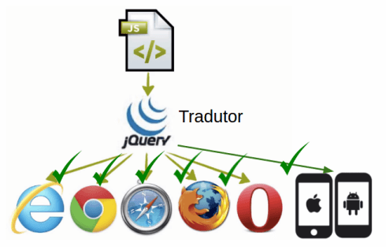

-------------------------------------------------------------------------------------
<h1>Seção 01 - Introdução</h1>

<h2>Apresentação</h2>

Seja bem-vindo ao curso de jQuery da Alura! Nós vamos estudar essa framework famosa do mundo Front-end.

No curso, construiremos a aplicação "Alura Typer", um jogo que consegue medir a velocidade de digitação do usuário.

app alura typer

Enquanto o digitador escreve no campo de texto, é feita uma contagem das palavras e caracteres digitados pelo usuário.

Depois, o resultado é adicionado ao placar localizado mais abaixo, com o número de palavras escritas.

resultado alura typer

A aplicação vai ficar complexa... Vamos além da manipulação de DOM do jQuery!

Veremos como adicionar o ícone de remover com animação no placar, como fazer um ícone de scroll. Mostraremos ainda como fazer Ajax, acessar o servidor e buscar uma frase nova.

Abordaremos também como sincronizar o placar enviando os dados para o servidor, tudo usando as diversas funções da biblioteca do jQuery.

O curso será dividido em dois módulos, o primeiro vai focar na estruturação da aplicação. Mostraremos a maneira correta de utilizar o jQuery no projeto, além de apresentar as diferenças nas versões existentes e como importá-lo no projeto.

Falaremos sobre manipulação de DOM, como colocamos um elemento na página HTML e alteramos um atributo. Vamos fazer alterações no CSS, colocando e removendo um classe.

Nesta primeira, já falaremos sobre manipulação de DOM. Também falaremos sobre eventos: click, focus, input. Trabalharemos com eventos utilizando as funções do jQuery.

Na segunda parte do curso, abordaremos o assunto das animações, como fazemos Ajax, além de envio e recebimento de dados. Falaremos sobre os cuidados que devemos ter ao trabalhar com Ajax, apontando também as principais dificuldades - e com elas são resolvidas utilizando jQuery.

Conheceremos na segunda parte do curso, alguns plugins que melhoram as funcionalidades da aplicação.

A seguir, vamos construir a aplicação Alura Typer e dar início aos nossos estudos. Espero que vocês aproveitem o conteúdo do curso.

<h2>Introdução ao jQuery</h2>
Para ampliar as possibilidades de interação de nossos usuários com nossas páginas, recorremos a recursos avançados do CSS3, e do HTML5, mas que muitas vezes não são suficientes. Este é o caso de quando queremos, por exemplo, copiar a informação digitada pelo usuário em outro elemento de nossa página, ou até mesmo fazer uma validação antes de enviar um formulário.

Para atender casos como este, e outros ainda mais complexos, programamos em JavaScript, uma linguagem dinâmica compreendida pelo navegador.

Mas nos dias de hoje, sabemos que nossas páginas são acessadas por usuários de diversos dispositivos diferentes, passando pelo usuário comum de desktop até mesmo a um usuário que possui um celular rodando um sistema operacional antigo. Esta variedade de dispositivos traz também uma variedade de navegadores.


representação de código JS que dá suporte aos navegadores comuns como o Internet Explorer, Google Chrome, Safari, Mozilla Firefox e Opera

Esta variedade tornou o desenvolvimento do Javascript algo mais complexo, já que existem pequenas diferenças no seu modo de funcionamento em cada navegador, fazendo com que um código seja completamente funcional em um determinado navegador, mas com um mau funcionamento em outro.


representação de um código JS não funcionando em todos os browsers

Para o resgate: o framework jQuery
Neste cenário, que devemos garantir que o código JavaScript rode nos mais diversos navegadores, que entra o famoso framework jQuery.

Trata-se de uma biblioteca que possuí várias funções de uso bastante comum no dia a dia do desenvolvedor JavaScript. O jQuery nos garante que suas funções funcionarão em diversos browsers, e nos dá a garantia de que o código JavaScript funcionará em um navegador específico.

Ele age como um "tradutor", no sentido mais amplo da palavra, tornando o código JavaScript que era incompatível para certos navegadores em um código JavaScript funcional na maioria deles:



representação de que o código jQuery é compatível com diferentes browsers, incluindo mobile

Vantagens do jQuery
Além da grande vantagem de compatibilidade entre navegadores proporcionada pelo jQuery, os códigos se tornam muito mais sucintos.

jQuery: write less. do more.


Logo do jQuery

Traduzido livremente para o português, a mensagem indica que com jQuery, o desenvolvedor escreve menos e é capaz de fazer mais.

A segunda grande vantagem de utilizar o jQuery em seus projetos é o ganho de produtividade do desenvolvedor. Graças às funções sucintas, quando utilizamos o jQuery podemos reduzir o tamanho dos códigos JavaScript, como é demonstrado no seguinte trecho:

var paragrafos = document.querySelectorAll('p');
for( var i = 0;i < paragrafos.length; i++){
    paragrafos[i].textContent = "novo texto";
}
Este pedaço de código seleciona todos os parágrafos da página, itera por eles, e troca o texto para "novo texto". Utilizando o jQuery, conseguimos realizar a mesma funcionalidade, com um código menor, veja:

$('p').text('novo texto');
Conforme é a afirmação o lema, conseguimos escrever menos quando utilizamos jQuery.

Um exemplo que combina tanto a vantagem da compatibilidade com a da produtividade é o seguinte:

var cabecalho = document.getElementById("cabecalho");

if (cabecalho.attachEvent) {
    cabecalho.attachEvent("onclick", function (event) {
        alert("Você clicou no cabeçalho, usuário do IE!");
    });
} else if (cabecalho.addEventListener) {
    cabecalho.addEventListener("click", function (event){
        alert("Você clicou no cabeçalho!)
    }, false);
}
Escrevemos uma grande quantidade de código JavaScript para que o evento de click seja detectado tanto nos browsers antigos (como Internet Explorer), quantos nos atuais, por isso, ele faz a verificação com o if no começo.

Este mesmo código, utilizando do jQuery se torna mais enxuto:

$("#cabecalho").click(function (event) {
    alert("Você clicou no cabeçalho");
});
A quantidade de código escrito ficou reduzida e conseguimos manter a compatibilidade com os mais diversos navegadores.

O grande foco deste treinamento é mostrar como trabalhar com as diversas funções da biblioteca do jQuery e tornar você um desenvolvedor mais ágil, além de bem preparado para lidar com as diferenças entre navegadores.

O que aprendemos ?
Os navegadores e suas diferenças.
Por que utilizar o jQuery.
Quais as vantagens do jQuery.


<h2>Colocando o jQuery no projeto</h2>
Versões do jQuery
Agora que já entendemos as vantagens do jQuery e por que ele é um framework tão famoso, vamos discutir um pouco sobre suas versões.

Para utilizar o jQuery em nosso projeto, primeiro precisamos baixá-lo. O jQuery pode ser baixado em seu site oficial, o jquery.com. Assim que entramos no site, nos deparamos com um grande botão de download:

botão de download do jQuery

Ao acessar esta página, veremos uma grande quantidade links, sendo que cada um corresponde à uma versão diferente do jQuery. Vamos entendê-las:

listagem das versões do jQuery para download no site

O jQuery lançou recentemente sua nova versão, a versão 3, que trouxe mais rapidez em suas funções e reduziu o seu tamanho. Além destas melhorias, trouxe uma nova versão do jQuery, a slim version, que hoje é disponibilizada como alternativa à versão tradicional do jQuery.

A versão slim, como a própria tradução indica, é uma versão mais leve do jQuery. Ela não possui as funções de AJAX, nem de animações, sendo uma boa opção para desenvolvedores que não vão precisar destas funcionalidades.

Uma outra distinção a se fazer é entre as versões de desenvolvimento e de produção. As versões de produção têm o código minificado e reduzido, tornando-o mais compacto, e com isso, onerar menos a banda do usuário quando ele fizer o download do jQuery. Normalmente ela é utilizada quando finalizamos o projeto e vamos colocá-la no servidor de produção.

Já a versão de desenvolvimento é uma versão que mostra o código como completo do jQuery, permitindo ao desenvolvedor ver como uma ou outra função do jQuery foi implementada, permitindo-o debbugar em caso de algum comportamento inesperado.

Neste treinamento, utilizaremos a versão normal do jQuery, a versão 3.1.0 de desenvolvimento, já que queremos aprender o máximo de funções possíveis, inclusive sobre AJAX e animações. Não se preocupe em baixá-la, pois ela já foi disponibilizada para você na pasta do projeto que você fará o download.

O projeto AluraTyper
Para praticar o conhecimento que iremos adquirir de jQuery, iremos desenvolver a aplicação AluraTyper. O AluraTyper é um jogo que tem como objetivo medir a velocidade de digitação de seus usuários, e salvar seu recordes em um placar. Esta aplicação parece simples, mas irá envolver quase toda a biblioteca de funções do jQuery, nos fazendo passar desde o básico de manipulação de elementos até requisições assíncronas com AJAX.

Depois que você fizer o download do projeto, abra-o no seu editor de textos e você deve ver a seguinte estrutura:

alura-typer/
├── public
│   ├── css
│   ├── fonts
│   ├── img
│   ├── js
│   │   ├── jquery.js
│   └── principal.html
└── servidor
Por enquanto, ignoraremos a pasta servidor e vamos no focar apenas na pasta public.

Iniciando o projeto: HTML base
Nosso primeiro passo é escrever um HTML inicial para nossa aplicação, então, começaremos editando o arquivo principal.html, que se encontra na seguinte forma:


<!DOCTYPE html>
<html lang="pt-br"> 
<head> 
    <meta charset="UFT-8"> 
    <title>Document</title>
</head>
<body>

</body>
<htlm>
Iremos adicionar o título da nossa aplicação (Alura Typer). Dentro de <body>, escreveremos novamente o título que será exibido na página, entre <h1>. Criaremos a classe frase e escreveremos frase genérica "Loren ipsun", entre as tags <p> - que correspondem ao parágrafo. A criação da classe possibilita que esse elemento seja identificado e modificado posteriormente.

<!DOCTYPE html>
<html lang="pt-br">
<head> 
    <meta charset="UFT-8">
    <title>Alura Typer</title>
</head>
<body>
    <h1>Alura Typer</h1>
    <p class="frase">Lorem ipsum dolor sit am  et, consectetur adipiscing elit, sed do eiusmod tempor incididunt ut labore et dolore magna aliqua.</p>
</body>
</html>
Por fim, faremos os contadores que registrarão o número de caracteres e de palavras da frase. Criaremos no código a lista de informações, utilizando a classe informacoes e a tag <ul>. Dentro de <ul>, criaremos duas <li>s que correspondem ao número de palavras e a quantidade de segundos. Colocaremos alguns valores aleatórios, por enquanto.

<!DOCTYPE html>
<html lang="pt-br">
<head> 
    <meta charset="UFT-8">
    <title>Alura Typer</title>
</head>
<body>
    <h1>Alura Typer</h1>
    <p class="frase">Lorem ipsum dolor sit amet, consectetur adipiscing elit, sed do eiusmod tempor incididunt ut labore et dolore magna aliqua.</p>

    <ul class="informacoes">
        <li>30 palavras</li>
        <li>10 segundos</li>
    </ul>
</body>
</html>
Nosso objetivo inicial é que o nosso contador de palavras seja atualizado de acordo com a frase que está no HTML. Por exemplo, para a frase: "Alura: Cursos online de tecnologia que reinventam sua carreira.", ele deve mostrar 9 palavras, automaticamente.

Para criar esse nível de interatividade teremos que começar a utilizar o JavaScript com jQuery.

Para utilizamos o JavaScript em nosso projeto, primeiro devemos importá-lo utilizando a tag <script> no fim da tag <body>, no arquivo principal.html:
<code>
<!DOCTYPE html>
<html lang="pt-br">
<head> 
    <meta charset="UFT-8">
    <title>Alura Typer</title>
</head>
<body>
    <h1>Alura Typer</h1>
    <p class="frase">Lorem ipsum dolor sit amet, consectetur adipiscing elit, sed do eiusmod tempor incididunt ut labore et dolore magna aliqua.</p>

    <ul class="informacoes">
        <li>30 palavras</li>
        <li>10 segundos</li>
    </ul>

    <script src="js/main.js"></script>

</body>
</html>
</code>
Repare que importamos o script com o caminho js/main.js, já que ele está dentro da pasta /js.

Como o foco do treinamento é trabalhar com as funções do jQuery, vamos importar o jquery.js:
<code>
<!DOCTYPE html>
<html lang="pt-br">
<head> 
    <meta charset="UFT-8">
    <title>Alura Typer</title>
</head>
<body>
    <h1>Alura Typer</h1>
    <p class="frase">Lorem ipsum dolor sit amet, consectetur adipiscing elit, sed do eiusmod tempor incididunt ut labore et dolore magna aliqua.</p>

    <ul class="informacoes">
        <li>30 palavras</li>
        <li>10 segundos</li>
    </ul>

    <script src="js/jquery.js"></script>
    <script src="js/main.js"></script>

</body>
</html>
</code>
Nós importamos o jQuery acima de main.js, pois queremos utilizar a funções do jQuery. É muito importante prestar atenção na ordem de importação dos seus scripts .js, para evitarmos bugs no nosso projeto.

O que aprendemos?
As diferenças entre as versões do jQuery.
Versão slim vs versão normal.
Versão de produção vs versão de desenvolvimento.
O projeto Alura Typer.
Estrutura de pastas do nosso projeto.
O HTML básico do Alura Typer.


<h2>Primeiros passos com jQuery</h2>
Nosso objetivo é fazer com que o número de palavras de uma determinada frase seja contado e registrado automaticamente.

O primeiro passo é criar um arquivo JavaScript que conterá nosso código. Criaremos o arquivo main.js dentro da pasta /js.

Usaremos a função seletora do JQuary, que leva o próprio nome da framework. Essa função é responsável por selecionar no mundo JQuary. Dentro dessa função, passaremos um seletor CSS - sinal gráfico . - que retorna o objeto desejado. Neste caso, queremos o elemento que contém a classe frase. Salvaremos essa função em uma variável que chamaremos de frase.

var frase = jQuery(".frase");
console.log(frase);
Feito isso, podemos imprimir a frase. No console, veremos que dentro do conteúdo devolvido será a frase correspondente.

[p.frase, prevObject:  jQuery.fn.init[1]]
Veremos que o JQuery não retorna exatamente o uma frase, e sim um objeto JQuery que contém o objeto frase. Para imprimirmos exatamente texto da frase, teremos de utilizar outra função text()

var frase = jQuery(".frase").text();
console.log(frase);
A função nos retorna o conteúdo de texto do elemento em formato de string.

Queremos, também, contar o número de palavras que compõe uma determinada frase. Observemos a seguinte frase:

Alura: Cursos de tecnologia.

Sabemos que ela tem quatro palavras, pois conseguimos mentalmente diferenciar que cada palavra é separada por um espaço, e por isso, conseguimos contá-las. Vamos adotar uma estratégia similar no código JavaScript responsável por fazer a contagem: quebraremos a nossa frase pelos espaços dela, e em seguida, vamos contar as palavras restantes.

Ao invés de escreveremos a função inteira jQuery, podemos utilizar o atalho $.

Para quebrar uma string em espaços, podemos utilizar a conhecida função .split() do JavaScript tradicional, que nos retorna um array com as palavras separadas. Como queremos separar pelo espaço em branco(" "), passaremos ele como parâmetro em split():

var frase = $(".frase").text();
var numPalavras = frase.split(" ");
console.log(numPalavras);
Como reterno teremos:

["Alura:", "Cursos", "de", "tecnologia"]

Como a variável numPalavras é um array, podemos nos aproveitar da propriedade length dos arrays para nos dizer o tamanho do array, que coincide com o tamanho da frase recém dividida:

var frase = $(".frase").text();
var numPalavras = frase.split(" ").length;
console.log(numPalavras);
Recebemos como retorno o número correspondente à quantidade de palavras, que é 4.

Quantificando o número de palavras
Agora que conseguimos quantificar o número de palavras da frase digitada, precisamos alterar o indicador de palavras para que ele seja atualizado. No arquivo principal.html, o primeiro passo é conseguir selecionar o elemento HTML que contém esta informação, para isso, envolveremos o número do indicador com uma tag <span>, ficando mais fácil acessá-lo:

<!DOCTYPE html>
<html lang="pt-br">
<head> 
    <meta charset="UFT-8">
    <title>Alura Typer</title>
</head>
<body>
    <h1>Alura Typer</h1>
    <p class="frase">Lorem ipsum dolor sit amet, consectetur adipiscing elit, sed do eiusmod tempor incididunt ut labore et dolore magna aliqua.</p>

    <ul class="informacoes">
        <li><span id ="tamanho-frase"19</span> palavras</li>
        <li>15 segundos</li>
    </ul>

    <script src="js/jquery.js"</script>
    <script src="js/main.js"></script>


</body>
</html>
Selecionaremos span no main.js, utilizando a função $:

var frase = $(".frase").text();
var numPalavras = frase.split(" ").length;

var tamanhoFrase = $("#tamanho-frase");
Note que, como queremos selecionar usando id do elemento, utilizaremos o seletor correspondente do CSS: a tralha (#).

Com o elemento selecionado, modificaremos o valor de texto para adicionar o número de palavras da frase, que está na variável numPalavras. Para isto vamos utilizar a função .text() do jQuery novamente, porém, passando um parâmetro desta vez. No caso, especificaremos que queremos modificar o valor de texto do atributo:

var frase = $(".frase").text();
var numPalavras = frase.split(" ").length;

var tamanhoFrase = $("#tamanho-frase");
tamanhoFrase.text(numPalavras);
Ao reiniciar sua página, você deve notar que nosso indicador atualizou-se para o valor de palavras da frase. Conseguimos fazer a contagem automática de palavras.

Você pode notar que .text() do jQuery tem dois comportamentos, o primeiro, quando passamos sem nenhum parâmetro, o retorno será o valor de texto do elemento, e o segundo, quando passamos com um parâmetro, altera o valor de texto do elemento.

Diversas funções do jQuery têm essa característica: variar o seu comportamento conforme os parâmetros passados, inclusive, este de retornar/alterar valor é um bastante comum.

Vamos estudar várias outras como essa no curso.

O que aprendemos? O projeto AluraTyper. Como importar o jQuery em seu projeto. A importância da ordem de importação de scripts. A função seletora do jQuery. Pegando texto com a função .text(). Alterando texto com a função .text().

<h2>Sobre o que é o jQuery?</h2>
A alternativa que melhor termina a frase:

O jQuery é...

R:uma biblioteca JavaScript que abstrai a sua complexidade e problemas de compatibilidade.

O jQuery é uma biblioteca, feita em JavaScript, que tem como objetivo facilitar a vida do desenvolvedor Web. O grande propósito dela é facilitar o uso do JavaScript nos websites, abstraindo da cabeça do desenvolvedor os problemas de compatibilidade entre os navegadores. Ele também possui funções enxutas, que reduzem drasticamente a quantidade de código que o desenvolvedor tem que escrever, possuindo módulos que facilitam coisas como o AJAX , que é algo nativamente complexo de se fazer com JavaScript puro.

O jQuery segue a máxima de seu lema, que é Write less, do more, focando em otimizar a experiência de desenvolver JavaScript para a Web. Este framework se tornou uma das mais famosas bibliotecas do desenvolvimento Web, com mais de 50% dos desenvolvedores utilizando-a em seu dia a dia.
http://blog.honeypot.io/popularity-of-javascript-frameworks-and-libraries/
Dominá-la é essencial para se tornar um profissional front-end completo e este é o foco do nosso curso!

<h2>Vantagens do jQuery</h2>
Sobre o framework jQuery, julgue as alternativas abaixo:
1- Ele aumenta a produtividade do desenvolvedor, pois ele consegue escrever muito menos código do que se estivesse escrevendo em Javascript puro.

2- Apenas a versão de desenvolvimento do jQuery possui as funções sucintas que aumentam a produtividade do desenvolvedor.

3- Aumenta a compatibilidade do código Javascript escrito com os diversos navegadores, pois se utilizamos as funções do jQuery ele já garante que este código funcionará nos mais variados browsers.

R: A primeira vantagem do jQuery é a compatibilidade que suas funções tem com os navegadores. Quando escrevemos código Javascript , temos de tomar cuidado com as diferentes implementações internas de cada navegador, o que pode fazer com que um código que é completamente funcional em um determinado navegador não seja em outro.

Utilizando jQuery e suas funções, podemos abstrair deste cuidado, já que todas as funções do jQuery são compatíveis com os navegadores mais recentes.

A segunda grande vantagem do jQuery é a produtividade que ele trás para o desenvolvedor. Com suas funções conseguimos escrever um código muito mais sucinto , trazendo maior agilidade no desenvolvimento.

Logo as alternativas corretas são as 1 e 3.

Avaliando a alternativa 2 , pode ver que ela é falsa , pois tanto a versão de desenvolvimento quanto a de produção possuem todas as funcionalidades do jQuery, só tendo diferença entre o código ser minificado ou não.

<h2>jQuery emagreceu</h2>
Qual a diferença da versão slim para a versão normal do jQuery 3.1 ?

R: A versão slim não possuí as funções de animação nem de AJAX do jQuery normal.

A grande diferença da versão slim do jQuery é que esta não possuí nem as funções de animação nem as de AJAX do jQuery tradicional, deixando a framework mais leve.

Por ela não possuir estes dois módulos do jQuery, ela chega a ser 20% menor do que a versão normal, onerando menos a banda do usuário quando ele acessa um site que utiliza a versão slim.

Ela é útil para desenvolvedores que querem utilizar o jQuery apenas para a manipulação do DOM, escutar eventos, adicionar ou remover classes ou criar elementos, permitindo estes desenvolvedores terem acesso a uma versão mais simples do framework, pois muitas vezes queremos fazer animações utilizando algum recurso do CSS3 ou utilizar alguma outra biblioteca específica para requisições AJAX.


<h2>Produção ou desenvolvimento?</h2>
Qual a diferença entre as versões de produção e de desenvolvimento do jQuery?
R: A versão de produção é minificada, já a de desenvolvimento vem em sua forma normal.
A grande diferença está na minificação da versão de produção em relação a versão de desenvolvimento. Minificar é o processo de reduzir o tamanho de um arquivo fazendo certos processos como remover comentários, trocar nome de váriaveis por nomes menores, remover espaços entre outras técnicas.

A versão de produção, por ser minificada, tem um tamanho reduzido, sendo incrívelmente 30% do peso da versão de desenvolvimento. Utilizar a versão de produção quando estamos disponibilizando a versão final do nosso website para o usuário é de extrema importância, pois conseguimos onerar menos a banda de nossos usuários, algo que é bem interessante nos dias de hoje, já com o aumento dos acessos a website via mobile a maioria dos usuários depende de redes 3G e 4G, que são naturalmente mais limitadas.

Mas já ao desenvolver um website, é comum utilizarmos a versão de desenvolvimento, pois podemos ver como uma determinada função do jQuery foi implementada e fica mais fácil debuggar em caso de necessidade.


<h2>Selecionando o jQuery</h2>
Quais das opções abaixo selecionam corretamente o parágrafo que está no seguinte HTML:
```html
<body>
    <h1 id="titulo">Introdução ao Javascript</h1>
    <p id="introducao" class="principal">Javascript é uma das linguagens mais importantes de nosso tempo, 
justamente por ser entendida pelos mais diversos navegadores (desktop/mobile).</p>
</body>
```
